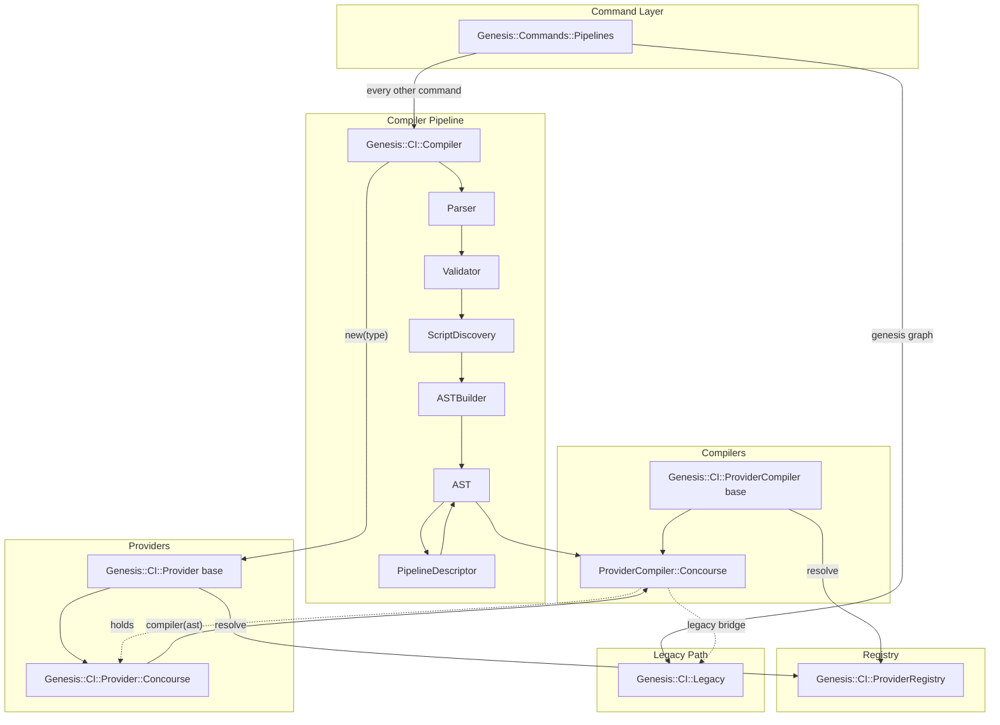

# Architecture Overview

The Genesis CI system has two parallel code paths for generating deployment
pipelines: a legacy path and a modern compiler pipeline. Both paths are
active in the codebase and serve different entry points. Understanding
how they coexist is essential before modifying any part of the system.

## Two Code Paths

The legacy code path calls directly into `Genesis::CI::Legacy`, a monolithic module that parses `ci.yml`, evaluates spruce operators, and generates Concourse pipeline YAML through string concatenation. It only ever supported Concourse, and it has been in production for years. The Concourse compiling class reaches it through the legacy bridge, and `genesis graph` calls it directly.

The compiler pipeline runs configuration through six stages, which are the Parser, the Validator, ScriptDiscovery, the ASTBuilder, the PipelineDescriptor, and the provider's compiler. It produces a structured AST as its intermediate representation, and every pipeline command that reads a repository's configuration takes this path.

Both paths are invoked from `Genesis::Commands::Pipelines`, the command handler module. There is no longer a `--platform` flag to route on. The provider is the one the repository is configured for under `pipeline.provider.type`, and a repository that names no type is on the manual provider.

## Module Map



## File Locations

All CI modules live under `lib/Genesis/CI/` in the Genesis CLI repository, and every one of them sits at the path its package name derives.

| File | Purpose |
|------|---------|
| `lib/Genesis/CI/ProviderRegistry.pm` | The one map of provider types to classes |
| `lib/Genesis/CI/Legacy.pm` | Monolithic legacy generator |
| `lib/Genesis/CI/Compiler.pm` | Compiler orchestrator |
| `lib/Genesis/CI/Compiler/Parser.pm` | Config file parser |
| `lib/Genesis/CI/Compiler/Validator.pm` | Config validator |
| `lib/Genesis/CI/Compiler/ScriptDiscovery.pm` | Script metadata discovery |
| `lib/Genesis/CI/Compiler/ASTBuilder.pm` | AST construction |
| `lib/Genesis/CI/Compiler/AST.pm` | AST data structure |
| `lib/Genesis/CI/Compiler/PipelineDescriptor.pm` | Generic pipeline builder |
| `lib/Genesis/CI/Provider.pm` | Provider abstract base |
| `lib/Genesis/CI/Provider/Concourse.pm` | Concourse provider |
| `lib/Genesis/CI/Provider/GithubActions.pm` | GitHub Actions provider |
| `lib/Genesis/CI/Provider/Manual.pm` | Manual provider |
| `lib/Genesis/CI/ProviderCompiler.pm` | Compiler abstract base |
| `lib/Genesis/CI/ProviderCompiler/Concourse.pm` | Concourse compiler |

The GitHub Actions and manual providers have no compiling class. A manual pipeline is one Genesis never sets, and the class that emits for GitHub Actions arrives with the provider itself.

The command handler is at `lib/Genesis/Commands/Pipelines.pm` and the CLI
command definitions are in `bin/genesis`.

## Entry Points

There are two ways code enters the CI system.

The primary entry point is `Genesis::Commands::Pipelines::apply()`, called when an operator runs `genesis pipeline-apply`. It reads the configured provider type, and every command that needs a compiled pipeline goes through the private `_compile_pipeline()` helper beside it, which builds a `Genesis::CI::Compiler` and runs `compile()`. The `pipeline_graph()`, `pipeline_describe()`, `diff()`, `status()`, `pause()`, and `resume()` functions in the same module all take that route. `genesis repipe` is deprecated and delegates to `apply()`.

The second entry point is `Genesis::CI::Legacy` directly, which the deprecated `graph()` calls to produce DOT source from a `ci.yml` file.

A provider object is never built by a command on its own. `Genesis::CI::Compiler::compile` builds it, and the command reads it back out of the result alongside the compiler.

## Data Flow

Configuration data flows through the system in a single direction, being
progressively transformed at each stage:

```
YAML files
  → parsed config (Perl hashref with normalized structure)
    → validated config (same hashref, errors collected)
      → scripts metadata (hashref of script_id → metadata)
        → AST source representation (Genesis-specific: targets, integrations, workflows)
          → AST generic pipeline (platform-agnostic: resource_types, resources, jobs, groups)
            → provider output (platform-specific YAML strings)
```

Each transformation is performed by a dedicated module. The AST is the
central data structure and it has two layers: a source representation
that holds Genesis-specific concepts, and a generic pipeline that holds
fully-resolved CI primitives. The PipelineDescriptor is the boundary
module that converts from one layer to the other.

## One Class per Provider, with Its Compiler as a Component

A provider used to inherit from two parents at once, one for a trait interface and one for the compiler interface, and the same object answered for both. That arrangement is gone. A provider is one class now, and the class that emits its artefact is a component the provider hands out.

```perl
my $provider = Genesis::CI::Provider->new(type => 'concourse', %block);
my $compiler = $provider->compiler(ast => $ast, top => $top);

$compiler->provider;   # the provider above, held rather than copied
```

Each side inherits from one base. `Genesis::CI::Provider` declares the options schema, the capabilities, the block validation, and `check_prereqs`. `Genesis::CI::ProviderCompiler` declares `platform_name`, `provider_type`, `generate_from_ast`, and `output_files`, and carries the shared helpers `dump_yaml`, `git_uri`, `secret_ref`, `topological_sort`, and `matches_pattern`.

The split is what gives two facts one home each. The toolchain check lives on the provider, where the CLI can ask it without compiling anything first, and the Concourse team default lives in the fragment's schema, which the compiler reads back through `provider_option('team')`. Before the split each of them was written twice, and the two copies could disagree.

A provider that has nothing to emit answers `compiler` with nothing, which is what the manual provider does and what the GitHub Actions provider does until its compiling class lands. A caller that needs a compiler rather than merely asking whether there is one passes `required`, and then the registry's refusal is what comes back.

See [Writing a Provider](writing-a-provider.md) for the full contract on both sides.

## Concourse Legacy Bridge

The Concourse compiler has a special bridge mechanism for legacy-sourced
ASTs. When the compiler pipeline processes a `ci.yml` file, the parser
normalizes it into the multi-file structure, but the ASTBuilder preserves
the raw legacy data in `$ast->provider_config->{concourse}{_legacy_pipeline_raw}`.

When `Genesis::CI::ProviderCompiler::Concourse::generate_from_ast()` detects
this legacy marker and a `$self->{top}` object is available, it calls
`_generate_from_legacy_ast()` which reconstructs the original `$P` hashref
that `Legacy::generate_pipeline_concourse_yaml()` expects and delegates
to it. This ensures that legacy configurations produce bit-identical output
regardless of whether they go through the compiler pipeline or the direct
legacy path.

For non-legacy ASTs (from the `pipeline:` section of `.genesis/config`),
the Concourse compiler calls `_generate_native()` which serializes the
generic pipeline from `PipelineDescriptor` directly to YAML.
