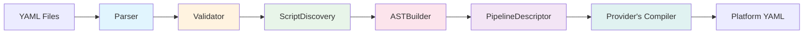

# Compiler Pipeline

The compiler pipeline transforms CI configuration files into platform-specific pipeline definitions through six sequential stages. Each stage has a dedicated module, takes input from the previous stage, and produces output for the next. The `Genesis::CI::Compiler` module orchestrates the stages.

## Pipeline Overview



## Stage 1: Parser

**Module:** `Genesis::CI::Compiler::Parser`

**Input:** The `pipeline:` section of `.genesis/config`, the path to a named configuration directory, or the path to a single `ci.yml`. No command names a directory any more, so in practice the first two are the section and the legacy file.

**Output:** A Perl hashref with normalized configuration

`parse()` is a three-way choice, tried in order. A caller that names a configuration directory gets `_parse_multi_file()`. A caller that names none, but hands over a `Genesis::Top` whose config carries the key, gets `_parse_genesis_config()`, which reads the `pipeline`, `targets`, and `integrations` blocks and optionally the `scripts`, `provider`, and `provider_config` blocks. Only `provider` is declared in the repository schema, so an operator who writes any of the other five into `.genesis/config` has the load refuse it by name before the parser is reached, and this reader sees them only where they come from an older configuration. A caller that names a file gets `_parse_legacy_file()`, which normalizes `ci.yml` into the same structure the other two produce. `_compile_pipeline()` in `Genesis::Commands::Pipelines` names no directory, so it asks `can_compile_from_genesis_config()` first and falls back to a file when the answer is no.

The two reads are about the same section, and they have to be. `can_compile_from_genesis_config()` asks for `pipeline`, the name D18 gave the section, and `parse()` asks for `pipeline` too. A gate that answered yes while the parser went looking for a file would send a correctly configured repository to the bail below, which would complain about a `ci.yml` nobody is meant to have any more.

Where a file is involved, the parser loads it through `spruce merge`, which means spruce operators like `(( grab ... ))`, `(( vault ... ))`, and `(( concat ... ))` are evaluated at parse time, so the parsed configuration holds resolved values rather than spruce expressions. The one exception is `--skip-vault`, which leaves vault operators unresolved and appearing in their literal `(( vault ... ))` form. The `pipeline:` section takes no such pass. `Genesis::Config::_load` reads `.genesis/config` through `Genesis::load_yaml_file`, which shells out to `spruce json` and evaluates no operator at all, so every value in the section reaches the compiler exactly as it was written.

The legacy normalization is extensive. The parser converts `boshes` into a `targets` structure with `type` and `connection` fields. It converts `vault`/`git`/`slack`/`email`/`locker` into a unified `integrations` structure. It parses the layout DSL into workflow definitions with `auto_patterns`, `environments`, and `will_trigger` maps. The original raw legacy data is preserved in `_legacy_raw` for use by the legacy bridge in the Concourse provider.

The parsed output always contains these keys:

```perl
{
  pipeline        => { metadata => {...}, branches => {...}, workflows => {...}, configuration => {...} },
  targets         => { targets => { env_name => {...}, ... } },
  integrations    => { vault => {...}, source_control => {...}, notifications => [...], ... },
  scripts         => { ... },
  provider_config => { ... },
  _source_format  => 'legacy' | 'multi-file' | 'genesis-config',
  _source_path    => '/path/to/source',
  _legacy_raw     => { ... },  # Only present for legacy format
}
```

### Layout DSL Parsing

The layout DSL parser in `_parse_layout_dsl()` processes the text line by line. It strips comments, collapses whitespace, and splits on semicolons and newlines to produce a list of "rules." Each rule is either an `auto` directive (which records glob patterns for auto-deployment) or an environment chain (sequences of environment names connected by `->` arrows).

For each chain, the parser validates that every environment name exists in `boshes` and builds a `will_trigger` map recording which environment triggers which other environments. The output for each layout is:

```perl
{
  auto_patterns => ['sandbox-*', 'preprod-*'],
  environments  => ['sandbox', 'staging', 'prod'],
  will_trigger  => { sandbox => ['staging'], staging => ['prod'] },
  _raw_source   => 'auto sandbox-* ; sandbox -> staging -> prod',
}
```

## Stage 2: Validator

**Module:** `Genesis::CI::Compiler::Validator`

**Input:** Parsed configuration hashref

**Output:** Same hashref (validated in place); errors and warnings collected

The validator performs structural checks, required-field validation, allowed-key enforcement, and cross-reference validation. It dispatches on the `_source_format` field, and the test is for `legacy` alone, so `genesis-config` and `multi-file` both fall through to `_validate_multi_file()` and are checked the same way.

For legacy format, the validator checks every section of the original `pipeline` structure: required top-level keys (`name`, `vault`, `git`, `boshes`), vault URL presence, git authentication mode (SSH key XOR username/password), BOSH director credentials (unless create-env), valid notification configuration (at least one of slack or email), layout validity, and allowed keys at every level. The allowed-key check at the top level permits exactly these keys: `name`, `public`, `tagged`, `errands`, `ocfp`, `vault`, `git`, `slack`, `email`, `boshes`, `task`, `layout`, `layouts`, `groups`, `debug`, `locker`, `unredacted`, `notifications`, `auto-update`, `registry`, `require-passed-caches`.

For the other two, the validator checks the targets section (connection URL required for bosh-director type), the integrations section (`vault.url` and `source_control` required), and cross-references (workflow trigger patterns that match no target raise a warning, and script references must resolve). The pipeline section is optional. `_validate_pipeline_section()` returns as soon as it sees an empty one, because an empty section means the topology comes from the `genesis.pipeline.*` keys in the environment files, and workflows are optional for the same reason. What it does check is conditional: a `metadata` block needs a `name`, and a `branches` block needs its control branch.

The validator also checks for DAG cycles in workflow graphs using a standard depth-first search with temporary marks. If a cycle is found, an error is recorded with the offending node name.

Errors and warnings are collected separately. The caller checks `has_errors()` and `has_warnings()` after validation. Errors are fatal (compilation stops), warnings are informational.

## Stage 3: ScriptDiscovery

**Module:** `Genesis::CI::Compiler::ScriptDiscovery`

**Input:** Parsed configuration hashref

**Output:** Hashref of `script_id => metadata`

Script discovery searches for script metadata from three sources in priority order. First, it loads explicit declarations from the `scripts` block of the parsed config. Second, it scans `scripts/` at the root of the deployment repository for `.sh` files that contain `@genesis-script` inline annotations. Third, for any remaining undiscovered scripts, it infers metadata from the filename.

Each discovered script gets a metadata record with these fields:

```perl
{
  id           => 'deploy/genesis-deploy',
  description  => 'Execute Genesis deployment',
  path         => 'scripts/deploy.sh',
  executor     => 'bash',
  version      => '1.0',
  requirements => [{ tool => 'genesis-cli', version => '>=3.1.0' }],
  inputs       => [{ name => 'deployment-repo', type => 'git-repository', required => 1 }],
  outputs      => [{ name => 'manifests', type => 'directory', path => '.genesis/manifests/' }],
  environment  => { required => ['CURRENT_ENV'], optional => ['GENESIS_TRACE'] },
  timeout      => '60m',
  exit_codes   => { 0 => 'success', 1 => 'error' },
  privileged   => 0,
}
```

The manifest has highest priority and overrides any inline annotations. Inline annotations override filename-based inference. The `_validate_script` method ensures all required fields have defaults and optionally checks that referenced script files exist on disk.

For legacy `ci.yml` configurations, the scripts section is typically empty because legacy pipelines use Genesis built-in CI commands (`ci-pipeline-deploy`, `ci-generate-cache`, etc.) rather than custom scripts.

## Stage 4: ASTBuilder

**Module:** `Genesis::CI::Compiler::ASTBuilder`

**Input:** Parsed configuration and discovered scripts

**Output:** `Genesis::CI::Compiler::AST` object

The ASTBuilder constructs the AST source representation from the parsed configuration. It dispatches on the source format the same way the validator does, testing for `legacy` alone, so `genesis-config` and `multi-file` both reach `_build_from_multi_file()`.

For legacy format, the builder extracts metadata (pipeline name, version, source type), branches, integrations (passed through from the parser), targets (passed through from the parser), and builds workflow definitions from the parsed layout data. The workflow builder is the most complex part: it computes aliases from `boshes`, determines which environments auto-deploy by matching `auto_patterns` against environment names using glob expansion, builds a `triggers` map (the inverse of `will_trigger`), and constructs a DAG with nodes and edges.

Each workflow node contains:

```perl
{
  stage_name  => 'sandbox',
  target_name => 'sandbox',
  alias       => 'sandbox',
  genesis_env => 'sandbox',
  auto        => 1,
  type        => 'deployment',
}
```

Each edge contains `{ from => 'sandbox', to => 'staging' }`.

The builder also preserves legacy-specific data in a `_legacy` key on each workflow. This data includes the original `environments`, `auto_envs`, `aliases`, `genesis_envs`, `will_trigger`, and `triggers` maps. The Concourse legacy bridge uses this data to reconstruct the `$P` hashref for delegation to `Legacy::generate_pipeline_concourse_yaml()`.

For the multi-file format, the builder passes most data through directly but constructs workflow graphs from stage definitions. If stages are provided as a list, `_build_workflow_graph()` creates a sequential DAG where each stage triggers the next. If an explicit graph is provided, it is used as-is.

The builder also handles `provider_config`, embedding the legacy raw data under `{concourse}{_legacy_pipeline_raw}` so the Concourse provider can detect it.

## Stage 5: PipelineDescriptor

**Module:** `Genesis::CI::Compiler::PipelineDescriptor`

**Input:** AST with populated source representation

**Output:** Generic pipeline hashref stored in the AST via `set_pipeline()`

This is the largest and most important module in the compiler (~1300 lines). It is the boundary between Genesis domain logic and generic CI pipeline generation. All Genesis-specific knowledge about deployment jobs, cache generation, locker integration, auto-update mechanics, notification wiring, and environment file conventions lives here.

The `describe()` method produces a hashref with four arrays:

```perl
{
  resource_types => [...],  # Concourse resource type definitions
  resources      => [...],  # Git, notification, BOSH config, locker resources
  jobs           => [...],  # Notify and deploy jobs for each environment
  groups         => [...],  # Pipeline UI groupings
  graphviz       => '...',  # DOT source for visualization
  description    => '...',  # Human-readable text description
}
```

The generation process iterates over each workflow in the AST. For each workflow, it extracts unified data from the graph (environments, aliases, auto flags, trigger relationships), then generates per-environment resources (Git change watchers, cache watchers, BOSH config resources, locker resources) and per-environment jobs (notification jobs for non-auto envs, deployment jobs for all envs).

Deployment jobs are the most complex. Each one contains resource gets (with trigger and passed constraints), lock acquisition steps, a deploy task with full environment variable configuration, errand tasks, a cache generation task, cache push steps for downstream environments, notification on-failure and on-success hooks, and lock release in an ensure block.

The module also generates auto-update resources and jobs when configured, custom or default pipeline groups, and graphviz/description output.

See [AST and PipelineDescriptor](ast-and-descriptor.md) for detailed coverage of the two-layer design.

## Stage 6: The Provider's Compiler

**Module:** Platform-specific (for example `Genesis::CI::ProviderCompiler::Concourse`)

**Input:** AST with populated generic pipeline

**Output:** Platform-specific YAML string(s)

The compiler is the final stage. The orchestrator builds the provider the run was asked for, asks that provider for its compiler, and hands the compiler the AST. The compiler takes the fully resolved generic pipeline and serializes it to the platform's native format. For Concourse, that means emitting YAML with `groups`, `resources`, `resource_types`, and `jobs` at the top level.

A compiler is intentionally thin. All Genesis-specific logic lives in PipelineDescriptor, so a compiler only needs to serialize the generic pipeline to its platform's format.

The `Genesis::CI::Compiler` orchestrator calls `compile()` which runs all six stages and returns:

```perl
{
  ast      => $ast_object,
  output   => { 'pipeline.yml' => $yaml_string },
  provider => $provider_object,
  compiler => $compiler_object,
  parsed   => $parsed_config,
}
```

Both halves come back, so the command layer can ask the provider whether the toolchain is present and ask the compiler to emit. It then decides what to do with the output, which is to deploy it through `fly`, write it to a directory, or print it to stdout.
