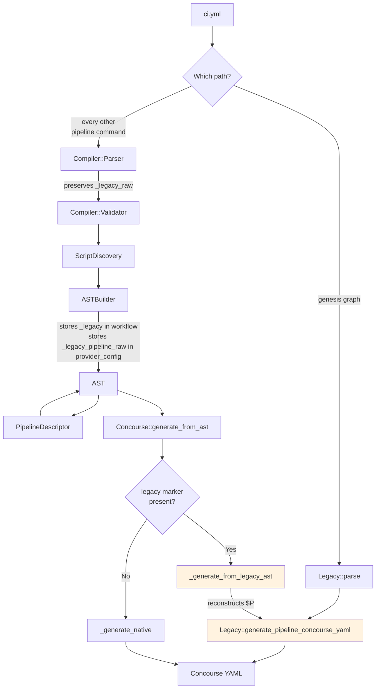

# Legacy Bridge

The Genesis CI system maintains full backward compatibility with the original monolithic pipeline generator (`Genesis::CI::Legacy`). This document explains how the legacy code interoperates with the modern compiler pipeline, when the bridge is activated, and how data flows between the two systems.

## Legacy Module Overview

`Genesis::CI::Legacy` is a self-contained module of approximately 1740 lines that handles every aspect of Concourse pipeline generation: parsing `ci.yml`, evaluating the layout DSL, resolving environment relationships, computing file paths, and emitting YAML through string concatenation with embedded spruce operators.

The module exposes four public functions:

`parse($config_file, $top, $layout)` loads the configuration file through `spruce merge`, validates required keys, normalizes defaults, parses the layout DSL, and returns a `$pipeline` hashref along with the selected layout name.

`generate_pipeline_concourse_yaml($pipeline, $top)` takes the parsed hashref and generates the complete Concourse pipeline YAML as a string. The output includes spruce operators like `(( grab ... ))` and `(( inject ... ))` that are resolved by a final `spruce merge --prune pipeline` pass.

`generate_pipeline_graphviz_source($pipeline)` produces a Graphviz DOT string from the parsed pipeline.

`generate_pipeline_human_description($pipeline)` prints a human-readable description of the pipeline to stdout.

## When Legacy is Used Directly

The legacy module is called directly, bypassing the compiler entirely, by the deprecated `genesis graph`. In `Genesis::Commands::Pipelines::graph()` the code reads `ci.yml` and asks Legacy for DOT source:

```perl
(my $pipeline, $layout) = Genesis::CI::Legacy::parse(get_options->{config}, $top, $layout);
my $dot = Genesis::CI::Legacy::generate_pipeline_graphviz_source($pipeline);
```

There is no longer a `--platform` flag to route on, and the other deprecated commands delegate to their successors rather than calling Legacy. `repipe` delegates to `apply`, and `describe` delegates to `pipeline_describe`. Every route but the one above reaches Legacy through the bridge below rather than directly.

## When the Bridge is Activated

The bridge is activated when all of these conditions are true:

1. The repository is configured for the Concourse provider, so the compiler pipeline runs and hands its AST to the Concourse compiler
2. The configuration source is a legacy `ci.yml` file, rather than the `pipeline:` section of `.genesis/config`
3. The Concourse compiler's `generate_from_ast()` is called

Under these conditions, the Parser reads `ci.yml` and normalizes it into the multi-file structure. The ASTBuilder preserves the raw legacy data in `$parsed->{_legacy_raw}` and stores it in the AST's provider config:

```perl
$provider_config->{concourse} = {
    _legacy_pipeline_raw => $parsed->{_legacy_raw}{pipeline},
};
```

When `Genesis::CI::ProviderCompiler::Concourse::generate_from_ast()` runs, it checks for this marker:

```perl
if ($source eq 'legacy'
    && $ast->provider_config->{concourse}
    && $ast->provider_config->{concourse}{_legacy_pipeline_raw}
    && $self->{top}) {
    return $self->_generate_from_legacy_ast($ast);
}
```

If detected, it calls `_generate_from_legacy_ast()` instead of `_generate_native()`.

## How the Bridge Reconstructs Legacy Data

The `_generate_from_legacy_ast()` method reconstructs the `$P` hashref that `Legacy::generate_pipeline_concourse_yaml()` expects. The raw pipeline data from the AST provides the top-level structure. The workflow's `_legacy` data provides the environment lists, auto-deploy flags, aliases, genesis environment mappings, and trigger relationships.

```perl
my $P = {
    pipeline     => { %$raw_p },
    file         => $ast->metadata->{source_file} || 'ci.yml',
    envs         => $leg->{environments} || [],
    auto         => $leg->{auto_envs}    || [],
    aliases      => { %{$leg->{aliases}      || {}} },
    genesis_envs => { %{$leg->{genesis_envs} || {}} },
    will_trigger => { %{$leg->{will_trigger} || {}} },
    triggers     => ref($leg->{triggers}) eq 'HASH' ? { %{$leg->{triggers}} } : {},
};
```

The method also applies the same boolean defaults that `Legacy::parse` applies (tagged, public, unredacted, ocfp, vault verify, task image/version/ privileged). Once the `$P` hashref is complete, it delegates to `Legacy::generate_pipeline_concourse_yaml($P, $self->{top})`.

This ensures that legacy configurations produce identical output regardless of whether they are processed through the compiler pipeline or the direct legacy path.

## Data Flow Diagram



## The Native Path

When the configuration comes from the `pipeline:` section of `.genesis/config`, there is no legacy raw data and no `_legacy_pipeline_raw` marker. In this case, `generate_from_ast()` falls through to `_generate_native()`, which reads the generic pipeline from the AST and serializes it directly:

```perl
sub _generate_native {
    my ($self, $ast) = @_;
    $self->_ensure_pipeline_resolved();
    my $pipeline = {
        groups         => $ast->groups,
        resources      => $ast->pipeline_resources,
        resource_types => $ast->resource_types,
        jobs           => $ast->jobs,
    };
    return "---\n" . $self->dump_yaml($pipeline) . "\n";
}
```

The `_ensure_pipeline_resolved()` method checks whether the generic pipeline has been built. If it has not, which can happen when the Concourse compiler is built from a configuration file rather than handed an AST, it creates a PipelineDescriptor and runs `describe()` to populate the AST's generic pipeline.

## The File-Built Legacy Mode

The Concourse compiler's file-built methods, which are `parse()`, `generate()`, `graph_md()`, and `describe()`, also have a legacy delegation path. When the compiler is built through `init()` with a `platform` of `legacy`, those methods delegate directly to `Legacy.pm` functions:

```perl
sub parse {
    my ($self) = @_;
    if ($self->{_platform} eq 'legacy') {
        my ($pipeline, $layout) = Genesis::CI::Legacy::parse(
            $self->{file}, $self->{top}, $self->{layout}
        );
        $self->{config} = $pipeline;
        $self->{layout} = $layout;
        return $self;
    }
    # ... native path ...
}
```

There are therefore two distinct ways legacy code is reached. The bridge path runs the compiler, builds an AST, reconstructs the `$P` hashref, and calls Legacy, so it preserves the compiler's intermediates for debugging. The file-built path calls `Legacy::parse()` directly and skips the compiler entirely.

Nothing in the tree calls `init()` any more, since the factory that used to is gone and there is no `--platform` flag to ask for legacy mode with. The constructor and the delegation both stand because `parse()` is the only thing that sets the `config` key that `generate()` and `deploy()` insist on, so removing them would take that path with them.

## Why the Bridge Exists

The bridge exists to guarantee output parity during the transition from legacy to modern generation. The Legacy module produces YAML with specific formatting, spruce operator placement, and ordering that operators have come to expect. By routing legacy configurations back through `Legacy::generate_pipeline_concourse_yaml()`, the system guarantees that the output is identical regardless of which code path was taken.

As confidence in the native generator grows (through testing against real deployment repositories), the bridge can eventually be removed and all configurations can flow through PipelineDescriptor and `_generate_native()`.
