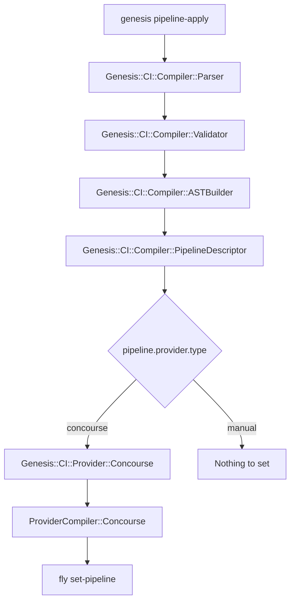

# CLI Commands

Genesis provides three user-facing commands for working with CI pipelines,
plus several internal commands that are called by the pipeline itself during
execution. This document covers all of them.

## genesis repipe

The `repipe` command generates a CI pipeline definition and optionally
deploys it to a CI platform. It is aliased as `genesis push`.

```
genesis repipe [<pipeline-layout>] [options]
```

`repipe` compiles the pipeline your repository configures and uploads it
to the CI system that pipeline names, through `fly set-pipeline` where
that system is Concourse. It prompts for confirmation before uploading
unless you pass `--yes`. The configuration is the `pipeline:` section of
`.genesis/config`, and the provider is read from
`pipeline.provider.type` rather than from any flag.

There is no fallback to `ci.yml`. A repository whose `pipeline:` section
is absent or not enabled has no pipeline to apply, and `repipe` says so
instead of compiling anything. A repository that still carries a
`ci.yml` with a top-level `pipeline:` key is refused earlier still, by a
check that names the migration, so no pipeline command reads that file.

The optional positional argument selects which pipeline layout to deploy
when your configuration defines multiple layouts via `pipeline.layouts`.
If you have a single `pipeline.layout`, the argument is ignored. If you
have multiple layouts and one is named `default`, it is selected when no
argument is given.

### Options

`--yes` or `-y` skips the `fly set-pipeline` confirmation prompt. This is
useful for automation.

`--dry-run` or `-n` generates the pipeline YAML and prints it to stdout
without deploying to Concourse. Combine this with output redirection to
save the generated YAML for review.

`--target` or `-t` specifies the Concourse target name (as shown by
`fly targets`). By default, the target name is derived from the layout
name.

`--config` or `-c` specifies the path to the configuration file. Defaults
to `ci.yml`.

`--paused` or `-P` keeps the pipeline paused after uploading. By default,
Genesis unpauses the pipeline after a successful `set-pipeline`.

`--output-dir` or `-o` writes compiled pipeline artifacts to a directory
instead of deploying. This produces the pipeline YAML, an `ast.json` file
containing the full AST, and any other provider output files.

`--skip-vault` bypasses Vault connectivity during compilation. When set,
the pipeline is compiled without connecting to Vault, which means spruce
vault operators will not be resolved. This is useful for local inspection
of the generated YAML.

`--debug-dir` writes intermediate compiler artifacts to a directory for
debugging. The artifacts are numbered by compilation stage:

```
01-parsed.json        # Parser output
02-ast-source.json    # AST source representation (Genesis concepts)
03-pipeline.json      # Resolved generic pipeline (resource_types, resources, jobs, groups)
04-pipeline.dot       # Graphviz DOT source
05-description.txt    # Human-readable description
06-output-pipeline.yml # Final provider output
```

### Examples

Compile and deploy the pipeline:

```bash
genesis repipe
```

Preview what is generated without deploying:

```bash
genesis repipe --dry-run > pipeline.yml
```

Write all compiler artifacts to a directory for inspection:

```bash
genesis repipe --output-dir ./debug --skip-vault
```

Dump every intermediate stage of compilation:

```bash
genesis repipe --debug-dir ./stages --skip-vault
```

To compile for GitHub Actions rather than Concourse, set
`pipeline.provider.type` to `github-actions` in `.genesis/config` and run
`genesis repipe` again.

## genesis graph

The `graph` command generates a Graphviz DOT representation of your pipeline
topology. Pipe the output through a Graphviz renderer to produce an image.

```
genesis graph [<pipeline-layout>] [options]
```

`graph` reads `ci.yml` and draws the legacy topology. For the Mermaid
flowchart the compiler writes, use `genesis pipeline-graph` instead.

```bash
# Generate a PNG image
genesis graph | dot -Tpng > pipeline.png

# Generate SVG
genesis graph | dot -Tsvg > pipeline.svg
```

Options: `--config` (same as `repipe`).

## genesis describe

The `describe` command prints a human-readable description of your pipeline,
listing each environment, whether it deploys automatically or requires
manual approval, and what triggers it.

```
genesis describe [<pipeline-layout>] [options]
```

Example output:

```
Pipeline: my-cf-deployments
Workflow: my-cf-deployments
  sandbox              sandbox-deployment  [auto]
  staging              staging-deployment  [manual] (triggered by sandbox)
  production           production-deployment  [manual] (triggered by staging)
```

Options: `--config` (same as `repipe`).

## Internal Pipeline Commands

The following commands are called by the pipeline itself during execution.
They are not intended for direct use by operators but are documented here
for completeness.

### genesis ci-pipeline-deploy

Runs inside a Concourse task to deploy an environment. It authenticates to
Vault using AppRole credentials from environment variables, loads the
Genesis environment, and calls `genesis deploy`. After deployment, it
commits state files and deployment artifacts back to the Git repository.

Required environment variables: `CURRENT_ENV`, `GIT_BRANCH`, `OUT_DIR`,
`WORKING_DIR`, `VAULT_ROLE_ID`, `VAULT_SECRET_ID`, `VAULT_ADDR`. Either
`GIT_PRIVATE_KEY` or both `GIT_USERNAME` and `GIT_PASSWORD` must be set.

### genesis ci-show-changes

Runs inside a Concourse task to show what would change if an environment
were deployed. It computes the diff between the current deployment and
the proposed manifest by querying the BOSH director. This is used by
notification jobs to show operators what changes are pending before they
approve a deployment.

### genesis ci-generate-cache

Runs inside a Concourse task after a successful deployment to generate a
cache of shared configuration files for downstream environments. The cache
is committed to the Git repository so that downstream environments can
detect when upstream changes have been tested.

### genesis ci-pipeline-run-errand

Runs inside a Concourse task to execute a BOSH errand after deployment.
The errand name is specified by the `ERRAND_NAME` environment variable.

## Code Path Summary


