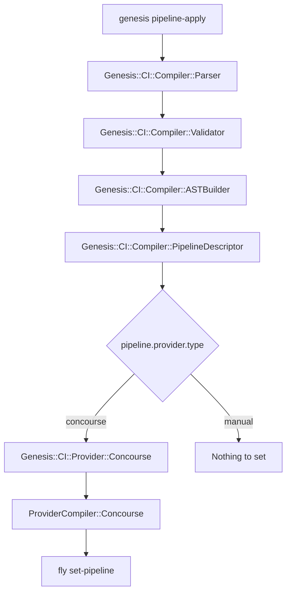

# CLI Commands

Genesis provides `genesis propagate` and a family of `pipeline-*` commands for working with CI pipelines, along with three deprecated commands that predate them and four retired ones. This document covers all of them.

Where a command refuses, it exits with a code from `Genesis::Exit` rather than with a bare number, so a pipeline job can tell a refusal from a partial result from a crash. The refusals on this page exit `CONFIG`. A fatal system error exits a bare 1, a usage or option error exits 2, and the prerequisites check exits 86, all three being Genesis precedent that predates the table.

## genesis pipeline-apply

The `pipeline-apply` command gives the pipeline its shape. It compiles a CI pipeline definition and, where the provider has one to set, deploys it to the CI platform.

```
genesis pipeline-apply [<pipeline-layout>] [options]
```

`genesis repipe` is the deprecated spelling of this command. It warns, then does exactly what `pipeline-apply` does, and it keeps the `push` alias. Use `pipeline-apply` in anything new.

`pipeline-apply` compiles the pipeline your repository configures and uploads it to the CI system that pipeline names, through `fly set-pipeline` where that system is Concourse. It prompts for confirmation before uploading unless you pass `--yes`. The configuration is the `pipeline:` section of `.genesis/config`, and the provider is read from `pipeline.provider.type` rather than from any flag.

There is no fallback to `ci.yml`. A repository whose `pipeline:` section is absent or not enabled has no pipeline to apply, and `repipe` says so instead of compiling anything. A repository that still carries a `ci.yml` with a top-level `pipeline:` key is refused earlier still, by a check that names the migration and exits `Genesis::Exit::CONFIG`, so no pipeline command reads that file.

The optional positional argument selects which pipeline layout to deploy when your configuration defines multiple layouts via `pipeline.layouts`. If you have a single `pipeline.layout`, the argument is ignored. If you have multiple layouts and one is named `default`, it is selected when no argument is given.

### Options

`--yes` or `-y` skips the `fly set-pipeline` confirmation prompt. This is useful for automation.

`--dry-run` or `-n` generates the pipeline YAML and prints it to stdout without deploying to Concourse. Combine this with output redirection to save the generated YAML for review.

`--target` or `-t` specifies the Concourse target name (as shown by `fly targets`). By default, the target name is derived from the layout name.

`--config` or `-c` is kept for compatibility and nothing reads it any more. The pipeline comes from the `pipeline:` section of `.genesis/config`.

`--paused` or `-P` keeps the pipeline paused after uploading. By default, Genesis unpauses the pipeline after a successful `set-pipeline`.

`--output-dir` or `-o` writes compiled pipeline artifacts to a directory instead of deploying. This produces the pipeline YAML, an `ast.json` file containing the full AST, and any other provider output files.

`--skip-vault` bypasses Vault connectivity during compilation. When set, the pipeline is compiled without connecting to Vault, which means spruce vault operators will not be resolved. This is useful for local inspection of the generated YAML.

`--debug-dir` writes intermediate compiler artifacts to a directory for debugging. The artifacts are numbered by compilation stage:

```
01-parsed.json        # Parser output
02-ast-source.json    # AST source representation (Genesis concepts)
03-pipeline.json      # Resolved generic pipeline (resource_types, resources, jobs, groups)
04-pipeline.dot       # Graphviz DOT source
05-description.txt    # Human-readable description
06-output-pipeline.yml # Final provider output
```

### Examples

Compile and deploy the pipeline:

```bash
genesis pipeline-apply
```

Preview what is generated without deploying:

```bash
genesis pipeline-apply --dry-run > pipeline.yml
```

Write all compiler artifacts to a directory for inspection:

```bash
genesis pipeline-apply --output-dir ./debug --skip-vault
```

Dump every intermediate stage of compilation:

```bash
genesis pipeline-apply --debug-dir ./stages --skip-vault
```

The provider is whichever type `pipeline.provider.type` names. Concourse is the only one Genesis can compile for today. The `github-actions` type validates and resolves on the CLI side, but it has no compiling class yet, so a repository set to it is told so rather than being given a pipeline. The `manual` type has no pipeline to set at all, and the command says which stage it skipped and exits successfully.

## genesis propagate

Walks the control branch forward and delivers each due commit to the deployment branches that are ready for it.

```
genesis propagate [options]
```

The run takes no environment argument. It walks control forward from every deployment branch's newest marker and routes each commit on its own, in control order. A commit is delivered to an environment when nothing upstream of it is still waiting to deploy the files that commit touches, and is held with its reason when something is. The run switches to the control branch inside its own session and leaves you on the branch you started on.

### Options

`--dry-run` or `-n` reports what each environment would receive, per control commit, and writes nothing.

`--yes` or `-y` publishes without asking. The verified delta for every environment is shown either way.

`--force` propagates by hand under a pipeline that owns the work. At a terminal you are still asked to confirm, and outside one the refusal stands.

## genesis pipeline-status

Reports where every environment of this deployment root stands.

```
genesis pipeline-status [options]
```

Each environment carries one reading of whether what its branch holds has been deployed, and the routing the walk decided stands beside it, so this command and `genesis propagate` can never disagree about what is held and why. The command writes nothing.

### Options

`--no-refresh` reports from the remote-tracking refs this clone already has, without refreshing them first. The header then says the report is stale, the routing summary and the divergence cell are marked unverifiable, and every reading that rests on those refs alone is qualified where it is printed. This is the only command that takes the option.

`--json` emits the canonical status record instead of the tree. The tree renders the same record, so the two never disagree.

## genesis pipeline-hold

Holds propagation to an environment until somebody releases it.

```
genesis prod pipeline-hold "waiting on the capacity report"
genesis pipeline-hold "freezing the fleet for the audit"
```

The reason is required. With an environment named it holds that one, and without one it holds every environment in the deployment root. While the hold stands, `genesis propagate` delivers nothing new to the environment and opens or updates no pull request, and everything already on the deployment branch stays deployable. The run's report and `genesis pipeline-status` both show `held, needs clearing` with the reason, whether or not anything is due.

A control commit can set the same hold for itself with a `Genesis-Stage: hold: <reason>` trailer, and the run writes the record when it delivers that commit, so the deploy of it finds the hold already standing. A commit whose gate the control branch has since released is delivered as an ordinary commit and sets no hold, because the reason travels with the gate and a released gate carries none.

## genesis pipeline-release

Clears the hold, so the next `genesis propagate` delivers to the environment again.

```
genesis prod pipeline-release
genesis pipeline-release
```

Releasing is a human act. No deploy clears a hold, and no flag does either. The record is deleted outright and no released-by fields are kept, so the release lives in the command's log line.

## genesis pipeline-graph

Compiles the pipeline and writes a Mermaid flowchart to `pipeline.md` in the current directory.

```
genesis pipeline-graph
```

This replaces `genesis graph`, which draws the legacy topology through Graphviz instead.

## genesis pipeline-describe

Compiles the pipeline and prints an ordered environment progression with gate and trigger annotations.

```
genesis pipeline-describe
```

It resolves the repository's own configuration out of files, so it holds no ref a refresh could make current and it takes no refresh flag. This replaces `genesis describe`.

## genesis pipeline-diff

Compiles the pipeline and compares it against the live pipeline fetched through `fly get-pipeline`.

```
genesis pipeline-diff [options]
```

It shows a unified diff, or reports that the two pipelines are identical. `--target` or `-t` names the Concourse target, defaulting to the pipeline name, and `--skip-vault` skips vault connectivity when compiling.

## The Provider Job Controls

Three commands reach past the compiled pipeline to the jobs the provider is running. All three are Concourse-only today, all three take `--target` or `-t` and `--skip-vault`, and all three take an optional environment name.

`genesis pipeline-jobs [<env>]` queries `fly jobs` and displays the status of each environment's deployment job. Pass an environment name to filter to a single job.

`genesis pipeline-pause [<env>]` pauses the named environment's job through `fly pause-job`. With no environment named it pauses the entire pipeline instead.

`genesis pipeline-resume [<env>]` resumes the named environment's job through `fly unpause-job`. With no environment named it resumes the entire pipeline instead.

These three are about the provider's jobs and not about propagation. To stop delivering to an environment, use `genesis pipeline-hold`, which is the one that `genesis propagate` and `genesis pipeline-status` both read.

## genesis graph (deprecated)

The `graph` command generates a Graphviz DOT representation of your pipeline topology. Pipe the output through a Graphviz renderer to produce an image. It warns that it is deprecated, and it is the one command left that calls the legacy generator directly.

```
genesis graph [<pipeline-layout>] [options]
```

`graph` reads `ci.yml` and draws the legacy topology. For the Mermaid flowchart the compiler writes, use `genesis pipeline-graph` instead.

```bash
# Generate a PNG image
genesis graph | dot -Tpng > pipeline.png

# Generate SVG
genesis graph | dot -Tsvg > pipeline.svg
```

Options: `--config`, which is kept for compatibility.

## genesis describe (deprecated)

The `describe` command prints a human-readable description of your pipeline, listing each environment, whether it deploys automatically or requires manual approval, and what triggers it. It warns, then delegates to `genesis pipeline-describe`, which is the command to use instead.

```
genesis describe [<pipeline-layout>] [options]
```

Example output:

```
Pipeline: my-cf-deployments
Workflow: my-cf-deployments
  sandbox              sandbox-deployment  [auto]
  staging              staging-deployment  [manual] (triggered by sandbox)
  production           production-deployment  [manual] (triggered by staging)
```

Options: `--config`, which is kept for compatibility.

## Retired Pipeline Commands

Four commands once ran inside a legacy Concourse task. All four are retired and none of them runs any more. `genesis ci-pipeline-deploy` authenticated to Vault with AppRole credentials from the environment, loaded the Genesis environment, deployed it, and committed the state files back to the repository. `genesis ci-show-changes` asked the BOSH director what a deployment would change, so that a notification job could show an operator what was pending before they approved it. `genesis ci-generate-cache` wrote the cache of shared configuration that downstream environments used to watch, which the deployment branches replaced. `genesis ci-pipeline-run-errand` ran a BOSH errand after a deployment. Each of the four is still registered in `bin/genesis` so that dispatch refuses it by name, which makes a legacy pipeline fail loudly rather than deploy something inconsistent. They are described here, in one place, so that a reader who meets one in an old pipeline knows what it did.

## What landed after the MVP

`genesis pipeline-hold` and `genesis pipeline-release` are the first entries on this list, and they arrived after the MVP rather than with it. The MVP shipped the propagation hold's record path, the outcome words that carry a hold's qualifier, and the readers that report one, and it shipped no way to set or clear a hold by hand. Nothing else was rebuilt when they arrived.

## Code Path Summary


