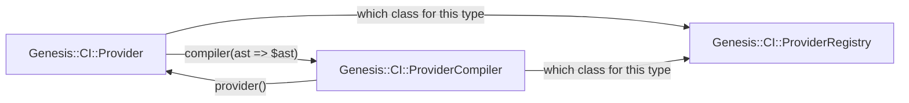
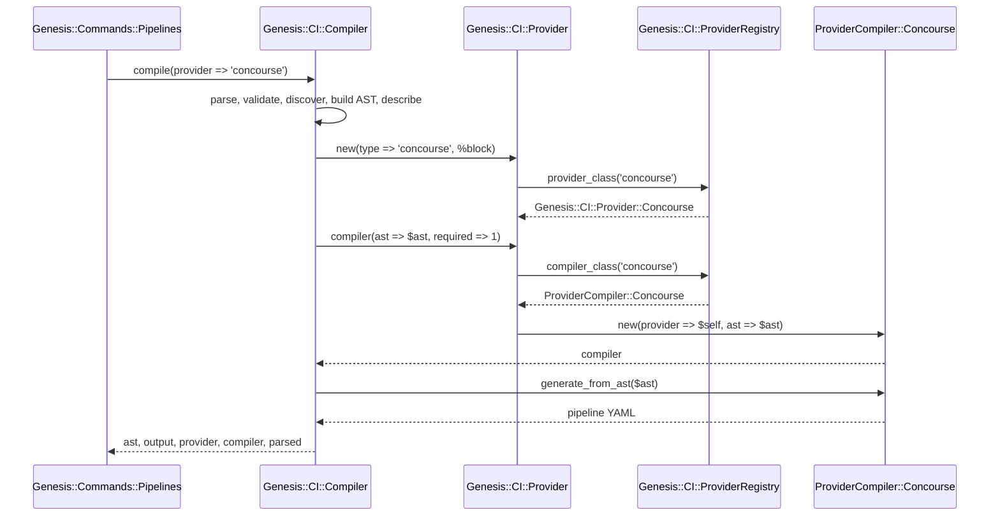

# The Genesis CI compiler and the classes around it

## Overview

This directory holds the stages that turn CI configuration into a pipeline AST, and `Genesis::CI::Compiler` one level above it runs those stages in order. The classes that turn an AST into a platform's own artefact do not live in here, because a provider is a thing in its own right and the compiler that emits for it is a component that provider owns.

Three classes carry that arrangement, and every run through the system consults all three.

| Class | What it answers for |
|-------|---------------------|
| `Genesis::CI::Provider` | The provider a repository is configured for. It declares the keys the `pipeline.provider` block may hold, declares what the provider is able to do, validates the block an operator wrote, and says whether the toolchain is present. |
| `Genesis::CI::ProviderCompiler` | The artefact that provider emits. It holds the provider it emits for and turns a resolved AST into one or more files. |
| `Genesis::CI::ProviderRegistry` | Which class answers for a type, on either side. Both families ask it, and it is the only map of types to classes in the tree. |

A provider hands out its compiler, and the compiler holds the provider that handed it out. That is the whole of the relationship, and it is what gives the toolchain check and the Concourse team default one home each rather than two.



## The registry

`Genesis::CI::ProviderRegistry` holds one entry per provider type. An entry names the class the CLI builds under `cli_class`, and, where the provider has an artefact to emit, the class that emits it under `class`. An entry names its classes and nothing else, because every package under `lib` derives its own file path, and a path written beside a class would be a second spelling of the same fact that could disagree with the first.

Three types are registered today.

- The `concourse` type has both halves, so it validates a block and emits a pipeline.

- The `github-actions` type has a CLI class and no compiling class yet. The type validates and resolves, and the class that emits for it arrives with the provider itself.

- The `manual` type has a CLI class and no compiling class, because a manual pipeline is one Genesis never sets.

Four subs read the map.

- `known_providers` answers every registered type, sorted. The configuration schema's enum, every class lookup, and every message that lists the valid types all read this, so a provider cannot be spelled one way in the schema and another in the code.

- `provider_info` answers one entry as a shallow copy, with each file path worked out from the class beside it.

- `automated_providers` answers every type that is not `manual`, so no caller writes that exclusion by hand.

- `register_provider` adds an entry at run time, for a test that stands a class up and for a provider that ships outside the tree.

Two subs resolve a type to a loaded class. `provider_class` answers the CLI class and `compiler_class` answers the compiling one. A type the registry does not hold is refused, and so is a type that has no compiling class, because emitting a pipeline and validating a block are different questions and a provider may answer the second while having nothing to answer the first with. Both refusals exit `CONFIG`, since a repository whose configured provider Genesis cannot compile for is a repository the operator can put right.

## The provider contract

A provider class lives under `Genesis::CI::Provider` and declares two things that the configuration layer reads before anything is compiled.

```perl
package Genesis::CI::Provider::MyPlatform;
use parent 'Genesis::CI::Provider';

# The keys this provider takes under pipeline.provider, in the shape
# Top's repository schema uses, so the configuration layer can merge
# them in and validate them for you.
sub provider_options_schema { ... }

# What this provider is able to do, as the six booleans the base names,
# so a key whose ability the provider lacks is refused at load rather
# than discovered at run time.
sub capabilities { ... }
```

`provider_options_schema` and `capabilities` are both mandatory and both abstract on the base, so every provider has to answer both. A provider that leaves either one out fails at configuration load, because the base raises rather than guessing. A provider with no declared keys would have every key an operator wrote refused by name, and a provider whose abilities are unknown cannot have those keys gated at all.

A provider also answers `check_prereqs`, which says whether the toolchain the provider needs is present. The base answers yes, which is the honest answer for a provider that needs no tool, and the Concourse provider overrides it to look for `fly` and to enforce the floor a repository declares as `pipeline.provider.min_fly_version`. A floor that cannot be compared against is a floor that is not enforced, so a `fly --version` that does not yield three dotted integers is refused by name rather than passed over.

`type` answers the registered type the provider was built under. It is set where the type is known rather than worked out later, because the only other place to read a type from is the configuration hash, and Perl randomises a hash's order once per process.

`compiler` hands out the compiler that emits this provider's artefact. A provider with nothing to emit answers with nothing, which is what `manual` does honestly and what `github-actions` does until its compiler lands. A caller that needs a compiler rather than merely asking whether there is one passes `required`, and then the registry's refusal is what comes back instead of an undefined value to trip over one line later.

## The compiler contract

A compiling class lives under `Genesis::CI::ProviderCompiler` and overrides four methods.

| Method | What it must do |
|--------|-----------------|
| `platform_name` | Answer a human-readable name for the platform, which appears in log messages and error output. |
| `provider_type` | Answer the canonical type string, which is the same string the registry keys the entry under. |
| `generate_from_ast` | Take a fully resolved AST and answer either one string or a hash of file names to contents. |
| `output_files` | Answer a hash describing the files this class writes, keyed by file name. |

The base builds every compiler, and the concrete class does not define a constructor of its own. A caller reaches the constructor through `$provider->compiler(ast => $ast)` rather than calling it directly, and a call that names no AST is refused by name, because a compiler blessed over an undefined AST fails much later and says far less about why.

Once built, a compiler can be asked for the provider it emits for.

```perl
my $provider = Genesis::CI::Provider->new(type => 'concourse', %block);
my $compiler = $provider->compiler(ast => $ast, top => $top);

$compiler->provider;                  # the provider above
$compiler->provider_option('team');   # 'main', from the fragment's default
$compiler->output_files;              # { 'pipeline.yml' => '...' }
```

The team default has one home, which is the default the Concourse fragment's schema declares, and `provider_option` is how the compiler reads it. The compiler asks what the repository's block says rather than what the CLI's provider object holds. A key an operator wrote with no value after it is the operator declining to choose rather than choosing nothing, so a bare `team:` still resolves to what the fragment declares.

The base also carries the helpers a provider is likely to want, which are `dump_yaml`, `git_uri`, `secret_ref`, `topological_sort`, and `matches_pattern`.

## How a run reaches all three

`Genesis::CI::Compiler::compile` runs the parse, the validation, the script discovery, the AST build, and the descriptor resolution, and then builds the provider and asks it for its compiler.



The type the caller asked to compile for wins over the type the block declares, because the caller is the one that named it and a block that disagrees would otherwise pick the class silently.

Both halves come back in the result, so a caller that wants an emitted artefact reads `compiler` and a caller that wants to know whether the toolchain is there reads `provider`.

```perl
my $result   = Genesis::CI::Compiler->new(top => $top)->compile(provider => 'concourse');
my $provider = $result->{provider};
my $compiler = $result->{compiler};

$provider->check_prereqs or exit 86;
$compiler->deploy(%deploy_opts);
```

## Adding a provider

A new platform takes one class on each side and one registry entry.

First, write the provider class at the path its package name derives, and give it the two declarations the contract above names.

```perl
package Genesis::CI::Provider::MyPlatform;
use parent 'Genesis::CI::Provider';

sub provider_options_schema { ... }
sub capabilities            { ... }
sub validate_config         { ... }
sub check_prereqs           { ... }
```

Second, write the compiling class, again at the path its package name derives, and override the four methods the compiler contract names.

```perl
package Genesis::CI::ProviderCompiler::MyPlatform;
use parent 'Genesis::CI::ProviderCompiler';

sub platform_name     { "My Platform" }
sub provider_type     { 'my-platform' }
sub generate_from_ast { ... }
sub output_files      { { 'pipeline.yml' => 'My Platform pipeline' } }
```

Third, add one entry to `%_providers` in `Genesis::CI::ProviderRegistry`.

```perl
'my-platform' => {
    class     => 'Genesis::CI::ProviderCompiler::MyPlatform',
    cli_class => 'Genesis::CI::Provider::MyPlatform',
},
```

There is no second place to register it. The schema's enum, the class lookups, and the valid-types messages all read this one map, so an entry added here is an entry every reader sees.

A provider that ships outside the tree calls `register_provider` at run time instead, which takes the same shape and refuses four things. A missing name would register the entry where nothing could look it up. A name already registered is refused rather than replaced, since replacing a real entry would leave the enum saying one thing and the lookup doing another. An entry with no `cli_class` is refused, because every type has a CLI class and a resolver that finds none behaves like `manual` instead of saying so. And a file path that disagrees with the class beside it is refused rather than honoured.

## The legacy generator

`Genesis::CI::Legacy` is the original Concourse generator, and it is still in the tree and still reached. It parses a `ci.yml` file, evaluates spruce operators, and builds Concourse pipeline YAML by string concatenation.

The Concourse compiling class bridges to it rather than duplicating it. When the ASTBuilder reads a legacy `ci.yml`, it keeps the raw pipeline data in the AST's provider configuration, and `generate_from_ast` reconstructs the structure the legacy generator expects and delegates. A legacy configuration therefore produces the same output whichever route it takes. An AST that carries no legacy marker is serialized natively from the generic pipeline the descriptor resolved.

See [the legacy bridge](../../../../docs/ci/dev/legacy-bridge.md) for how the reconstruction works in detail.

## A known defect

Four methods on the Concourse compiling class refuse unless `parse` has populated the object's `config` key, and `parse` is the route a compiler built from a configuration file takes. A compiler built on the compile path never has that key, because the constructor blesses only the provider, the AST, the `Genesis::Top` object, and the provider options.

The methods are `generate`, `deploy`, `graph_md`, and `describe`, with `generate_description` reaching the last of them through an alias. So `genesis pipeline-apply`, `genesis pipeline-graph`, and `genesis pipeline-describe` all reach a "Must call parse() before ..." refusal under the Concourse provider once the compile has finished. The defect predates the composition described above and is not caused by it. It wants a ticket of its own, and nothing here cures it.

Reading `provider_option`, `output_files`, or the `output` hash the compile returns works from a compile-built compiler, because none of those reads the `config` key.
