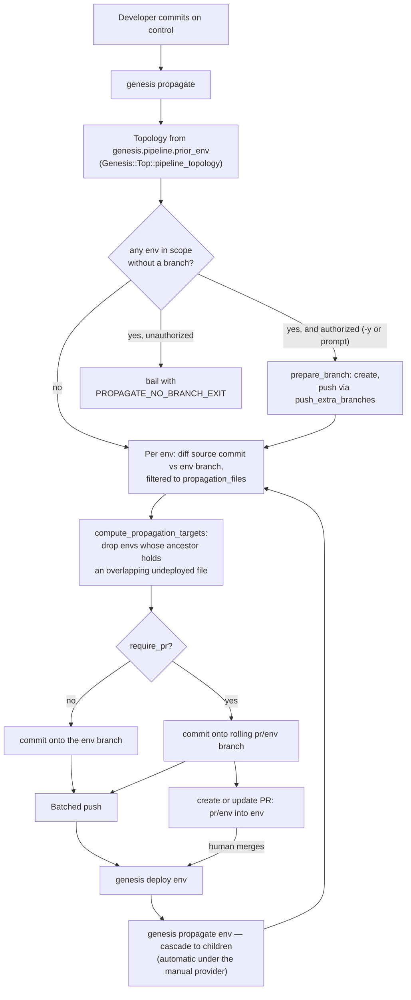
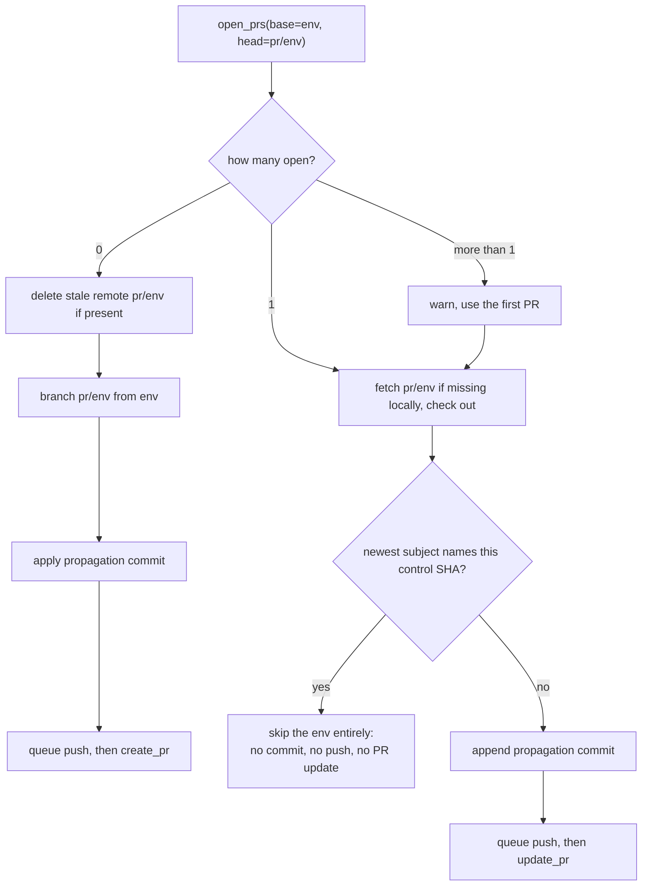
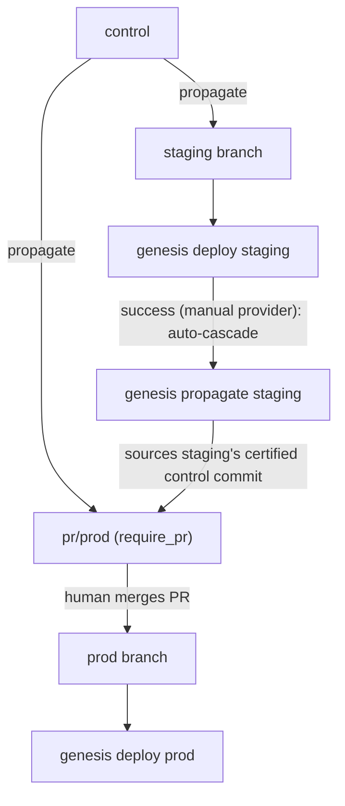

# Branch-Based Pipeline Architecture

**Status:** Partially implemented — see Implementation Status
**Last Updated:** 2026-08-28

---

## Overview

This document defines the branch-based pipeline architecture that replaces the cache-based system. Changes originate on a `control` branch and propagate to environment-specific branches.

### Goals

- Simplify recovery from failed deployments
- Unify CLI and pipeline deployment behavior
- Enable git-native access controls and audit trails
- Preserve layout/trigger semantics from current system

### Implementation Status

Parts of this document described a design that was never built, and the built design differs in ways that matter. This table is the map; the sections below carry the detail. "Superseded" means the design in this document was replaced by something else that shipped; "not built" means nothing took its place.

| Concept | State | Where it lives |
|---------|-------|----------------|
| `control` branch | Implemented | `Genesis::Top::DEFAULT_CONTROL_BRANCH` |
| Environment branches, named `<env>` | Implemented | `Genesis::Env::prepare_branch` |
| Explicit branch creation and reconciliation | Implemented | `genesis pipeline-prepare` → `Genesis::Commands::Pipelines::pipeline_prepare` |
| Branch creation during propagation | Implemented, authorized per run | `Genesis::Commands::Pipelines::_authorize_branch_creation`, `_create_missing_branches` |
| Single topology source | Implemented | `Genesis::Top::pipeline_topology` |
| Propagation planning (entry points) | Implemented | `Genesis::CI::Propagation::compute_propagation_targets` |
| Propagation execution | Implemented | `Genesis::CI::Propagation::propagate_envs` |
| PR-gated propagation (`require_pr`) | Implemented, GitHub only | `Genesis::CI::Propagation::_propagate_one_pr_env` |
| Cascade after deploy | Implemented (manual provider) | `Genesis::Env::_post_deploy`, `genesis propagate <env>` |
| Deploy-manifest trigger guard | Implemented | `ignore_paths` on the env-branch resource, `PipelineDescriptor::_env_resources` |
| Manifest-store / provider warning | Implemented | `Genesis::CI::Compiler::Validator::_validate_manifest_store` |
| `kickoff` dispatch branch | **Superseded** — propagation goes control → env branches directly | nothing |
| Sequence tags (`push-<n>`) and hybrid tags | **Not built** — ordering comes from the deploy-certified control commit | nothing |
| Sidecar files | **Not built** | nothing |
| `genesis push` | **Not built** — `genesis propagate` is the entry point | nothing |
| `pipeline.mode: branch` / `pipeline.branches:` in `ci.yml` | **Superseded** — config moved to `.genesis/config` and per-env `genesis.pipeline.*` | `.genesis/config`, env YAML |
| Concourse-driven propagation | **Not wired** — only the manual provider drives propagation today | see Open Questions |

### Non-Goals

- <!-- TBD -->

### Out of Scope

#### Dev Kits (`dev/` directory)

Dev kits (unpacked kits in the `dev/` directory) were never intended for pipeline use but were not explicitly blocked. The legacy cache system did not manage `dev/` contents, meaning changes would deploy immediately to any environment using a dev kit without propagating through predecessor environments.

**Updated 2026-08-28.** The implementation no longer ignores `dev/`. `Genesis::Env::propagation_files` returns the path `dev/` for any environment whose kit `is_dev`, so a dev kit is treated as an ordinary dependency path: changes under `dev/` are diffed and propagated like any other file. The environment does not bypass propagation ordering any more.

What remains out of scope is anything finer-grained than the whole directory. `dev/` propagates as a single path, so every environment on a dev kit receives every dev-kit change, whether or not it uses the changed part.

---

## Terms

| Term | Definition |
|------|------------|
| **Repository** | A git-based hierarchical structure containing versioned files across multiple branches. Branches share a common base but may diverge in content. All changes are tracked in version history. |
| **`control` branch** | The primary branch for the standard workflow. Developers commit changes here. Changes do not propagate on commit — propagation is an explicit act (`genesis propagate`, or the automatic cascade a manual-provider deploy runs on success). Named `control`; treat that as fixed. |
| **Environment Branch** | A branch named exactly for the environment (`staging`, `c-aws-prod`), containing only the files that environment depends on. Created and reconciled by `Genesis::Env::prepare_branch`, which `genesis new`, `genesis pipeline-prepare`, and an authorized `genesis propagate` all call. Cut from `control`, so it does share ancestry with it, but it is never merged back. |
| **Propagation Set** | The git-root-relative paths an environment depends on, from `Genesis::Env::propagation_files`. This is what gets diffed and what gets copied. See "Propagation Set" below. |
| **Ancestral File** | A YAML file whose name is a prefix of an environment's name, based on hyphen-delimited segments. For environment `c-aws-east-prod`, ancestral files include `c.yml`, `c-aws.yml`, and `c-aws-east.yml`. Typically lacks a `genesis.env` key, making it a configuration fragment rather than a deployable environment. Ancestral files are shared across all environments matching their prefix and appear in the propagation set of every environment that inherits them. Ancestry does not require saturation—intermediate files may be absent. Using a deployable environment as an ancestor of another is possible but discouraged. |
| **Ops File** | A manifest fragment in the `ops/` directory that extends or customizes kit behavior. Referenced via the `kit.features` array in environment files. May be shared across environments or environment-specific. Unlike ancestral files, ops file applicability is explicit—determined by which environments reference them, not by naming convention. |
| **Included File** | A file explicitly inherited via the `genesis.inherits` key in an environment file. Provides direct inheritance independent of hyphen-based naming conventions. Allows environments to share configuration without requiring a common name prefix. |
| **Env DAG** | The deployment topology, built from per-environment `genesis.pipeline.prior_env` keys by `Genesis::CI::Compiler::ASTBuilder::_build_from_env_files` and reached by every pipeline command through the single accessor `Genesis::Top::pipeline_topology`. Each environment has at most one parent and any number of children. This — not `ci.yml` layouts — is what propagation walks. See "Topology source". |
| **Layout** | A deployment progression plan defined in legacy `ci.yml` under `pipeline.layout` or `pipeline.layouts`, using arrow notation (`->`) and the `auto <pattern>` directive. Still parsed by the compiler for legacy configs, but propagation does not read it; the env DAG replaced it for that purpose. |
| **Propagation** | Copying changed files from a control commit onto the environment branches that depend on them, one commit per environment, subject `[pipeline] control@<short-sha> -> <env>`. |
| **Entry point** | An environment that receives a propagation event directly, rather than waiting for it to cascade down from its parent. Computed by `compute_propagation_targets`. |
| **Cascade** | `genesis propagate <env>`, which scopes propagation to `<env>`'s descendants and sources files from the control commit that `<env>`'s last successful deployment certified. |
| **Certified control commit** | `git.control_commit` in an environment's latest successful exodus deployment record — the control SHA that was actually deployed. This, not a tag, is what orders the pipeline. |
| **Propagation marker** | The `[pipeline] control@<sha>` string in an environment branch commit subject. Load-bearing: it is parsed to find the last propagated control SHA, to derive a deploy reason, and to decide PR idempotency. |
| **`require_pr`** | Per-environment flag (`genesis.pipeline.require_pr`) that routes propagation through a rolling `pr/<env>` branch and a pull request instead of committing straight to `<env>`. |
| **Rolling `pr/<env>` branch** | The branch a `require_pr` environment's propagations accumulate on while its pull request stays open. Not per-propagation — one branch, many commits, one PR. |
| **Trigger** | <!-- TBD --> |
| **Cache** | <!-- TBD: Legacy term, define for contrast --> |

### Superseded terms

These appeared in earlier drafts and have no counterpart in the implementation. Retained so the reasoning trail survives.

| Term | Original definition | Status |
|------|--------------------|--------|
| **`kickoff` branch** | A pipeline-controlled branch mirroring `control` up to the latest pushed tag, serving as the dispatch point to environment branches. | Superseded 2026-08-28. Never built; `grep -rn kickoff lib/` returns nothing. Propagation reads directly from a control commit. |
| **Sidecar** | A tag reference to files destined for downstream environments, pulled from `kickoff` when the pipeline progressed rather than committed to intermediate branches. | Not built. Downstream delivery is instead a fresh diff against the certified control commit at cascade time. |
| **Sequence tag** | Monotonically increasing `push-<n>` tags providing ordering for conflict resolution. | Not built. See "Ordering without sequence tags". |

---

## Branch Structure

### The `control` Branch

**Role:** Active development branch where changes are built out iteratively. Developers may rebase to reorder commits as needed before propagating.

**Naming:** `control`, per `Genesis::Top::DEFAULT_CONTROL_BRANCH`. Treat this
as fixed. A `ci.control_branch` config key exists in the code as an escape
valve, but it is deliberately unpublished and unsupported: it is not
exposed as a CLI option, and the propagation commands do not read it (see
Open Questions). Repositories should not set it.

**Contents:**
- All environment YAML files (ancestral and environment-specific)
- `ops/` directory
- `bin/` directory
- `kit-overrides.yml`
- `.genesis/` directory (config, embedded genesis, compiled kits)

**Access:** Writable by developers

**Trigger behavior:** Commits do NOT propagate on their own. Propagation happens when someone runs `genesis propagate`, or automatically after a successful deploy under the manual provider.

**Enforcement:** `genesis propagate` bails unless the working tree is on the control branch and clean — including under `--dry-run`, because uncommitted edits to environment files would make a dry run misrepresent what a real run would do. `genesis pipeline-prepare` enforces the same two conditions, for a different reason: it copies files into each environment branch out of the current branch's HEAD, so the current branch has to be the one those branches are meant to follow. `genesis new` likewise refuses to create an environment from anywhere but control, so the topology stays visible to pipeline tooling.

### The `kickoff` Branch (superseded)

> **Superseded 2026-08-28.** The `kickoff` branch was never implemented and nothing replaced it. Propagation reads files out of a control commit (`git checkout <control-sha> -- <path>`) and commits them onto environment branches; there is no intermediate branch and no service-account-only write gate. The original text follows for the reasoning trail.
>
> **Role:** Pipeline-controlled dispatch point. Mirrors `control` up to the latest pushed tag. Serves as the source for routing files to environment branches.
>
> **Naming:** Configurable, defaults to `kickoff`
>
> **Contents:** Full copy of `control` at the tagged commit
>
> **Access:** Writable only by pipeline service account (break-glass exception for emergencies)
>
> **Ancestry:** Shares git ancestry with `control`
>
> The access-control goal this branch existed to serve is currently met by branch protection on the environment branches plus `require_pr`, not by a separate dispatch branch. Whether that is sufficient is an open question.

### Sequence Tags (not built)

> **Superseded 2026-08-28.** No sequence tags, no hybrid tags, no `genesis push`. See "Ordering without sequence tags" for what the implementation does instead. Original text retained:
>
> **Purpose:** Provide ordering for conflict resolution when fast-path commits overtake slow-path commits.
>
> **Format:** Monotonically increasing integers (1, 2, 3, ...)
>
> **Problem solved:**
> ```
> Tag #n:   changes go test → staging → prod  (slow path)
> Tag #n+1: changes go directly to prod       (fast path)
>
> #n+1 arrives at prod before #n
> When #n reaches prod, pipeline must not rollback #n+1's overlapping changes
> Sequence numbers enable this comparison
> ```
>
> **Created by:** `genesis push [<commit>]` command
>
> **Annotation:** Markdown-formatted comment including Mermaid diagram of planned file flow

### Environment Branches

**Role:** Deployable state for a specific environment. Contains only the files that environment depends on.

**Naming:** The environment name itself — `staging`, `c-aws-prod`. Not namespaced. The earlier `pipeline/<env>` and `<ci-provider>/<env>` proposals were not adopted; `genesis deploy <env>` checks out the branch named `<env>`, and `Genesis::Env::prepare_branch` creates it under that name.

The one namespaced branch in the system is `pr/<env>`, used only for `require_pr` environments.

**Ancestry:** Cut from `control` at the point the environment was created, so it shares ancestry with `control`. It is never merged back into `control`, and files arrive on it by copy-and-commit, not by merge.

**Contents:** Exactly the propagation set (see below), plus anything already on the branch that `prepare_branch` declines to touch: files under `.genesis/`, and files outside the deployment's git prefix in multi-deployment repositories.

**Creation:** three commands create environment branches, all of them through `Genesis::Env::prepare_branch`, which creates the branch if absent and reconciles its contents — adding the files this environment needs, pruning files it does not, and recording a seed commit even when nothing changed so the branch has a propagation anchor.

| Entry point | When it creates |
|-------------|-----------------|
| `genesis new <env>` | Always, as the last step of creating the environment. Commits the new environment file to control first, then prepares the branch |
| `genesis pipeline-prepare` | Always. Every environment in the topology, or just one with `genesis <env> pipeline-prepare`. This is the command for an environment that already exists on control but whose branch does not |
| `genesis propagate` | Only when authorized — `-y`/`--yes`, or an answered prompt. See "Missing branches during propagation" |

**Local absence is not absence.** `prepare_branch` asks `Service::Git::resolve_branch` where the branch stands before doing anything, and gets one of four answers: `local` (present here), `fetched` (the remote had it, so it was pulled rather than forked), `absent` (neither has it — create), or `unverifiable` (`--no-fetch`, so the remote could not be consulted). A branch that exists on the remote but not in this clone is the ordinary CI case, where the checkout holds only the control branch; creating it off local HEAD would fork it from the real branch and the subsequent push would either be rejected or overwrite the anchor propagation certifies against. Under `unverifiable`, `pipeline-prepare` skips the environment, warns, and tells the operator to re-run without `--no-fetch`. `--no-fetch` therefore means *offline*, not *unguarded*.

`pipeline-status` still reports an environment with no branch as `not propagated` (internal status `no-branch`), with dashes for both SHA columns.

> **Superseded 2026-08-28.** An earlier revision of this document stated that "`genesis propagate` never creates environment branches. It skips any environment whose branch does not exist." Neither clause holds on this branch, and `genesis pipeline-prepare` did not exist when that sentence was written. Skipping is precisely what the missing-branch guard was added to end: an absent branch and a branch with no pending changes produce the same empty diff, so a repository whose branches were never created reported "nothing to propagate" and exited successfully having done nothing. Propagation now bails on a missing branch, or creates it when authorized. (The same sentence's claim about `pipeline-status` was and remains correct, and is restated above.)

---

## Propagation Set

What travels with an environment, from `Genesis::Env::propagation_files`. Paths are git-root-relative.

| Source | Paths |
|--------|-------|
| Environment file hierarchy | Every file from `actual_environment_files` — the environment's own YAML, its hyphen-ancestors, and anything reached via `genesis.inherits` |
| Kit | The compiled kit tarball for a released kit, or the whole `dev/` directory for a dev kit |
| Repo config | `.genesis/config` |
| Reaction scripts | `bin/<script>` for every script named under `genesis.reactions` |
| Explicit extras | `genesis.pipeline.required_files`, which supports globs and an `<env>` placeholder, and rejects absolute, `~`, or `..` paths |

Two consequences worth stating plainly:

- **Ops files are not enumerated separately.** They arrive because the merged environment definition references them and `actual_environment_files` resolves them, not because `ops/` is special-cased.
- **The embedded Genesis binary is not propagated.** `.genesis/bin/genesis` is not in the propagation set, and `prepare_branch` explicitly refuses to prune anything under `.genesis/`. Whatever binary an environment branch has, it keeps, until someone puts a different one there. This differs from the earlier design, which routed `.genesis/bin/genesis` to all environments.

### The `genesis yamls` approach (superseded)

> **Superseded 2026-08-28.** An earlier draft proposed determining applicability by merging ancestry with `genesis yamls --no-kit <env>` and reading `genesis.inherits` and `kit.features` out of the flattened YAML. The implementation instead asks the loaded `Genesis::Env` object directly via `propagation_files`, which reuses the same file-resolution machinery the deploy path uses. The distinction matters mainly because the answer now comes from a live environment load, so an environment that fails to load produces no propagation set at all rather than a wrong one — `propagate` skips it, and `pipeline-status` shows a `load error` row with the reason.

BOSH config files (under `ops/` but not manifest ops files) remain unresolved — see Open Questions.

### Break-Glass Direct Edits

In emergency scenarios, files (including `.genesis/bin/genesis`) can be modified directly on environment branches. Nothing prevents this; propagation will overwrite such an edit the next time it copies that file from control, and will not notice it otherwise. `_resolve_propagation_base` warns when an environment branch has commits on top of its most recent propagation marker, which is the signal that a manual edit happened.

---

## Propagation Flow

### Overview

Propagation is one stage, not two. A run of `genesis propagate`:

1. **Reads the topology** from the environment files on control (`genesis.pipeline.prior_env`) via `Genesis::Top::pipeline_topology`, giving a DAG, a parent map, and a stable order.
2. **Fetches** every environment branch in one round-trip, so diffs see teammate commits (`--no-fetch` skips this). A branch the remote does not have is reported, not raised — an unprepared environment has to reach the missing-branch guard below rather than dying on a raw git error first.
3. **Resolves the source control commit** — control HEAD for a root run, the certified control commit of the named environment for a cascade run, or `--commit` if given.
4. **Handles missing branches** — any environment in scope without a branch is either created (with authorization) or the run refuses. See "Missing branches during propagation".
5. **Diffs, per environment**, that control commit against the environment branch, filtered to the environment's propagation set. Also computes an undeployed set: the diff between the environment's certified control commit and the source commit.
6. **Picks entry points** with `compute_propagation_targets`: an environment is an entry point when its diff is non-empty and none of those files overlap an ancestor's undeployed set. Everything else waits for the cascade.
7. **Executes** with `propagate_envs`: per environment, a direct commit onto `<env>` or a commit onto the rolling `pr/<env>` branch, then one batched push, then the PR API calls. Branches created in step 4 are added to the batched push explicitly, because a freshly seeded branch has no propagation commit and would otherwise stay local.
8. **Deploys** happen separately. Under the manual provider, a successful deploy runs `genesis propagate <env>` automatically, which is what moves the change down one level.



### Missing branches during propagation

An environment in scope with no branch is a broken topology, not an environment with nothing to do — and the per-environment diff cannot tell the two apart, since `git diff <env-branch>..<sha>` against an absent branch yields nothing. `_missing_env_branches` finds them before the diff loop runs, and `_authorize_branch_creation` decides what happens next:

| Situation | Outcome |
|-----------|---------|
| `-y`/`--yes` given | Creates the branches without asking |
| Interactive terminal, no `-y` | Names every missing environment, then asks once for the whole set. Declining bails with "Aborted - no branches were created." |
| No controlling terminal, no `-y` | Refuses, naming both `genesis pipeline-prepare` (or `genesis <env> pipeline-prepare` when exactly one is missing) and `-y` |

Two properties of that refusal are load-bearing:

- **It names a remedy, not just a complaint.** The message carries the environment list, the reason an absent branch cannot be distinguished from an unchanged one, and both ways forward.
- **It exits with `Genesis::Top::PROPAGATE_NO_BRANCH_EXIT` (9)**, not 1, so a deploy running propagate as a subprocess can tell "refused, and here is the one-command fix" apart from "propagation actually broke". `Genesis::Env::_post_deploy` branches on exactly that code.

Creation is opted into rather than assumed because it is incidental to what propagate is for: moving files between branches that already exist. Branch creation is a repair propagate happens to be positioned to perform, and doing it unattended is the kind of silent change that is hard to notice afterwards. `genesis pipeline-prepare` remains the deliberate path; `-y` is the shortcut for an operator who is already standing here.

A created branch is seeded from control by `prepare_branch`, so its propagation diff is empty and it never becomes a propagation target in the same run. It is pushed via `push_extra_branches` instead.

Two details of propagate's creation path differ from `pipeline-prepare`'s, both because `_create_missing_branches` calls `prepare_branch` without passing `no_fetch` and without reading its third return value:

- `--no-fetch` suppresses the bulk env-branch fetch, but the per-branch `resolve_branch` inside `prepare_branch` still consults the remote, so a branch that exists remotely is fetched rather than forked even on a `--no-fetch` run.
- The run reports every such branch as `created`. `pipeline-prepare` distinguishes `created` from `fetched` in its output; propagate does not.

### Two diffs, not one

The signature of `compute_propagation_targets` takes `env_changed` and `env_undeployed` separately, and conflating them is the mistake it is shaped to prevent.

- `env_changed` asks *what is on control that this environment's branch lacks*. It drives what gets copied.
- `env_undeployed` asks *what has this environment not yet deployed*. Its branch may already carry a file while exodus still records an older control commit. It identifies an ancestor sitting on an in-flight propagation.

A file must not cascade past an ancestor that has received it but not yet deployed it, or commits stop travelling as a unit. When exodus has no record — no deploy history, vault down, pre-pipeline deploy — the undeployed set falls back to the environment's own pending set, which blocks descendants rather than letting them run ahead of state nobody can verify.

This filter also does structural work downstream: by the time a propagation reaches a rolling `pr/<env>` branch, it touches files disjoint from anything already queued there, which is why the fast-forward-only push (see Limitations) has held up in practice.

### Root propagation versus cascade

`genesis propagate` with no argument is a **root** run. Scope is the whole DAG, and the source is control HEAD, so freshly committed changes reach the first tier immediately.

`genesis propagate <env>` is a **cascade** run. Scope is `<env>`'s descendants, and the source is `<env>`'s last successful deployment's `git.control_commit` — the control state that was *certified* at that ancestor, not whatever is on control now. That is what keeps a change travelling as a unit while control keeps advancing.

Cascade runs carry extra guards:

- The named environment must have been propagated to at least once, and must have a successful deployment with a `git.control_commit` recorded. Without one, propagation bails rather than guessing. `--commit` overrides the source and skips the certification check.
- An environment already at or ahead of the cascade source is skipped and reported as such, instead of being rolled back to an older commit.
- Vault being unavailable downgrades the deployment check to a warning, since the certification cannot be read either way.

### Ordering without sequence tags

The earlier design solved fast-path/slow-path ordering with monotonic `push-<n>` tags and hybrid `push-34+33` tags. The implementation does not have them. Ordering falls out of three other mechanisms:

- **The certified control commit.** A cascade sources from what the ancestor actually deployed, so a slow-path change cannot arrive downstream carrying a control state the ancestor never ran.
- **The ancestor-overlap filter.** A change cannot enter at a descendant while an ancestor is still sitting on an overlapping undeployed change.
- **The at-or-ahead skip.** A cascade that would regress an environment to an older control commit is dropped, and named in the run summary.

What is lost relative to the tag design is the audit artifact: there is no per-event record of *what was deliberately omitted and why*. The propagation commit subject names the source control SHA, and the diff shows what was applied, but an environment that was skipped leaves a line in terminal output and nothing in git. Whether that matters enough to reintroduce something tag-like is an open question.

### Superseded: two-stage dispatch

> **Superseded 2026-08-28.** The staged `control → kickoff → env` flow below was never implemented. Retained for the reasoning trail; read it as the design that the single-stage flow above replaced.
>
> Propagation is a multi-stage process:
>
> 1. **Developer triggers** `genesis push` on `control`
> 2. **Tag created** with sequence number and file flow annotation
> 3. **Pipeline job** detects new tag
> 4. **`kickoff` updated** (push or PR based on config)
> 5. **File analysis** determines routing to env branches
> 6. **Env branches updated** with applicable files
> 7. **Deployments triggered** per layout rules
>
> **Stage 1: Control → Kickoff** — the developer runs `genesis push`, a sequence tag is created on control annotated with a file-flow diagram, a pipeline job picks up the tag, and depending on the configured kickoff mode either pushes the tagged commit to `kickoff` (`auto`) or opens a PR against `kickoff` for a human to review and merge (`manual`).
>
> **Stage 2: Kickoff → Environment Branches** — the pipeline analyzes changed files, classifies each, determines target branches, and for each: creates the branch if missing, or compares sequence numbers and skips when newer changes are already present.
>
> **Kickoff Modes**
>
> | Mode | Behavior | Use Case |
> |------|----------|----------|
> | `auto` | Direct push to `kickoff` on tag | Trusted CI/CD, automated pipelines |
> | `manual` | Create PR against `kickoff` | Change review required, audit trail |
>
> The review-gate intent of `manual` mode survives, but as a per-environment property (`require_pr`) applied at the environment branch rather than a repository-wide property applied at a dispatch branch. That is a meaningful change: review now gates entry to a specific environment, so `prod` can require a PR while `sandbox` does not, which the single-dispatch-branch design could not express.

### Superseded: sequence number conflict resolution

> **Superseded 2026-08-28.** Hybrid tags were never built. Original text:
>
> The sequence tag is propagated to each env branch as part of the pipeline job. When an earlier-numbered tag arrives after a later-numbered tag (due to different routing paths), the pipeline creates a hybrid tag.
>
> ```
> Tag #33: changes route through test → staging → prod (slow path)
> Tag #34: changes route directly to prod (fast path)
>
> Timeline on pipeline/prod:
>   1. #34 arrives first (fast path)  → branch tagged: push-34
>   2. #33 arrives later (slow path)  → branch tagged: push-34+33
> ```
>
> **Hybrid tag format:** `push-<latest>+<merged>` (e.g., `push-34+33`), with a commit message listing which files were applied from the incoming tag and which were omitted because a newer version was already present.

### Superseded: sidecar files

> **Superseded 2026-08-28.** Sidecars were never built. The scenario they addressed — a downstream file superseded while in transit — is handled instead by re-diffing at cascade time: a cascade computes a fresh diff between the certified control commit and the environment branch, so a file that a later control commit changed is delivered in its later form, and an environment already ahead of the cascade source is skipped entirely. Original text:
>
> Files destined for downstream environments are referenced via the push tag but NOT committed to intermediate branches. The propagation tool analyzes the push tag to determine which files apply where, commits only applicable files to each env branch, records the tag reference (the "sidecar") for downstream files, and pulls them from `kickoff` at the tagged commit when the pipeline progresses.
>
> **Key point:** Env branches never contain files that don't apply to them. The canonical source for any file is always `kickoff` at the relevant tag.
>
> **Design principle:** When a sidecar file has been superseded by a later tag, skip it. The env branch should reflect what's CURRENTLY in `control`, not what was in an older tag. User reconciles via new push if needed.
>
> That design principle survived the implementation change; only the mechanism differs.

---

## PR-Based Propagation

An environment with `genesis.pipeline.require_pr: true` does not receive commits on its own branch. Its propagations land on a rolling `pr/<env>` branch, and a pull request from `pr/<env>` into `<env>` is opened or updated. Merging the PR is what puts the change on the environment branch, which is what makes it deployable.

`require_pr` is set per environment, at `genesis new` time (interactively, or with `--require-pr`), and lives in the environment's own YAML under `genesis.pipeline`.

### Why the branch rolls

One branch, many propagations, one PR. A `pr/<env>` branch is not created per propagation event — it persists as long as its PR is open and accumulates a commit per propagation. The pull request body is deliberately generic (it points at the commit history) because it cannot enumerate propagations it does not yet know about.

The tradeoff is that a reviewer approving a PR may be approving more than they last looked at. Each commit subject names its source control SHA, so the history is readable, but the PR title and body do not change as commits accumulate.

### The decision tree

Open pull requests are the authority on state, not branch presence. `propagate_envs` queries `open_prs(base => <env>, head => pr/<env>)` and branches on the count:



The count > 1 case is unreachable in practice — GitHub enforces uniqueness of (head, base) for open PRs — but it is handled rather than assumed away.

Deleting a stale remote `pr/<env>` in the count-0 case matters: a previous PR may have been closed without merging, leaving the branch behind. Branching from `<env>` on top of that stale branch would carry rejected commits back into a new PR.

### Idempotency

`_pr_branch_has_control_sha` inspects the newest commit subject on the branch and returns true when it matches `[pipeline] control@<short-sha>` for the control SHA being propagated. When it does, the environment is skipped whole: no commit, no push, no PR update. It still counts as propagated in the result, and is listed under `skipped_idempotent`.

This is what makes re-running `genesis propagate` after a successful run a no-op rather than a source of duplicate commits.

The check is deliberately shallow — newest commit only. A propagation for this SHA buried under a later commit is not detected and the environment is propagated again. The commit-subject format is therefore load-bearing: `_apply_propagation_commit` writes it and `_pr_branch_has_control_sha` parses it, and the match is word-boundary anchored so a shorter SHA cannot match a longer one.

### Push and PR control

Pushing direct commits and pushing PR branches are separately controlled, because the two callers need different combinations:

| Flag | Default | Meaning |
|------|---------|---------|
| `push_direct_commits` | 1 | Queue direct-to-`<env>` commits for the batched push |
| `push_pr_branches` | 1 | Queue `pr/<env>` branches for the batched push |
| `create_prs` | 1 | Call `create_pr` / `update_pr` |
| `no_push` | 0 | Master kill switch — forces all three to 0 |
| `dry_run` | 0 | Report only; no git, no API |
| `push_extra_branches` | `[]` | Extra branches to include in the batched push |

The manual provider (the `genesis propagate` command) passes `push_direct_commits => 1` and `push_extra_branches => [control]`, so new control commits land on the remote alongside the propagated branches. The intended Concourse shape sets `push_direct_commits => 0`, because a concourse `put` on the environment's git resource is what lands direct-mode commits — but `push_pr_branches` stays 1 there, because concourse has no resource for creating GitHub pull requests, so those must go through Genesis either way. That Concourse wiring is not landed; see Open Questions.

Pushes are batched into a single `git push` at the end of the run, and PR API calls happen after that. If any environment failed, both blocks are skipped entirely — a partial remote state is worse than none. The command bails on a non-empty error list; the module itself collects errors and returns them rather than bailing, so other callers can decide.

`--no-push` currently still permits read-only network calls: `open_prs` queries the API and `fetch_branch` contacts the remote. Local `pr/<env>` branches are left with the commit applied, so mixing `--no-push` runs with normal runs can require manual local cleanup.

### Preconditions

For any `require_pr` environment that is an entry point in a non-dry run:

- The origin remote must parse to a GitHub `owner/repo`.
- Unless `--no-push`, `GITHUB_AUTH_TOKEN` must be set and must authenticate; the token is validated against the API before any branch is touched.

### Limitations

- **GitHub only.** PR lookup, creation, and update go through `Service::Github`. GitLab, Bitbucket, and Gitea are not supported. Adding a forge means a parallel service with the same `open_prs` / `create_pr` / `update_pr` surface plus a dispatch layer in `propagate_envs`.
- **Single working tree.** `propagate_envs` assumes one `Service::Git` handle in which every target branch can be checked out. That is the manual-mode shape. The one-workspace-per-branch shape a CI job would want is not wired; the interface is stable for it, only the caller layer changes.
- **Fast-forward-only push.** Appending to an existing `pr/<env>` is pushed with a plain `git push`. A non-fast-forward remote makes the push fail and the environment is reported in errors. The cherry-pick-and-force-push recovery path is deferred, on the reasoning that the ancestor-overlap filter keeps a fresh propagation disjoint from what is already queued. If the case proves reachable, the recovery path gets built; until then the failure surfaces rather than being papered over.
- **Manifest store.** With `manifest_store` set to `repository` or `hybrid`, the post-deploy manifest writer expects to push to `<env>` — which `require_pr` propagation does not write to. No resolution is settled. Configure `manifest_store: exodus` on `require_pr` environments until one is. The compiler now warns about that pairing (see "Compile-time validation"), but only repository-wide: `manifest_store` is a `.genesis/config` key while `require_pr` is per environment, so the check cannot tell a PR-gated environment from an ordinary one and does not settle this.

### Per-Environment Override

The earlier sketch put this in `ci.yml`:

```yaml
pipeline:
  branches:
    propagation: push  # default
    prod:
      propagation: pr  # override for prod
```

**Superseded 2026-08-28.** There is no repository-wide propagation mode and no per-environment override of one. The flag lives in each environment's own file, which is also where the topology lives:

```yaml
genesis:
  env: c-aws-prod
  pipeline:
    prior_env:    c-aws-staging
    require_pr:   true
    manual:       true
```

---

## Deployment Triggers

### Topology source

The env DAG comes from `genesis.pipeline.prior_env` in the environment files, not from `ci.yml` layouts. `_build_from_env_files` scans the environment YAMLs, makes a node per valid environment (including ones with no `genesis.pipeline` block at all, so entry points appear), and adds a `prior_env -> env` edge wherever `prior_env` names another environment present on disk.

**One accessor, not several.** `Genesis::Top::pipeline_topology` is the single entry point onto that DAG, returning `nodes`, `edges`, `children`, `parent_of`, and a stable breadth-first `order`. `propagate`, `pipeline-status`, `pipeline-prepare`, and `pipeline-graph` all read it; none of them collects edges or computes an ordering of its own. `Genesis::Top::pipeline_env_names` is a wrapper over the same call, so "which environments are in this pipeline" has one answer rather than two that happened to agree.

Membership is every environment `has_env` accepts, with or without a `genesis.pipeline` block — such an environment still has a branch, still appears in `pipeline-status`, and still needs preparing. Every field comes back empty when CI is not configured, so callers iterate without a guard and decide for themselves whether an empty pipeline is fatal (`propagate` and `pipeline-status` bail; `pipeline-prepare` reports that there is nothing to prepare).

Legacy `ci.yml` layouts are still parsed by the compiler for legacy configurations, and the arrow/`auto` DSL below still describes them, but propagation does not consult them.

```
auto *-sandbox
sandbox -> preprod -> prod
```

### Trigger Flow



### What the emitted pipeline watches

`PipelineDescriptor::_env_resources` gives each environment one git resource, `<alias>-branch`, tracking the branch named `<env>`. There is no path filtering on it: under branch propagation the branch *is* the change signal, since anything that reaches it is by definition intended for that environment. This resource replaced both the path-filtered changes resource and the cache resource that used to carry an upstream environment's files inside the control branch.

It does carry one exclusion:

```yaml
ignore_paths: [".genesis/manifests/*"]     # prefixed with source_control.root when set
```

A deploy commits its manifests to the environment branch — which is the branch its own job triggers on, so the commit starts the job again. `ignore_paths` breaks that loop.

It is emitted unconditionally rather than gated on `manifest_store`. Under `exodus` nothing writes there and the exclusion costs nothing; under `hybrid` and `repository` the writes do happen, and those are exactly the configurations that need the guard. Gating would remove the defence from the two stores that need it, and from any later regression that reintroduces git writes.

**This is a loop-breaker, not a resolution.** Ignoring the path stops a deploy retriggering itself, but the deploy is still a git writer on a branch that propagation also advances — two writers on one branch. Only `manifest_store: exodus` removes the second writer, by making the deploy stop writing to the repository at all. `Genesis::CI::Compiler::Validator::_validate_manifest_store` warns about that pairing; see "Compile-time validation".

### Per-environment flags

| Flag | Effect today |
|------|--------------|
| `require_pr` | Routes propagation through `pr/<env>` and a PR. Surfaces as a `PR` label in the Mermaid graph, a `require_pr` flag in `pipeline-describe`, and `[PR required]` / `[PR #n open]` in `pipeline-status`. |
| `manual` | Surfaces as a `MANUAL` label in the Mermaid graph and a `manual` flag in `pipeline-describe`. |
| `redeploy` | `manual`, `cron`, or `signal`; surfaces as a `REDEPLOY` label. |

Note what is *not* in that table: `require_pr` and `manual` do not currently change the emitted Concourse pipeline beyond the graph label. `PipelineDescriptor` reads both only in `_mermaid_node_def`. Whether the emitted pipeline should gate on them is an open question.

---

## Deployment Execution

### `genesis deploy <env>` in a CI-configured repo

When `ci.enabled` and a provider type are set, deploy does more than deploy:

1. **Fetches** all pipeline environment branches in one round-trip (`--no-fetch` skips).
2. **Switches** to the branch named for the environment, refusing to move with a dirty tree and bailing if the branch does not exist. All preflight work then runs against the right branch rather than whatever the operator happened to be on. Note that deploy's missing-branch bail still directs the operator to `genesis new <env>`, unlike propagate's, which now names `pipeline-prepare` — see Open Questions.
3. **Pulls** that branch fast-forward-only from the remote.
4. **Asserts the prior-environment invariant** — if the environment declares a `prior_env`, that predecessor must have deployed successfully at least once. This has no `--yes` override.
5. **Warns on manual deploys** of a pipeline-managed environment under a non-manual provider, and prompts for confirmation. Skipped under the manual provider, where the operator *is* the pipeline.
6. **`--pull`** (implied by `-F`/`--fix-checks`, opt out with `--no-pull`) propagates onto this environment's branch before deploying, sourced from `prior_env`'s last successful `git.control_commit`, or control HEAD for an entry point. It is a no-op when the branch is already current.
7. **Derives a reason** from the `[pipeline] control@<sha>` markers in the branch's commit range when `--reason` is not given, using the control commit subjects.
8. **Records git context in exodus**: `git.branch`, `git.commit`, and `git.control_commit`. The control commit is read from the most recent propagation marker in the last 20 subjects, falling back to the control branch's SHA for entry points, which never receive markers.
9. **Commits and pushes deploy artifacts** to the environment branch when `manifest_store` writes to the repository, rebasing onto the remote first.
10. **Cascades** — under the manual provider only, and unless `--no-propagate`, checks out control and runs `genesis propagate <env>` after success. Failure there warns and tells the operator to retry; it does not fail the deploy, which already succeeded.

#### How the cascade runs its propagate child

Three details of that subprocess matter, all of them about propagation staying a side effect rather than becoming an interruption:

- **Stdin comes from `/dev/null`.** The child inherits the deploy's terminal, so it could otherwise stop and ask the operator about a downstream branch mid-deploy. Cut off from stdin, `in_controlling_terminal` fails and propagate takes its non-interactive path.
- **`-F`/`--fix-checks` on the deploy adds `-y` to the child**, authorizing branch creation during the cascade. Deliberately not `--yes`: on a deploy, `-y` means "don't ask about this deployment", not "create branches on my behalf". `-F` is the flag for repairing secondary issues, which is what creating a downstream branch is.
- **A refusal is reported, not leaked as a number.** When the child exits with `PROPAGATE_NO_BRANCH_EXIT`, the operator is told the deployment succeeded and is complete, that nothing propagated, and how to proceed — `genesis pipeline-prepare`, or redeploy with `-F`. Any other non-zero exit gets the generic "propagation failed, deploy succeeded, retry manually" warning.

### Safeguards

| Scenario | Behavior |
|----------|----------|
| `genesis propagate` from a non-control branch | Bails |
| `genesis propagate` with uncommitted changes | Bails, including under `--dry-run` |
| `genesis pipeline-prepare` from a non-control branch, or with uncommitted changes | Bails; it copies files out of the current branch's HEAD, so that branch has to be the one they follow |
| `genesis new` from a non-control branch | Bails |
| `genesis propagate` with an environment branch missing | Creates it with `-y`; prompts interactively; otherwise bails with `PROPAGATE_NO_BRANCH_EXIT`, naming `pipeline-prepare` and `-y` |
| `genesis pipeline-prepare --no-fetch` with a branch missing locally | Skips that environment and warns, rather than forking a branch the remote may already have |
| `genesis deploy` with the environment branch missing | Bails, pointing at `genesis new` |
| `genesis deploy` with a dirty tree needing a branch switch | Bails |
| `genesis deploy` of an environment whose `prior_env` never deployed | Bails, no override |
| Manual `genesis deploy` under a non-manual provider | Warns and prompts |
| Deploy older revision than branch | <!-- TBD --> |

---

## Conflict Handling

### What the implementation does

| Scenario | Behavior |
|----------|----------|
| Two environments queued for the same file, one an ancestor | Descendant is withheld; only the entry point receives it, and it reaches the descendant by cascade after the ancestor deploys |
| Cascade would move an environment backwards | Environment is skipped and named in the run summary as already ahead |
| Manual commits on top of an environment branch's last propagation | `_resolve_propagation_base` warns; propagation proceeds from the marker, so manual edits to propagated files are overwritten and edits to other files are left alone |
| `pr/<env>` remote has commits the local branch lacks | Push fails, environment reported in errors, whole run's pushes and PR calls skipped |
| Any per-environment failure | Loop stops at the first failure, working tree is reset, no push and no PR calls happen |

### Resolution Strategies

There are no configurable strategies. The behavior is fixed: propagation copies files from a control commit and commits them; it does not merge, rebase, or ask. Whether a `fail`/`merge`/`rebase`/`ask` knob is wanted remains open.

---

## Recovery Procedures

### Failed Deployment at Environment N

**Current (cache-based):** Complex, requires manual cache reconstruction

**Branch-based:** The environment branch is the state. Fix forward on control and re-propagate, or check out the environment branch and inspect it directly. Re-running `genesis propagate` after a partial run is safe: direct-mode environments re-diff and get only what they still lack, and PR-mode environments hit the idempotency skip.

<!-- TBD: worked example -->

### Accidental Manual Deploy

<!-- TBD -->

### State File Recovery

<!-- TBD: How are state files (create-env) handled? -->

---

## Configuration Surface

### Superseded: `ci.yml` schema extensions

> **Superseded 2026-08-28.** No `pipeline.mode`, no `pipeline.branches`. Original sketch:
>
> ```yaml
> pipeline:
>   mode: branch              # 'branch' | 'legacy' (default: legacy)
>   branches:
>     control: control        # Control branch name
>     propagation: push       # 'push' | 'pr'
>     <env-name>:
>       propagation: pr
> ```

### What actually configures this

**Repository level, `.genesis/config`:**

| Key | Meaning |
|-----|---------|
| `ci.enabled` | Whether CI is on |
| `ci.provider.type` | `concourse`, `github-actions`, or `manual`. Together with `ci.enabled` this is what `ci_configured` tests, and what gates all the branch-aware behavior |
| `ci.name` | Pipeline name for display |
| `manifest_store` | `exodus`, `repository`, or `hybrid`. Defaults to `hybrid` when unset. Interacts with `require_pr` (see Limitations) and with the env-branch trigger (see "What the emitted pipeline watches"); pairing a non-`manual` provider with anything but `exodus` warns at compile time |

**Environment level, in the environment's own YAML under `genesis.pipeline`:**

| Key | Meaning |
|-----|---------|
| `prior_env` | Parent in the DAG; absence makes the environment an entry point |
| `require_pr` | Route propagation through `pr/<env>` and a PR |
| `manual` | Require a manual CI trigger (graph/describe annotation only today) |
| `redeploy`, `redeploy_cron_start`, `redeploy_cron_stop` | Scheduled redeploy lane |
| `status_signal`, `signal_prefix` | Deployment status signalling |
| `track_bosh_configs` | BOSH config tracking |
| `required_files` | Extra paths to include in this environment's propagation set |

### Compile-time validation

`Genesis::CI::Compiler::Validator` checks the parsed configuration and collects *warnings* separately from *errors*. Errors bail the compile; warnings are printed by `Genesis::CI::Compiler::compile` and compilation continues. Every command that compiles — `pipeline-apply`, `pipeline-graph`, `pipeline-describe`, `pipeline-diff` — therefore surfaces them.

Four warning sites exist today:

| Warning | Condition |
|---------|-----------|
| Provider schema not loadable | The named provider class fails to `require`, so its options schema cannot be checked |
| Workflow trigger matches nothing | A workflow's trigger pattern matches no targets |
| Undefined script reference | A workflow stage names a script that script discovery did not find |
| Manifest store versus provider | A non-`manual` provider paired with a `manifest_store` other than `exodus` |

The last of those is the branch-workflow one. Under `hybrid` or `repository`, each deploy commits manifests into the environment's own branch — the same branch the propagate job advances — leaving two writers on one branch. `ignore_paths` on the env-branch resource stops those commits retriggering the deploy that made them, but it does not remove the second writer; only `exodus` does.

Two deliberate choices in that check:

- **It reads the same keys their consumers read.** `ci.provider.type` is the key `Genesis::Env::_post_deploy` gates its cascade on, and `manifest_store` is read with the same `hybrid` default `Genesis::Env` applies, so an unset key reads as "git writes are happening" rather than as absent. The check cannot drift from the behaviour it describes.
- **It warns rather than bails**, so repositories still on `hybrid` keep compiling while the policy question is settled separately.

Its documented limitation is the repository-wide scope described under PR-Based Propagation → Limitations.

### Backward Compatibility

Repositories with a legacy pipeline `ci.yml` are detected at config load (`has_legacy_ci_yml`) and the pipeline command group is gated behind a migration message, while non-pipeline commands still run. The legacy pipeline task entry points (`ci-pipeline-deploy`, `ci-show-changes`, `ci-generate-cache`, `ci-pipeline-run-errand`) are registered as retired so a legacy pipeline fails loudly at dispatch rather than producing a silent inconsistent deploy.

### Command Surface

| Command | Role |
|---------|------|
| `genesis propagate [<env>]` | Root or cascade propagation. `--dry-run`, `--yes`/`-y`, `--commit`, `--no-push`, `--no-fetch` |
| `genesis pipeline-prepare` / `genesis <env> pipeline-prepare` | Create the branch for any environment lacking one, and reconcile existing branches with the files their environment depends on. Repo- or env-scoped. Must run from control. `--dry-run`, `--no-fetch` |
| `genesis pipeline-status` | Per-environment branch SHA, deployed SHA, and status across the DAG. `--no-fetch` |
| `genesis pipeline-apply` (alias `pipeline-push`) | Compile and deploy the pipeline to the provider. Bails on the manual provider, which has no pipeline to apply |
| `genesis pipeline-graph` | Write a Mermaid graph to `pipeline.md` |
| `genesis pipeline-describe` | Print the environment progression with flags |
| `genesis pipeline-diff` | Compiled versus live pipeline |
| `genesis pipeline-jobs`, `pipeline-pause`, `pipeline-resume` | Provider job control |
| `genesis embed` | Copy the running binary to `.genesis/bin/genesis` |
| `genesis repipe`, `graph`, `describe` | Deprecated; delegate to the `pipeline-*` equivalents |
| `genesis dev-pipeline-compile` | Developer-only (`DEV` group). Renders one compiler stage from an AST captured by `pipeline-apply --debug-dir`, so an emitter change can be diffed with no repository, vault, or CI provider in the loop |

---

## Edge Cases

### Proto-BOSH (create-env)

<!-- TBD: Special handling needed? -->

### Multi-Region Deployments

<!-- TBD: How do regional branches work? -->

### Multi-Deployment Repositories

`prepare_branch` will not prune files outside the deployment's git prefix, so several deployments (`bosh/`, `vault/`, `cf/`) can share a repository and an environment branch without one deleting another's files. Propagation paths are git-root-relative and prefixed accordingly.

### Locker Integration

<!-- TBD: Any changes needed? -->

### Sync-Back (env → `control`)

Not implemented. Environment branches are write targets, never merged back. Manual edits on an environment branch stay there and are silently overwritten the next time propagation copies that file.

### Unskippable Commits

<!-- TBD: Deferred to post-MVP? How to mark migrations that cannot be skipped? -->

---

## Diagrams

### Complete Workflow

<!-- TBD: End-to-end Mermaid diagram; the Propagation Flow and Trigger Flow diagrams above cover the pieces -->

### File Classification Decision Tree

<!-- Superseded: there is no classification decision tree. An environment's
     propagation set comes from Genesis::Env::propagation_files, and every
     path in it is diffed the same way regardless of what kind of file it is. -->

### Propagation State Machine

<!-- The PR-mode decision tree under "PR-Based Propagation" is the closest
     thing that exists. Direct mode has no states: check out, copy, commit. -->

---

## Open Questions

1. ~~**`ci.control_branch` is not honored by the propagation commands.**~~
   **Resolved 2026-08-28 — not a defect.** `Genesis::Top::ci_control_branch`
   reads the key and `DeploymentManager` uses it, while `propagate` and
   `pipeline-status` call `Genesis::Top::DEFAULT_CONTROL_BRANCH()` directly.
   That asymmetry is tolerated rather than accidental: the control branch is
   `control`, and the key exists only as an escape valve nobody is expected
   to reach for. It is deliberately unpublished, so a repository setting it
   is already outside supported territory. Do not document it as a
   configuration option, and do not rely on it being honoured everywhere.
2. ~~**`pipeline-status` looks for the wrong PR branch name.**~~
   **Confirmed a code defect 2026-08-28; fix pending.** `pipeline-status`
   matches open PR head refs against `^propagate/([^/]+)/`, the retired
   per-propagation naming, while `Propagation.pm` creates `pr/<env>`.
   `pr/<env>` is the correct, current form — the status command is what is
   out of date. As written, status can never find an open propagation PR
   and always reports `[PR required]` even when one is open.

   Note the test fixtures also encode the retired name, so they pass while
   the behaviour is wrong: the tests confirm the code matches itself rather
   than that it matches what propagation produces. Fixing the pattern means
   fixing the fixtures with it.

   This is a code fix, not a documentation change; recorded here so the
   next reader does not re-derive it.
3. **Concourse propagation is not wired.** `Propagation.pod` describes the Concourse provider invoking `propagate_envs` from a per-environment pipeline task with `push_direct_commits => 0`, but no provider or descriptor code references propagation. Only the manual provider drives it, via the post-deploy cascade. Unclear whether the emitted pipeline is expected to shell out to `genesis propagate` or whether a task template is still to be written.

   Re-verified 2026-08-28 against this branch: `Providers/Concourse.pod` documents a "Deployment propagation" section describing the env-graph behaviour, but the only occurrences of "propagat" in `lib/Genesis/CI/Compiler/` remain comments and POD. Nothing emits a propagate task.
4. **`require_pr` and `manual` do not affect the emitted pipeline.** Both are read only for graph labels. Should the emitted Concourse pipeline gate a deploy job on them, or is the branch-level PR gate considered sufficient?
5. **No audit record of skipped propagations.** The tag design produced a durable record of what was omitted and why. Today a skipped environment produces terminal output only. Is that acceptable, or is a git-visible record needed?
6. **Access control for environment branches.** The `kickoff` branch existed partly to concentrate write access in a pipeline service account. Without it, that protection has to come from branch protection rules plus `require_pr`. Has that been validated against the access-control goal?
7. **`--no-push` semantics.** Currently a write kill switch that still permits reads. The alternative — skip all network, degrading the PR decision tree to "always branch locally from `<env>`" — would be a single guard at the top of `_propagate_one_pr_env`. Unresolved.
8. **BOSH config files** under `ops/` that are not manifest ops files (carried over from File Classification, still open).
9. **Deploying an older revision than the environment branch holds** — no defined behavior.
10. **`genesis deploy`'s missing-branch bail names the wrong command.** Propagation's bail was retargeted from `genesis new <env>` to `pipeline-prepare`, on the reasoning that those environments already exist on control and only their branches are missing. Both of `deploy`'s missing-branch bails still say "Create it with `genesis new <env>` on the control branch", which has the same problem the propagate message was fixed for. Whether `deploy` should name `pipeline-prepare`, or offer to create the branch the way propagate now does, is undecided. Recorded as an observation, not a diagnosed defect — nothing in the code says the wording is unintentional.
11. **Which manifest store a PR-gated environment should use.** `manifest_store` is a repository-wide `.genesis/config` key; `require_pr` is per environment. The compile-time warning therefore fires on the pairing of provider and store without being able to see which environments are PR-gated, and the Limitations note tells operators to set `exodus` on `require_pr` environments — which the key's scope does not permit per environment. `Genesis::Env::manifest_store` reads the repository key and varies per environment in one direction only: an environment whose Genesis compatibility floor is below 3.1.0 is forced to `repository`, because older Genesis cannot update the exodus deployment audit data. That override moves away from `exodus`, not toward it. Either the store needs a genuine per-environment override, or the guidance needs restating repository-wide.

---

## Decisions Log

| Date | Decision | Rationale |
|------|----------|-----------|
| 2026-02-20 | Fan-out only; no fan-in gates | See below |
| 2026-02-20 | Name `kickoff` for dispatch branch (tentative) | See below |
| 2026-08-28 | Drop the `kickoff` dispatch branch | See below |
| 2026-08-28 | No sequence tags; order by certified control commit | See below |
| 2026-08-28 | Environment branches named `<env>`, not `pipeline/<env>` | See below |
| 2026-08-28 | Review gates are per-environment (`require_pr`), not repository-wide | See below |
| 2026-08-28 | Topology moves from `ci.yml` layouts to per-env `prior_env` | See below |
| 2026-08-28 | One accessor for the topology: `Genesis::Top::pipeline_topology` | See below |
| 2026-08-28 | Branch creation is a command of its own (`pipeline-prepare`) | See below |
| 2026-08-28 | Propagation may create a missing branch, but only when authorized | See below |
| 2026-08-28 | Branch existence is resolved through the remote, not local absence | See below |
| 2026-08-28 | The env-branch resource ignores manifest writes unconditionally | See below |

### 2026-02-20: Fan-Out Only (No Fan-In Gates)

**Context:** Should layouts support fan-in gating where multiple predecessor environments must all pass before triggering a successor? (e.g., `lab-us + lab-eu + lab-ap -> qa`)

**Decision:** No. Layouts support fan-out only (one predecessor, multiple successors). Fan-in gates are out of scope.

**Rationale:**
- Adds significant complexity for limited use cases
- Conflates two concerns: propagation (file flow) and triggering (deployment ordering)
- Users have workable alternatives:

**Alternative patterns:**

1. **Parallel regional paths** - Each region has its own progression:
   ```
   lab-us -> qa-us -> prod-us
   lab-eu -> qa-eu -> prod-eu
   ```

2. **Single gate with multiple successors** - One lab triggers all QA environments:
   ```
   lab-a -> qa-a
   lab-a -> qa-b
   lab-a -> qa-c
   # lab-b and lab-c exist for deployment/usage but don't gate anything
   ```

3. **Sequential chain** - When all environments must deploy before proceeding:
   ```
   lab-a -> lab-b -> lab-c -> qa-a -> qa-b -> ...
   ```
   Longer runtime but pipelines can run overnight.

**Trade-off accepted:** Sequential chains are slower but simpler than implementing fan-in gate logic.

**Still holds (2026-08-28):** The env DAG enforces exactly this shape — `prior_env` gives each environment at most one parent, and any number of children.

### 2026-02-20: Dispatch Branch Naming (`kickoff`)

**Context:** Need a name for the branch between `control` and environment branches that serves as the pipeline-controlled dispatch point.

**Decision:** Use `kickoff` as working name (tentative, may revisit).

**Alternatives considered:**
- `dispatch` - describes the routing function
- `pending` - suggests queued changes
- `queue` - similar to pending
- `release` - implies finality
- `staging` - conflicts with common environment name

**Rationale for `kickoff`:** Captures the idea that this is where deployments "kick off" from. However, open to better suggestions as design evolves.

**Superseded by the 2026-08-28 entry below.**

### 2026-08-28: Drop the `kickoff` Dispatch Branch

**Context:** The February design put a pipeline-controlled `kickoff` branch between `control` and the environment branches, mirroring `control` up to the latest pushed tag and acting as the single dispatch point. The shipped implementation has no such branch: `grep -rn kickoff lib/` returns nothing.

**Decision:** Recorded after the fact. Propagation reads files directly out of a control commit and commits them onto environment branches. There is no intermediate branch.

**What the direct design does instead:**
- The *source* is a specific control SHA — control HEAD for a root run, the ancestor's deploy-certified `git.control_commit` for a cascade. A commit SHA pins the source at least as precisely as a mirrored branch did, without a second branch to keep in sync.
- The *review gate* moved from the dispatch branch to the environment branch as `require_pr`, which makes it per-environment rather than repository-wide.
- The *service-account write barrier* has no replacement inside Genesis; it has to come from branch protection on the environment branches.

**Trade-off accepted:** Losing the single choke point costs a repository-wide place to enforce write access and to inspect "what is about to go out". Both are now per-environment concerns. Whether the access-control goal is adequately met is recorded as an open question.

### 2026-08-28: No Sequence Tags; Order by Certified Control Commit

**Context:** The February design used monotonic `push-<n>` tags, hybrid `push-<latest>+<merged>` tags, and a `genesis push` command to order propagations when a fast-path change overtook a slow-path one.

**Decision:** Recorded after the fact. None of it was built. Ordering comes from three mechanisms instead: the certified control commit as the cascade source, the ancestor-overlap filter in `compute_propagation_targets`, and the at-or-ahead skip in cascade runs.

**Rationale:** The tag scheme required a monotonic counter, a hybrid-tag format, and per-file merge reasoning at each environment. The certified-commit approach gets the same guarantee — a change cannot arrive downstream carrying control state the ancestor never deployed — from data that already exists in the exodus deployment record, with no new artifact to maintain.

**Trade-off accepted:** The tag design's audit artifact is gone. There is no durable record of what a propagation deliberately omitted; the commit subject records the source SHA and the diff shows what landed, but a skipped environment leaves only terminal output.

### 2026-08-28: Environment Branches Named `<env>`

**Context:** The February draft left the naming convention open between `pipeline/<env>`, `<ci-provider>/<env>`, and unnamespaced.

**Decision:** Recorded after the fact. Environment branches are named for the environment, unnamespaced. The only namespaced branch is `pr/<env>`.

**Rationale:** `genesis deploy <env>` derives the branch name from the environment name, so an operator checking out a branch to inspect or fix an environment types the name they already know. Namespacing would buy collision avoidance against a hypothetical branch of the same name, at the cost of an indirection on every manual git operation.

**Trade-off accepted:** An environment cannot share a name with any other branch in the repository.

### 2026-08-28: Per-Environment Review Gates

**Context:** The February design had a repository-wide kickoff mode (`auto` versus `manual`), plus a sketched per-environment `propagation: pr` override in `ci.yml`.

**Decision:** Recorded after the fact. The gate is per environment, declared in the environment's own YAML as `genesis.pipeline.require_pr`, with no repository-wide default to override.

**Rationale:** The gate belongs with the topology, and the topology already lives in the environment files as `prior_env`. Keeping both in one place means `genesis new` can prompt for them together and write them together, and a reader of an environment file sees its full pipeline behavior without cross-referencing a repository config.

### 2026-08-28: Topology from `prior_env`, Not Layouts

**Context:** The February design read the deployment progression from `ci.yml` layouts (`sandbox -> preprod -> prod`, `auto *-sandbox`).

**Decision:** Recorded after the fact. Propagation builds its DAG from per-environment `genesis.pipeline.prior_env` keys. Layouts are still parsed by the compiler for legacy configurations, but propagation does not read them.

**Rationale:** Same reasoning as the review-gate entry — an environment's place in the progression is a property of the environment. It also makes adding an environment a single-file change: `genesis new` writes `prior_env` into the new file and the DAG grows, with no second file to keep in sync.

**Trade-off accepted:** The progression is no longer readable in one place. `genesis pipeline-describe` and `genesis pipeline-graph` exist to reconstruct the view that a layout block used to give directly.

**Extended 2026-08-28** by the entry below: the source is unchanged, but every command now reaches it through one accessor rather than rebuilding the DAG for itself.

### 2026-08-28: One Accessor for the Topology

**Context:** "Which environments are in this pipeline" had two implementations. `Genesis::Top::pipeline_env_names` globbed `*.yml`, while `ASTBuilder::_build_from_env_files` walked the same directory building a DAG. They agreed on membership — both gate on `has_env` — but by coincidence rather than construction, and nothing kept them agreeing. The DAG one was private, and `Genesis::Commands::Pipelines` called it from four places, each repeating the same edge collection and breadth-first ordering.

**Decision:** `Genesis::Top::pipeline_topology` is the single entry point, returning `nodes`, `edges`, `children`, `parent_of`, and a stable order. `pipeline_env_names` became a wrapper over it, so the two can no longer drift, and the four call sites collapsed into it.

**Rationale:** Adding a fifth caller for `pipeline-prepare` would have entrenched the duplication. Membership is defined once, as every environment `has_env` accepts — with or without a `genesis.pipeline` block, since such an environment still has a branch, still appears in `pipeline-status`, and still needs preparing.

**Trade-off accepted:** Every field comes back empty when CI is not configured, so callers iterate without a guard and each decides for itself whether an empty pipeline is fatal. That is a deliberate shift of the "is this a pipeline repository" judgement out of the accessor and into the commands.

### 2026-08-28: Branch Creation Gets Its Own Command

**Context:** Propagation refuses to run when an environment in scope has no branch, because an absent branch and an unchanged one produce the same empty diff. Until this branch, the refusal told the operator to run `genesis new <env>` — the wrong verb, since the environment already exists on control and only its branch is missing. It said so because there was no better command to name.

**Decision:** `genesis pipeline-prepare` creates the branch for any environment that lacks one and reconciles existing branches against their environment's dependency set. It is repo-scoped by default and env-scoped as `genesis <env> pipeline-prepare`. The propagate refusal now names it, offering the env-scoped form when exactly one environment is missing.

**Rationale:** Preparing branches is a distinct operation from creating an environment and from moving files between branches. Giving it a command means the refusal can name a remedy rather than a workaround, and means recovering a repository whose branches were never pushed does not require inventing environments that already exist.

**Trade-off accepted:** A third command that calls `prepare_branch`, alongside `genesis new` and (conditionally) `propagate`. They share the implementation, so the risk is documentation drift rather than behavioural drift.

### 2026-08-28: Propagation May Create, But Only When Authorized

**Context:** Refusing to propagate against a missing branch was correct but unhelpful. Genesis knows the environment, knows the control branch, and already has the code to build the branch.

**Decision:** `genesis propagate` creates missing branches when authorized — `-y`/`--yes`, or an answered prompt in a controlling terminal. Without either, it still refuses, and the refusal now names both `-y` and `pipeline-prepare`. The refusal exits with `PROPAGATE_NO_BRANCH_EXIT` rather than 1.

**Rationale:** Creating a branch is incidental to propagating, so it is opted into rather than assumed. Outside a terminal there is no one to ask, and creating branches unattended is exactly the silent, hard-to-notice change that should not happen on its own. The distinct exit code exists so a deploy running propagate as a subprocess can tell "refused, and here is the one-command fix" apart from "propagation actually broke", and report accordingly.

**Related:** the deploy cascade passes `-y` only for `-F`/`--fix-checks`, not for the deploy's own `--yes`. On a deploy, `-y` means "don't ask about this deployment"; `-F` is the flag for repairing secondary issues, which is what creating a downstream branch is.

**Trade-off accepted:** `propagate` can now change branch topology, which it previously could not. The prompt, the `-y` requirement, and the `/dev/null` stdin on the cascade child are what keep that from happening unnoticed.

### 2026-08-28: Branch Existence Is Resolved Through the Remote

**Context:** `prepare_branch` treated a branch missing from the local clone as a branch that does not exist, and created it from local HEAD. In CI that is always wrong: the checkout holds only the control branch.

**Decision:** `Service::Git::resolve_branch` decides, returning `local`, `fetched`, `absent`, or `unverifiable`. A branch the remote already has is fetched rather than forked; only one absent from both is created. `prepare_branch` returns which happened, so an operator is not told a fetched branch was created.

**Rationale:** Forking off local HEAD produces a branch with the right name and the wrong history. The push that follows is either rejected or overwrites the anchor that propagation certifies against — a silent loss of the propagation marker chain.

**Trade-off accepted:** `--no-fetch` now means offline rather than unguarded. Local branches still reconcile, but an environment whose branch cannot be verified is skipped with a warning instead of created blind, so a fully offline operator cannot prepare a brand-new environment.

### 2026-08-28: The Env-Branch Resource Ignores Manifest Writes

**Context:** A deploy commits its manifests to the environment branch, which is the branch its own job triggers on, so the commit starts the job again.

**Decision:** The `<alias>-branch` git resource emits `ignore_paths: ["<root/>.genesis/manifests/*"]`, unconditionally — not gated on `manifest_store`.

**Rationale:** Gating would remove the defence from `hybrid` and `repository`, which are the two stores that actually write there, and from any later regression that reintroduces git writes. Under `exodus` nothing writes to that path and the exclusion costs nothing.

**Trade-off accepted:** It breaks the trigger loop without removing the underlying condition — the deploy is still a git writer on a branch propagation also advances. Only `manifest_store: exodus` removes the second writer, and a compile-time warning now says so rather than the compiler silently accepting the pairing. It is a warning and not a bail so repositories still on `hybrid` keep compiling while the policy question is settled.

---

## References

- [Current System Documentation](./Current%20System%20Documentation.md)
- [Kickoff Issues](./Kickoff%20Issues.md)
- [ci.yml Configuration Reference](./ci.yml%20Configuration%20Reference.md)
- [Workflows](./Workflows.md)
- `lib/Genesis/CI/Propagation.pod` — the authoritative description of propagation behaviour
- `lib/Genesis/Commands/Pipelines.pm` — command surface
- `lib/Genesis/Commands/Pipelines.pod` — `pipeline_prepare`, `_authorize_branch_creation`, `_missing_env_branches`
- `lib/Genesis/CI/Compiler/ASTBuilder.pm` — `_build_from_env_files`, the env DAG
- `lib/Genesis/Top.pod` — `pipeline_topology`, `fetch_pipeline_envs`, `PROPAGATE_NO_BRANCH_EXIT`
- `lib/Service/Git.pod` — `resolve_branch`, `fetch_branches`, `remote_branch_exists`
- `lib/Genesis/CI/Compiler/PipelineDescriptor.pm` — `_env_resources`, the env-branch trigger and its `ignore_paths`
- `lib/Genesis/CI/Compiler/Validator.pm` — compile-time checks; see its `Warnings` POD section
- `lib/Genesis/Env.pod` — `prepare_branch`, `propagation_files`, `_post_deploy`
