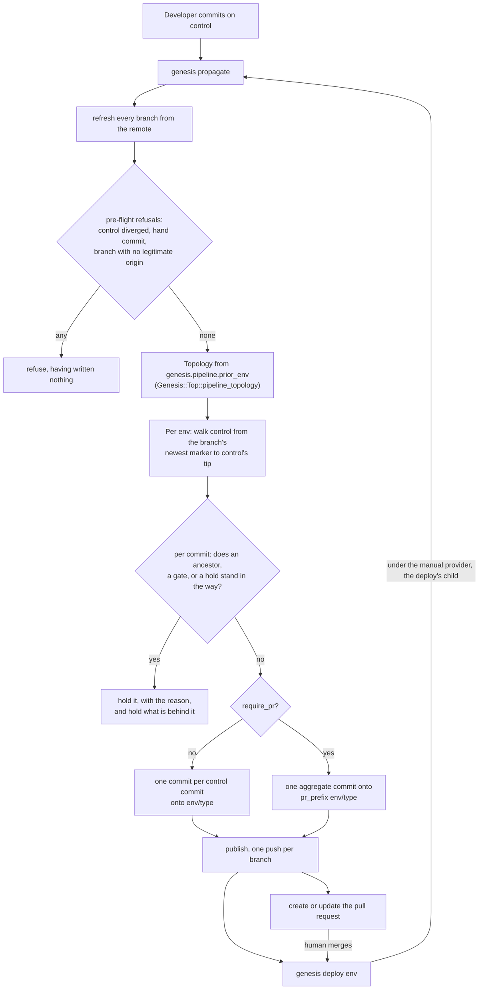
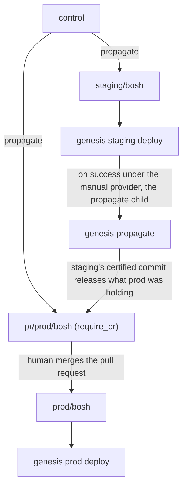

# Branch-Based Pipeline Architecture

**Status:** Superseded by the pipeline propagation design set, which decided the routing, the configuration surface, and the branch rules this document sketched. What survives here is the shape of the workflow and the decisions log, kept for the trail. The design set lives outside this repository, so the shipped surface to read instead is [docs/ci](../docs/ci/README.md).
**Last Updated:** 2026-09-20

Branch rules this document assumes throughout. Control and every `<env>/<type>` branch on the remote are append-only, so the previous tip is always an ancestor of the new tip and Genesis never force-pushes either, while `<pr_prefix><env>/<type>` is derived and may be rewritten freely against the tip the run read at its refresh. A deployment branch is derived state too, and it never carries a local commit outside a propagation activity, so the run resets a marker-only local commit and refuses a hand commit. The repository's own pipeline settings live in `.genesis/config` under `pipeline`, and each environment's live in its own file under `genesis.pipeline`.

---

## Overview

This document sketched the branch-based pipeline architecture that replaced the cache-based system. Work lands on a `control` branch, and a propagation run delivers each control commit to the deployment branches that are ready for it, one branch per deployment, named `<env>/<type>`.

### Goals

- Simplify recovery from failed deployments
- Unify CLI and pipeline deployment behavior
- Enable git-native access controls and audit trails
- Preserve layout/trigger semantics from current system

### Implementation Status

Parts of this document described a design that was never built, and the built design differs in ways that matter. This table is the map, and the sections below carry the detail. "Superseded" means the design in this document was replaced by something else that shipped, "retired" means something shipped and was then withdrawn, and "not built" means nothing took its place.

| Concept | State | Where it lives |
|---------|-------|----------------|
| `control` branch | Implemented | `Genesis::Top::control_branch`, defaulting to `Genesis::Top::DEFAULT_CONTROL_BRANCH` |
| Deployment branches, named `<env>/<type>` | Implemented | `Genesis::Top::branch_for` over `Genesis::Top::deployment_slug_for`, with `Genesis::BranchClass::classify_branch` for telling the classes apart |
| Branch creation, by `genesis pipeline-apply` | Implemented | `Genesis::Commands::Pipelines::_apply_init_branches` |
| Branch protection derived from `require_pr` | Implemented, GitHub only | `Genesis::Commands::Pipelines::_protection_rules_for`, `_apply_branch_protection` |
| Single topology source | Implemented | `Genesis::Top::pipeline_topology` |
| Per-commit routing, delivering or holding each control commit | Implemented | `Genesis::CI::Walk::plan`, `Genesis::CI::Walk::route_commit`, `Genesis::CI::Walk::hold_for` |
| Delivery onto a deployment branch | Implemented | `Genesis::CI::Propagation::_apply_propagation_commit` |
| Publishing, one push per branch | Implemented | `Genesis::CI::Publish::publish_run` |
| Pull request delivery (`require_pr`) | Implemented, GitHub only | `Genesis::CI::PullRequest::deliver` |
| The propagation hold an operator sets and clears | Implemented | `Genesis::Commands::Pipelines::pipeline_hold`, `pipeline_release` |
| The run's pre-flight refusals | Implemented | `Genesis::CI::Preflight` |
| The deploy's two recorded commits | Implemented | `Genesis::Env::DeploymentManager::_git_context` |
| The environment's branch as the pipeline's trigger | Implemented | `Genesis::CI::Compiler::PipelineDescriptor::_env_resources` |
| `kickoff` dispatch branch | **Superseded**, delivery goes from control to the deployment branches directly | nothing |
| Sequence tags (`push-<n>`) and hybrid tags | **Not built**, ordering comes from the deploy-certified control commit | nothing |
| Sidecar files | **Not built** | nothing |
| `genesis push` | **Not built**, `genesis propagate` is the command operators run | nothing |
| `genesis pipeline-prepare`, and branch creation during a propagation run | **Retired**, `genesis pipeline-apply` cuts every branch before a run delivers to it | nothing |
| The `<env>` argument to `genesis propagate`, and the cascade run it scoped | **Retired**, one run walks every environment and a later run releases what an ancestor was holding | nothing |
| `pipeline.mode: branch` and `pipeline.branches:` in `ci.yml` | **Superseded**, the repository's settings moved to `.genesis/config` under `pipeline` and the environment's to `genesis.pipeline` | `.genesis/config`, the environment files |
| A pipeline that runs the propagation itself | **Partly built**, the Concourse provider compiles and sets a pipeline, and the emitted pipeline's own propagate job is not wired | see Open Questions |

### Non-Goals

- <!-- TBD -->

### Out of Scope

#### Dev Kits (`dev/` directory)

Dev kits, which are unpacked kits in the `dev/` directory, were never intended for pipeline use and were never explicitly blocked either. The legacy cache system did not manage what lived under `dev/`, so a change there reached any environment on a dev kit at its next deploy, without travelling through that environment's predecessors first.

**Updated 2026-08-28.** The implementation no longer ignores `dev/`. `Genesis::Env::propagation_files` returns the path `dev/` for any environment whose kit `is_dev`, and it marks that path as one that triggers a deploy, so a change under it is mirrored onto the deployment branch like any other triggering path and it holds the descendants that share it until the ancestor has deployed. A dev kit does not bypass the ordering any more.

What remains out of scope is anything finer-grained than the whole directory. `dev/` propagates as a single path, so every environment on a dev kit receives every dev-kit change, whether or not it uses the changed part.

---

## Terms

| Term | Definition |
|------|------------|
| **Repository** | A git-based hierarchical structure containing versioned files across multiple branches. Branches share a common base but may diverge in content. All changes are tracked in version history. |
| **`control` branch** | The branch the standard workflow runs on, where developers commit their changes. A commit does not propagate because it was made. Propagation is an act somebody takes, either `genesis propagate` by hand or the child a manual-provider deploy spawns on success. The name defaults to `control` and is read through `Genesis::Top::control_branch`. Control is append-only on the remote, so Genesis never force-pushes it and never rewrites its history. |
| **Deployment Branch** | The branch a deployment's environment is deployed from, named `<env>/<type>`, where `<type>` is the repository's `deployment_type`. It holds only the files that deployment depends on. `genesis pipeline-apply` cuts it as an orphan branch with a single `init` file, and the first delivery replaces that file with the propagation set. It is derived state, so it never carries a local commit outside a propagation activity, and it is append-only on the remote. |
| **Propagation Set** | The git-root-relative paths a deployment depends on, from `Genesis::Env::propagation_files`. This is what a delivery mirrors onto the branch. The set divides into triggering and non-triggering paths, which the "Propagation Set" section below takes apart. |
| **Ancestral File** | A YAML file whose name is a prefix of an environment's name, based on hyphen-delimited segments. For environment `c-aws-east-prod`, ancestral files include `c.yml`, `c-aws.yml`, and `c-aws-east.yml`. Typically lacks a `genesis.env` key, making it a configuration fragment rather than a deployable environment. Ancestral files are shared across all environments matching their prefix and appear in the propagation set of every environment that inherits them. Ancestry does not require saturation, so intermediate files may be absent. Using a deployable environment as an ancestor of another is possible but discouraged. |
| **Ops File** | A manifest fragment in the `ops/` directory that extends or customizes kit behavior. Referenced via the `kit.features` array in environment files. May be shared across environments or environment-specific. Unlike ancestral files, an ops file's applicability is explicit, because it is determined by which environments reference it rather than by a naming convention. |
| **Included File** | A file explicitly inherited via the `genesis.inherits` key in an environment file. Provides direct inheritance independent of hyphen-based naming conventions. Allows environments to share configuration without requiring a common name prefix. |
| **Env DAG** | The deployment topology, built from per-environment `genesis.pipeline.prior_env` keys by `Genesis::CI::Compiler::ASTBuilder::_build_from_env_files` and reached by every pipeline command through the single accessor `Genesis::Top::pipeline_topology`. Each environment has at most one parent and any number of children. This is what the walk reads, and the `ci.yml` layouts are not. See "Topology source". |
| **Layout** | A deployment progression plan defined in legacy `ci.yml` under `pipeline.layout` or `pipeline.layouts`, using arrow notation (`->`) and the `auto <pattern>` directive. Still parsed by the compiler for a legacy configuration, and the walk does not read it, the env DAG having replaced it for that purpose. |
| **Propagation** | Delivering a control commit to the deployment branches that depend on the files it changed, as one commit per branch, with the subject `[pipeline] control@<short-sha> -> <env>`. |
| **Environment with no `prior_env`** | An environment that nothing has to deploy before. No ancestor can hold its commits, so a control commit is routed to it as soon as that commit changes one of the files in its propagation set that trigger a deploy. It reaches the environment once nothing holds it, and a gate ahead of the commit, an operator hold on the environment, an open pull request, or a commit already held for that environment can each still hold it. |
| **Certified control commit** | `git.control_commit` in an environment's latest successful exodus deployment record, which is the control commit the deploy actually stood on. This, and not a tag, is what orders the pipeline. |
| **Propagation marker** | The `[pipeline] control@<sha>` string in a deployment branch commit's subject or body, written and read through `Genesis::CI::Marker`. It is load-bearing, because the walk starts from the newest one, the deploy records the commit it names, and the pull request arm recovers it across a merge. |
| **Gate** | A control commit carrying a `Genesis-Stage: <reason>` trailer. It travels with the commits already ahead of it and ends the delivery, so everything after it is held until the environment's certified commit reaches it, until a later commit reverts it, or until the hold its reason set is released. |
| **Propagation hold** | The hold an operator sets with `genesis pipeline-hold` and clears with `genesis pipeline-release`. While it stands, the run delivers nothing new to that environment and opens or updates no pull request, and what the branch already holds stays deployable. |
| **`require_pr`** | The per-environment key (`genesis.pipeline.require_pr`) that routes delivery through a `<pr_prefix><env>/<type>` branch and a pull request instead of committing straight to the deployment branch, and that `genesis pipeline-apply` also reads when it derives that branch's protection. |
| **Rolling PR branch** | The branch a `require_pr` environment's deliveries land on, named `<pr_prefix><env>/<type>`, where `pr_prefix` defaults to `pr/`. One branch, one pull request, and one aggregate commit that the run rebuilds each time more is due. |
| **Trigger** | <!-- TBD --> |
| **Cache** | <!-- TBD: Legacy term, define for contrast --> |

### Superseded terms

These appeared in earlier drafts and have no counterpart in the implementation. Retained so the reasoning trail survives.

| Term | Original definition | Status |
|------|--------------------|--------|
| **`kickoff` branch** | A pipeline-controlled branch mirroring `control` up to the latest pushed tag, serving as the dispatch point to environment branches. | Superseded 2026-08-28. Never built; `grep -rn kickoff lib/` returns nothing. Propagation reads directly from a control commit. |
| **Sidecar** | A tag reference to files destined for downstream environments, pulled from `kickoff` when the pipeline progressed rather than committed to intermediate branches. | Not built. Downstream delivery is instead the ordinary delivery of the control commits an ancestor has certified. |
| **Sequence tag** | Monotonically increasing `push-<n>` tags providing ordering for conflict resolution. | Not built. See "Ordering without sequence tags". |
| **`entry point`** | An environment that received a propagation event directly, rather than waiting for it to cascade down from its parent. Computed ahead of the walk by `compute_propagation_targets`. | Retired 2026-09-19. The walk takes every control commit for every environment and either delivers it or holds it with a reason, so no set of environments is computed ahead of it. An environment with no `prior_env` is what the term named. |
| **Cascade** | `genesis propagate <env>`, a run scoped to `<env>`'s descendants that sourced its files from the control commit `<env>`'s last successful deployment certified. | Retired 2026-09-20. There is one run and it takes no environment argument. It walks control for every environment from that environment's newest marker, so a commit held behind an ancestor is released by the next ordinary run once the ancestor has certified it. |

---

## Branch Structure

### The `control` Branch

**Role:** The branch development happens on. Changes are built out iteratively here, and developers may rebase to reorder commits before a run delivers them.

**Naming:** `control` by default, read through `Genesis::Top::control_branch` and written as `pipeline.source_control.control_branch` in `.genesis/config` for a repository that wants another name.

**Contents:**
- All environment YAML files (ancestral and environment-specific)
- `ops/` directory
- `bin/` directory
- `kit-overrides.yml`
- `.genesis/` directory (config, embedded genesis, compiled kits)

**Access:** Writable by developers. Where `pipeline.source_control.control_requires_pr` is true the writing goes through a pull request instead, and `genesis pipeline-apply` derives control's branch protection from that key.

**History:** Append-only and linear on the remote. The previous tip is always an ancestor of the new tip, Genesis never force-pushes control, and because the history is linear the walk can name the commit that introduced an environment file exactly.

**Trigger behavior:** A commit does not propagate because somebody made it. Propagation happens when somebody runs `genesis propagate`, or when a successful deploy under the manual provider spawns that run as a child.

**Enforcement:** `genesis propagate` switches to control inside its own session and puts you back on the branch you started on, so the run reads the topology off control whatever you were standing on. Every other pre-deploy command, `genesis new` and the `pipeline-*` family among them, runs on control or on a feature branch that descends from control's tip, is not a deployment, pull request, or artifacts branch, and does not carry an environment's name. A deployed-state command such as `genesis deploy` switches to the environment's own deployment branch instead. The run also reads where control stands against the remote, and it refuses a control branch that is ahead, because the commits it would deliver are not pushed yet, or behind, because the topology it would read is stale.

### The `kickoff` Branch (superseded)

> **Superseded 2026-08-28.** The `kickoff` branch was never implemented and nothing replaced it. Propagation reads files out of a control commit (`git checkout <control-sha> -- <path>`) and commits them onto environment branches; there is no intermediate branch and no service-account-only write gate. The original text follows for the reasoning trail.
>
> **Role:** Pipeline-controlled dispatch point. Mirrors `control` up to the latest pushed tag. Serves as the source for routing files to environment branches.
>
> **Naming:** Configurable, defaults to `kickoff`
>
> **Contents:** Full copy of `control` at the tagged commit
>
> **Access:** Writable only by pipeline service account (break-glass exception for emergencies)
>
> **Ancestry:** Shares git ancestry with `control`
>
> The access-control goal this branch existed to serve is currently met by branch protection on the environment branches plus `require_pr`, not by a separate dispatch branch. Whether that is sufficient is an open question.

### Sequence Tags (not built)

> **Superseded 2026-08-28.** No sequence tags, no hybrid tags, no `genesis push`. See "Ordering without sequence tags" for what the implementation does instead. Original text retained:
>
> **Purpose:** Provide ordering for conflict resolution when fast-path commits overtake slow-path commits.
>
> **Format:** Monotonically increasing integers (1, 2, 3, ...)
>
> **Problem solved:**
> ```
> Tag #n:   changes go test → staging → prod  (slow path)
> Tag #n+1: changes go directly to prod       (fast path)
>
> #n+1 arrives at prod before #n
> When #n reaches prod, pipeline must not rollback #n+1's overlapping changes
> Sequence numbers enable this comparison
> ```
>
> **Created by:** `genesis push [<commit>]` command
>
> **Annotation:** Markdown-formatted comment including Mermaid diagram of planned file flow

### Deployment Branches

**Role:** The deployable state of one deployment. It holds only the files that deployment depends on, and a deploy stands on it and certifies the control commit its newest marker names.

**Naming:** The deployment slug, `<env>/<type>`, where `<env>` is the environment's name and `<type>` is the repository's `deployment_type`. The environment `qa` of a `bosh` deployment therefore propagates on `qa/bosh`. The branch is per deployment rather than per environment, so one repository holding a `bosh` root and a `cf` root gives `qa` a branch under each.

The other two derived names are built from that slug. A `require_pr` environment proposes on `<pr_prefix><env>/<type>`, where `pr_prefix` comes from `pipeline.source_control.pr_prefix` and defaults to `pr/`. The artifacts branch, `artifacts/<env>/<type>`, is named and classified but nothing writes to it yet.

One consequence of the slug is a ref collision. A branch named for an environment alone occupies `refs/heads/<env>`, and git cannot then create `refs/heads/<env>/<type>` beneath it, so such a branch has to be deleted or renamed before the environment can have a deployment branch. "Migration from v2" says what to do about the ones a v2 repository already has.

**Ancestry:** An orphan branch, sharing no history with control. Its root is the `init` commit `genesis pipeline-apply` makes, carrying one `init` file that says who owns the branch, and the first delivery deletes that file as it writes the propagation set. The branch is never merged into control, and files arrive on it by a mirror of a control commit rather than by a merge.

**Contents:** Exactly the propagation set as it stood at the control commit the newest marker names, and nothing else. A delivery is a mirror, so it removes a path that has dropped out of the set as well as writing the paths that are in it, and the writer checks both halves against the index before it commits.

**Creation:** `genesis pipeline-apply` cuts every branch the topology needs, applies the protection each one's `require_pr` asks for, and pushes them. Nothing else creates one. A propagation run that meets an environment with no branch reports it as awaiting `pipeline-apply` and delivers nothing to it, and a deploy of such an environment refuses, because a deploy with no branch would have to stand on control and certify a commit no run ever routed there.

**History:** Append-only on the remote, exactly as control is, and derived in your clone. A local commit whose subject carries a marker is discarded and the branch reset to the remote's tip, because the next run reproduces it from control. A local commit with no marker is a hand edit that belongs on control, so the run refuses before its first write, naming each branch and commit and the two ways out, which are to push it or to move the change to control and reset the branch. A local branch the remote does not have, or one that shares no ancestor with the remote's, has no legitimate origin, so the run refuses that too and names the remedy in order. Genesis deletes nothing in any of those cases.

`genesis pipeline-status` reports an environment whose branch exists nowhere as awaiting `pipeline-apply`, with nothing in its two commit columns.

> **Superseded 2026-08-28.** An earlier revision of this document stated that "`genesis propagate` never creates environment branches. It skips any environment whose branch does not exist." Skipping is what the missing-branch guard was added to end, because an absent branch and a branch with no pending changes produce the same empty diff, so a repository whose branches were never created reported "nothing to propagate" and exited successfully having done nothing. The guard is still there, and what it does now is report the environment as awaiting `pipeline-apply`, that command having taken over branch creation entirely.

---

## Propagation Set

What travels with a deployment, from `Genesis::Env::propagation_files`. Paths are git-root-relative, and a walk reads the set out of the tree at the commit it is delivering rather than out of your working tree, because a restructure moves the prefix the set is built from.

Every path carries one of two marks. A triggering path is one whose change means deploy me, and a non-triggering path is content the deployment needs that no deploy has to happen for.

| Source | Paths | Kind |
|--------|-------|------|
| Environment file hierarchy | Every file from `actual_environment_files`, which is the environment's own YAML, its hyphen-ancestors, and anything reached through `genesis.inherits` | Triggering |
| Kit | The compiled kit tarball for a released kit, or the whole `dev/` directory for a dev kit | Triggering |
| Blueprint fragments | The repository-side manifest fragments the kit's blueprint draws on, which is where the ops files arrive | Triggering |
| Kit overrides | `kit-overrides.yml`, where the repository has one | Triggering |
| Embedded genesis | `.genesis/bin/genesis`, because a genesis version can change rendering and hook behaviour, which is the thing a pipeline exists to prove in lab before prod | Triggering |
| Extra tracked paths | `genesis.pipeline.track_additional_files`, which supports globs and an `<env>` placeholder, and rejects absolute, `~`, and `..` paths | Triggering |
| Repo config | `.genesis/config`, since nothing in it reaches the manifest | Non-triggering |
| Reaction scripts | `bin/<script>` for every script named under `genesis.reactions`, since a changed script takes effect at the next deploy whenever that comes | Non-triggering |

Three consequences worth stating plainly:

- **Ops files are not enumerated separately.** They arrive because the kit's blueprint draws them out of the repository and the fragment list names what it drew, not because `ops/` is special-cased.

- **A commit of non-triggering content alone makes no delivery.** It rides along with the next delivery that has triggering content, which needs no carry-along mechanism, because a delivery is a snapshot of a control commit and a later snapshot already holds it. Non-triggering paths also never count toward the overlap that computes a hold, since a hold exists to stop unproven content reaching a descendant and a shared `.genesis/config` would otherwise hold every descendant behind the commit that changed it.

- **Deploy artifacts never propagate.** Manifests live in exodus and `.genesis/manifests` is outside the set, so a deployment branch carries the deployment's inputs and never its outputs.

### The `genesis yamls` approach (superseded)

> **Superseded 2026-08-28.** An earlier draft proposed determining applicability by merging ancestry with `genesis yamls --no-kit <env>` and reading `genesis.inherits` and `kit.features` out of the flattened YAML. The implementation instead asks the loaded `Genesis::Env` object directly via `propagation_files`, which reuses the same file-resolution machinery the deploy path uses. The distinction matters mainly because the answer now comes from a live environment load, so an environment that fails to load produces no propagation set at all rather than a wrong one — `propagate` skips it, and `pipeline-status` shows a `load error` row with the reason.

BOSH config files are named by `genesis.pipeline.track_bosh_configs`, which takes either a boolean that turns every config type on or a list that names the ones this environment cares about. A named type gets a resource of its own in the emitted pipeline and a change to it triggers this environment's redeploy job, and none of them is part of the propagation set.

### Break-Glass Direct Edits

A hand commit on a deployment branch has two fates, and which one it gets depends on whether anybody else can see it.

Local and unpushed, it makes the run refuse before its first write. The run checks every branch in scope for a local-only commit, names each branch and commit, and gives the two ways out, which are to push it or to move the change to control and reset the branch. Nothing partial is left, because nothing was written. A local-only commit that carries a marker is a different thing, being something a run made and nobody else has seen, so it is reset to the remote's tip and the walk reproduces it from control.

Pushed to the remote, it is legal, and it is the emergency hatch. It deploys at once under an automated provider and by the operator's hand under the manual one, and it is temporary by construction, because the next delivery to that environment overwrites every file of the propagation set that differs from its source and reports each file it overwrote. It is never silent either. `genesis pipeline-status` reports the environment as drifted and names the files that differ from the marker's snapshot, and a deploy warns about the same difference and deploys anyway. The marker walk skips the commit, so the certified commit stays a control commit and the hotfix never travels downstream.

---

## Propagation Flow

### Overview

Propagation is one run, and it takes no environment argument. It has three stages, which are settling every branch against the remote, walking control and writing what is due, and publishing. In detail, a run of `genesis propagate`:

1. **Refreshes**, bringing every branch in scope from the remote into this clone's tracking refs, control included, before it reads any of them. There is no flag to skip it, because a report that quietly rested on a stale tracking ref is the thing the refresh removes.

2. **Stands itself on control**, inside a session that puts you back on the branch you started on, so a run started from a feature branch reads the same topology as a run started from control.

3. **Refuses what it cannot safely write.** A control branch that is ahead or behind, a deployment branch with a local commit that carries no marker, a local branch the remote lacks or that shares no ancestor with the remote's, and a repository whose configuration disowns a pipeline that is still live each end the run before anything is written. A local commit that carries a marker is reset to the remote's tip instead, being something a run made that nobody else has seen.

4. **Reads the topology** from the environment files on control through `Genesis::Top::pipeline_topology`, which gives the nodes, the edges, each environment's parent, and a stable order.

5. **Walks control, once per environment**, from the commit that environment's newest marker names to control's tip. A branch with no marker has been delivered nothing, so its walk starts at the commit that introduced the environment file instead.

6. **Routes each commit on its own**, in control order. A commit is delivered to an environment when it changes one of the files in that environment's propagation set that trigger a deploy and nothing holds it, and a commit that changes only the other files in the set rides along with the next delivery. A held commit holds every commit behind it for that environment, so the branch is always the snapshot of one control commit.

7. **Writes**, per environment, either one commit per delivered control commit onto `<env>/<type>`, or one aggregate commit onto `<pr_prefix><env>/<type>` for an environment in pull request mode. Each commit is a mirror of the control commit filtered to the propagation set, and the writer checks the index against that source before it commits.

8. **Publishes**, one push per branch, after showing the delta every push would carry and asking at a terminal. No push's result withholds another's, so a branch the remote rejects costs that one environment its run and nothing else. The pull request calls follow the pushes.

9. **Reports** one outcome for every environment in scope, one for every control commit routed to it, and one for every hand edit it overwrote.

Deploys happen separately. Under the manual provider a successful deploy spawns this same run as a child, which is what moves a change down one level.



### An environment with no branch

An environment in the topology with no deployment branch is awaiting `genesis pipeline-apply`, which is the one command that cuts branches. The run reports it that way and delivers nothing to it, and because it has certified no commit it holds its descendants as any uncertified ancestor does.

That reporting matters because the branch's absence and the branch having nothing due look the same to a diff. An absent branch yields an empty diff exactly as an up-to-date one does, so a repository whose branches were never cut would otherwise report that there was nothing to propagate and exit successfully having done nothing.

A deploy of such an environment refuses outright rather than warning, because a deploy certifies the commit of the branch it stands on, and with no branch it would stand on control and certify a commit no run ever routed there.

### Two readings, not one

The walk asks two different questions about each environment, and conflating them is the mistake the design is shaped to prevent.

- The **changed set** asks what a control commit changes within this environment's propagation set. It drives what a delivery writes, and its triggering half decides whether there is a delivery at all.

- The **undeployed set** asks what an ancestor has been delivered and has not yet deployed. It is the difference between that ancestor's certified control commit and the commit being routed, and it is what says an ancestor is sitting on an in-flight change.

A commit must not reach a descendant past an ancestor that has received it and not yet deployed it, or commits stop travelling as a unit. An ancestor whose record cannot be read, or which has no certified commit at all, holds everything below it for the same reason, and nothing is ever stood in for by control's own tip, because that would assert a deploy that never happened.

### One run, and no cascade

`genesis propagate` takes no environment argument and has no modes. One run walks every environment, and a commit held behind an ancestor is released by the next ordinary run, once that ancestor's certified commit has advanced past it.

The earlier design had two runs. A root run sourced control's tip for the whole DAG, and a cascade run, `genesis propagate <env>`, scoped itself to `<env>`'s descendants and sourced the control commit `<env>`'s last successful deployment had certified. Per-commit routing does what the cascade did, because each environment's walk already starts at its own marker and each commit is already checked against its ancestors' certified commits, so a run aimed at one environment would compute the same answer the bare run computes for it.

Two guards the cascade carried fell away with it. The at-or-ahead skip is subsumed by ordered delivery, an environment never being sent a commit it already carries, and the certification check is now the ordinary ancestor hold.

### Ordering without sequence tags

The earlier design solved fast-path and slow-path ordering with monotonic `push-<n>` tags and hybrid `push-34+33` tags. The implementation does not have them. Ordering falls out of three other mechanisms:

- **Delivery in control order.** Each environment takes the commits due to it oldest first, and a held commit holds everything behind it, so an urgent change cannot overtake the shared change it may depend on.

- **The certified control commit.** An ancestor holds a commit until it has deployed what it was already given, so a change cannot arrive downstream carrying a control state the ancestor never ran.

- **The gate.** A control commit with a `Genesis-Stage` trailer ends the delivery where the author wanted it to stop, and everything after it waits until that commit is certified or released.

The audit gap the tag design worried about is closed by the run's report rather than by git. Every environment in scope ends a run with one recorded outcome, every control commit routed to it carries another, and a held commit carries the reason it was held, so what was withheld and why is something the run says rather than something a reader has to reconstruct.

### Superseded: two-stage dispatch

> **Superseded 2026-08-28.** The staged `control → kickoff → env` flow below was never implemented. Retained for the reasoning trail; read it as the design that the single-stage flow above replaced.
>
> Propagation is a multi-stage process:
>
> 1. **Developer triggers** `genesis push` on `control`
> 2. **Tag created** with sequence number and file flow annotation
> 3. **Pipeline job** detects new tag
> 4. **`kickoff` updated** (push or PR based on config)
> 5. **File analysis** determines routing to env branches
> 6. **Env branches updated** with applicable files
> 7. **Deployments triggered** per layout rules
>
> **Stage 1: Control → Kickoff** — the developer runs `genesis push`, a sequence tag is created on control annotated with a file-flow diagram, a pipeline job picks up the tag, and depending on the configured kickoff mode either pushes the tagged commit to `kickoff` (`auto`) or opens a PR against `kickoff` for a human to review and merge (`manual`).
>
> **Stage 2: Kickoff → Environment Branches** — the pipeline analyzes changed files, classifies each, determines target branches, and for each: creates the branch if missing, or compares sequence numbers and skips when newer changes are already present.
>
> **Kickoff Modes**
>
> | Mode | Behavior | Use Case |
> |------|----------|----------|
> | `auto` | Direct push to `kickoff` on tag | Trusted CI/CD, automated pipelines |
> | `manual` | Create PR against `kickoff` | Change review required, audit trail |
>
> The review-gate intent of `manual` mode survives, but as a per-environment property (`require_pr`) applied at the environment branch rather than a repository-wide property applied at a dispatch branch. That is a meaningful change: review now gates entry to a specific environment, so `prod` can require a PR while `sandbox` does not, which the single-dispatch-branch design could not express.

### Superseded: sequence number conflict resolution

> **Superseded 2026-08-28.** Hybrid tags were never built. Original text:
>
> The sequence tag is propagated to each env branch as part of the pipeline job. When an earlier-numbered tag arrives after a later-numbered tag (due to different routing paths), the pipeline creates a hybrid tag.
>
> ```
> Tag #33: changes route through test → staging → prod (slow path)
> Tag #34: changes route directly to prod (fast path)
>
> Timeline on pipeline/prod:
>   1. #34 arrives first (fast path)  → branch tagged: push-34
>   2. #33 arrives later (slow path)  → branch tagged: push-34+33
> ```
>
> **Hybrid tag format:** `push-<latest>+<merged>` (e.g., `push-34+33`), with a commit message listing which files were applied from the incoming tag and which were omitted because a newer version was already present.

### Superseded: sidecar files

> **Superseded 2026-08-28.** Sidecars were never built. The scenario they addressed, which is a downstream file superseded while it was in transit, is handled instead by delivering each control commit in order. A superseded file arrives in its earlier form and then in its later one, each delivery held behind whatever its ancestors have not yet deployed, so nothing downstream ever runs ahead of what was proven upstream. Original text:
>
> Files destined for downstream environments are referenced via the push tag but NOT committed to intermediate branches. The propagation tool analyzes the push tag to determine which files apply where, commits only applicable files to each env branch, records the tag reference (the "sidecar") for downstream files, and pulls them from `kickoff` at the tagged commit when the pipeline progresses.
>
> **Key point:** Env branches never contain files that don't apply to them. The canonical source for any file is always `kickoff` at the relevant tag.
>
> **Design principle:** When a sidecar file has been superseded by a later tag, skip it. The env branch should reflect what's CURRENTLY in `control`, not what was in an older tag. User reconciles via new push if needed.
>
> That design principle survived the implementation change; only the mechanism differs.

---

## PR-Based Propagation

An environment with `genesis.pipeline.require_pr: true` does not receive commits on its own branch. Its deliveries land on `<pr_prefix><env>/<type>`, and a pull request from that branch into `<env>/<type>` is opened or updated. Merging the pull request is what puts the change on the deployment branch, which is what makes it deployable.

`require_pr` lives in the environment's own file under `genesis.pipeline`, and `genesis pipeline-apply` reads the same key when it derives the deployment branch's protection, so a site that reviews everything and a lab that pushes straight through are configured the same way and protected differently.

### One aggregate commit, not a pile

The branch is rebuilt rather than appended to. Every time more is due, the run rebuilds `<pr_prefix><env>/<type>` from the deployment branch plus the commits still due, as one commit carrying the aggregate of all of them, with its marker naming the newest. The commit's message, and the pull request body with it, carry one entry per control commit, each with its short hash, its subject, and the files it changed within this environment's propagation set.

Rebuilding is what keeps review honest. A commit somebody rejected never lands on its own once its fix arrives, because the fix and the rejected commit are one commit by then, and no merge method can split the aggregate into separate deploys. The pull request's title is the aggregate's subject, so it changes on every rebuild that moves the newest marker.

The branch is derived, so the run force-pushes it against the tip it read at its own refresh. That is the one class of branch a forced refspec may touch.

### What the run does with an open pull request

The pull request's review state decides what the run does, and the run reads that state from the API rather than guessing it from the branch.

| Review state | What the run does |
|--------------|-------------------|
| None open | Rebuilds the branch from the deployment branch plus the commits due, pushes it, and opens a pull request |
| Open and unreviewed | Rebuilds and force-updates freely, with the body saying what changed |
| Changes requested | Rebuilds with the fix folded into the aggregate, and names the review it answers |
| Approved | Freezes the pull request, holds every newly due commit for that environment, and reports merge pending until somebody merges it |
| Closed without merging | Supersedes it with a new pull request, carrying a link to the closed one |
| Unreadable | Refuses that environment rather than acting on a state it could not read |

When nothing is due, the branch is deleted on the remote and locally, and a closed and unmerged pull request's branch goes with it.

Commits on the branch the run did not write are reported by count and author before the rebuild discards them, so nothing disappears silently.

### Idempotency

Idempotency is the marker walk on both branches, and not a subject comparison. A rebuilt branch that comes out equal to the one already there, same markers and same tree, pushes nothing and touches no pull request, and the environment is recorded as idempotent.

That falls out of the delivery being a mirror. A marker names exactly one control commit and the branch's tree is that commit's propagation set, so two runs from the same state cannot produce different content, and there is nothing left for a separate idempotency rule to decide.

### Push and pull request control

There are no flags governing the publish. `genesis propagate --dry-run` is the preview, and it writes nothing at all, neither a commit nor a push nor an API call.

A real run shows the delta every push would carry before the first one goes out, and it shows it whether or not anybody is there to read it, so a pipeline job and a deploy's child both log what an operator would have seen. At a terminal the showing comes before the ask, and `-y` answers that ask and nothing else.

The pushes are one per branch rather than one batch, so a rejection on one branch costs one environment one run. The pull request calls follow the pushes, each pull request for a branch that was actually published.

### Preconditions

For any `require_pr` environment that takes a delivery in a run that is not a dry run:

- The origin remote must parse to a GitHub `owner/repo`.

- `GITHUB_AUTH_TOKEN` must be set and must authenticate, and the token is validated once for the run before any branch is touched.

### Limitations

- **GitHub only.** Reading, creating, and updating a pull request all go through Genesis's GitHub service. GitLab, Bitbucket, and Gitea are not supported. Adding a forge means a parallel service with the same surface and a dispatch layer in the pull request arm.

- **One working tree.** The run assumes one git handle in which every target branch can be checked out, which is the shape a person's clone has. The one-workspace-per-branch shape a CI job would want is not wired, and the interface is stable for it.

- **Rebase merges only.** A pull request into a deployment branch is merged by rebase, so the marker survives into the branch's history and the walk can find it. The run also recovers a marker from a tip that was merged without one.

### Per-Environment Override

The earlier sketch put this in `ci.yml`:

```yaml
pipeline:
  branches:
    propagation: push  # default
    prod:
      propagation: pr  # override for prod
```

**Superseded 2026-08-28.** There is no repository-wide propagation mode and no per-environment override of one. The key lives in each environment's own file, which is also where the topology lives:

```yaml
genesis:
  env: c-aws-prod
  pipeline:
    prior_env:    c-aws-staging
    require_pr:   true
    manual:       true
```

The block is read merged rather than leaf-only, so a key written in a site file is inherited by every environment beneath it and a key written in the environment's own file wins over the one it inherits. That is what makes `require_pr: true` in a site file a policy rather than something each environment has to repeat.

---

## Deployment Triggers

### Topology source

The env DAG comes from `genesis.pipeline.prior_env` in the environment files, and not from `ci.yml` layouts. `_build_from_env_files` scans the environment YAMLs, makes a node per valid environment, including one with no `genesis.pipeline` block at all so that an environment another one names as its `prior_env` appears, and adds a `prior_env -> env` edge wherever `prior_env` names another environment present on disk.

Every read of a `genesis.pipeline` key goes through the merged hierarchy rather than the leaf file alone, because most of these keys live high in the hierarchy, typically in a site file, and a leaf-only read would find an inherited key absent and say nothing about it.

**One accessor, not several.** `Genesis::Top::pipeline_topology` is the single entry onto that DAG, returning `nodes`, `edges`, `children`, `parent_of`, and a stable breadth-first `order`. `propagate`, `pipeline-status`, `pipeline-apply`, and `pipeline-graph` all read it, and none of them collects edges or computes an ordering of its own. `Genesis::Top::pipeline_env_names` is a wrapper over the same call, so "which environments are in this pipeline" has one answer rather than two that happened to agree.

Membership is every environment the deployment root holds, with or without a `genesis.pipeline` block, because such an environment still has a deployment branch and still appears in `pipeline-status`. Every field comes back empty where no pipeline is enabled, so callers iterate without a guard and decide for themselves whether an empty pipeline is fatal.

A legacy `ci.yml` layout is still parsed by the compiler for a legacy configuration, and the arrow and `auto` DSL below still describes one, and the walk does not consult it.

```
auto *-sandbox
sandbox -> preprod -> prod
```

### Trigger Flow



### What the emitted pipeline watches

`PipelineDescriptor::_env_resources` gives each environment one git resource, `<alias>-branch`, tracking that environment's branch. There is no path filtering on it, because under branch propagation the branch is the change signal, anything that reaches it being by definition intended for that environment. This resource replaced both the path-filtered changes resource and the cache resource that used to carry an upstream environment's files inside the control branch.

BOSH config resources follow it, one per config type, where a type is `cloud`, `runtime`, or `cpi`. They are emitted only for the types `genesis.pipeline.track_bosh_configs` names, and never for a create-env environment, which has no director to read a config from.

The branch resource carries one exclusion:

```yaml
ignore_paths: [".genesis/manifests/*"]     # prefixed with source_control.root when set
```

It is emitted unconditionally. Under the store a pipeline repository is required to use, nothing writes to that path at all, so the exclusion costs nothing today and it guards against any later change that puts a git write back on the branch a deploy triggers on. A deploy that committed its manifests to the branch its own job watches would start that job again, and that is the loop this breaks.

**The emitted resource still names the branch after the environment alone.** The descriptor passes the environment name where the deployment slug belongs, so a repository whose deployment type is not implied by the environment name gets a resource pointing at a branch the propagation half never writes. Closing that is the compiler half taking the slug from `Genesis::Top::branch_for`, as everything on the propagation half already does.

### Per-environment flags

| Key | Effect today |
|-----|--------------|
| `require_pr` | Routes delivery through `<pr_prefix><env>/<type>` and a pull request, derives that deployment branch's protection at `pipeline-apply` time, and surfaces in the Mermaid graph, in `pipeline-describe`, and in `pipeline-status` |
| `manual` | Says the deploy job waits for a person. Every environment built from environment files already takes `trigger: false` on its branch, so what the key reaches is the `MANUAL` label on the graph and the hold reason that says a descendant is waiting on an ancestor's trigger. It is valid only where the provider declares that it emits a triggering resource, and it is refused by name at configuration load where the provider does not |
| `redeploy_cron` | One crontab expression, or a list of them, in UTC, triggering the environment's redeploy job |
| `track_dependencies` | The deployments this one reads, declared so that the applied record and the staleness check know about them |
| `track_bosh_configs` | The BOSH config types whose change triggers this environment's redeploy job, either as a boolean that turns every type on or as a list that names them |
| `track_additional_files` | Extra deployment-root-relative paths for this environment's propagation set |
| `notifications` | This environment's override of the repository's notification style |

---

## Deployment Execution

### `genesis <env> deploy` in a repository with a pipeline

The deploy observes and never writes git. Its one write is the exodus record, and the only ref it moves is the fast-forward of a deployment branch that is behind the remote, which neither creates nor discards a commit. In order, a deploy:

1. **Refreshes** every branch in scope from the remote, unconditionally, because the warnings below are worthless against a stale tracking ref. There is no flag to skip it.

2. **Checks control**, refusing where control exists neither on the remote nor locally, since the environment files live on it and nothing can read the topology without it.

3. **Checks whether the configuration disowns a live pipeline**, which is a repository whose `pipeline.enabled` is false while the applied record says a pipeline was applied. A person's deploy warns and continues, because they may be mid-teardown. A deploy inside the pipeline's own job errors instead, because a job never deploys what its own configuration disowns.

4. **Switches to `<env>/<type>`** inside a session, so all the preflight work runs against the right branch rather than whatever you happened to be standing on, and so you are put back where you started.

5. **Classifies that branch against the remote.** In sync proceeds, behind is fast-forwarded, and ahead or diverged is refused, naming the counts and `genesis propagate`, because discarding a commit belongs to the propagation run's pre-flight and never to a deploy. A branch that exists nowhere, or one that shares no ancestor with the remote's, is refused with the remedy named in order.

6. **Asserts the prior-environment invariant.** Where the environment declares a `prior_env`, that predecessor must have deployed successfully at least once. There is no override.

7. **Passes the provider gate.** Under an automated provider a deploy by hand is refused unless `--force`, and at a terminal it asks for an acknowledgement that `-y` does not suppress. The manual provider never reaches the gate, because there the operator is the pipeline.

8. **Warns three times, and asks once.** It warns when the applied record is stale against control, naming the environments that changed and `genesis pipeline-apply`. It warns when commits are due to this environment and not yet on its branch, naming them and `genesis propagate`, and at a terminal it asks before continuing unless `-y`. It warns beside that when the branch has drifted from its marker's snapshot, naming the files that differ, and deploys anyway. No flag switches a warning off.

9. **Deploys**, and then **records two commits in exodus**, which are `git.commit`, the deployment branch commit it stood on, and `git.control_commit`, the control commit that branch's newest marker names. A branch carrying no marker has been delivered nothing, so the record names no control commit rather than standing control's own tip in for one.

10. **Finishes the session** and hands off. A tracked modification found at that point is a defect, a kit hook that wrote into the repository or a deploy that died before its cleanup, and it is named before it is discarded, with the deploy reported as succeeded and the command exiting non-zero.

11. **Spawns the propagate child**, under the manual provider only, and unless `--no-propagate`. A failure there warns and tells the operator to run `genesis propagate` themselves, and it does not fail a deploy that already succeeded.

What the deploy computes for its due-commits warning is the same walk the propagation run makes, run read-only for one environment against the same durable state, so a deploy and a run can never disagree about what is due or about why something is held.

#### How the deploy runs its propagate child

Three details of that subprocess matter, and all of them are about propagation staying a side effect rather than becoming an interruption.

- **It runs after the deploy's own session has finished**, and it takes the switch lock itself, so the child and the deploy never both want the working tree.

- **Its standard input comes from `/dev/null`.** The child inherits the deploy's terminal, so it could otherwise stop and ask the operator about another environment's branch mid-deploy. Cut off from standard input it takes its non-interactive path, printing the delta it would publish rather than asking about it.

- **A refusal is reported rather than leaked as a number.** The child's named exit is turned back into a sentence, so the operator is told the deployment succeeded, that nothing propagated, and what to do next.

### Safeguards

| Scenario | Behavior |
|----------|----------|
| `genesis propagate` from a branch that is not control | Switches to control inside its own session, and puts the operator back afterwards |
| `genesis propagate` with uncommitted changes | Bails, naming the files, including under `--dry-run` |
| `genesis propagate` with control ahead of the remote | Bails as unpushed, except under `--dry-run`, which warns that its answer assumes the push |
| `genesis propagate` with control behind the remote | Bails as stale, because the topology it would read is out of date |
| `genesis propagate` with a hand commit on a deployment branch in this clone | Bails before the first write, naming each branch and commit and the two ways out |
| `genesis propagate` with a deployment branch missing | Reports the environment as awaiting `genesis pipeline-apply` and delivers nothing to it |
| `genesis new` from a feature branch that does not descend from control, or whose name is an environment's | Bails, naming the condition it failed |
| `genesis <env> deploy` with the deployment branch missing | Bails, pointing at `genesis pipeline-apply` |
| `genesis <env> deploy` with a dirty tree needing a branch switch | Bails, naming the files |
| `genesis <env> deploy` with its branch ahead of or diverged from the remote | Bails, naming the counts and `genesis propagate` |
| `genesis <env> deploy` of an environment whose `prior_env` never deployed | Bails, with no override |
| `genesis <env> deploy` by hand under an automated provider | Refuses unless `--force`, and asks for an acknowledgement at a terminal |
| `genesis <env> deploy` with commits due and not yet delivered | Warns, names them, and asks unless `-y` |
| `genesis <env> deploy` of a branch that has drifted from its marker's snapshot | Warns, names the files that differ, and deploys |

---

## Conflict Handling

### What the implementation does

| Scenario | Behavior |
|----------|----------|
| Two environments queued for the same file, one an ancestor | The descendant's commit is held with the reason `ancestor-overlap`, naming the ancestor and the files that overlap, and the walk delivers it once the ancestor has deployed |
| A delivery that would move an environment backwards | Cannot arise. The walk replays control forward from the commit each branch's newest marker names, so an environment is never sent a commit it already carries |
| Hand commits on top of a deployment branch's last delivery | A local unpushed commit with no marker refuses the whole run before its first write, naming each branch and commit and the two ways out. A commit pushed to the remote is legal and temporary, and the next delivery overwrites every file of the propagation set that differs from its source and reports each one it overwrote |
| The pull request branch on the remote has commits the run did not write | The run reports them by count and author, rebuilds the branch from the deployment branch plus the commits still due, and pushes against the expected tip it read at the refresh |
| Any per-environment failure | The run holds what it cannot deliver and continues, so one environment's failure does not withhold another's delivery. A failed snapshot assertion is the exception, being fatal to the whole run, which resets every branch it had committed to and publishes nothing |

### Resolution Strategies

There are no configurable strategies. Delivery writes each control commit's propagation set onto the branch as a mirror of that commit, so it does not merge, rebase, or ask. A `fail`, `merge`, `rebase`, or `ask` knob was considered and is not in the design.

---

## Recovery Procedures

### Failed Delivery at Environment N

The environment's branch is the state. Fix forward on control and run `genesis propagate` again, or check the branch out and inspect it directly.

Re-running after a partial run is safe. The walk re-reads each branch's newest marker and replays control forward from the commit it names, so an environment that took its delivery is already up to date and one that did not takes it now. A PR-mode environment's branch is rebuilt from the deployment branch plus the commits still due, rather than skipped, so a half-built pull request corrects itself, and the run reports any commit it did not write before the rebuild discards it.

### Accidental Manual Deploy

The deploy records the commit it stood on as `git.commit` and the control commit its marker names as `git.control_commit`, so the deploy is traceable even where the branch carried a hand commit. `genesis pipeline-status` reports such an environment as drifted and names the files that differ from the marker's snapshot.

### State File Recovery

A create-env deployment's state file is an artifact of the deploy rather than content a run moves. The deploy writes it into its own cache directory, at `.genesis/deploy-cache/<env>/<env>-state.json`, and names it in the exodus deployment record beside the manifest, so the record is where a later deploy reads it back from. `Genesis::Env::deployment_cache_setup` names the file and `Genesis::Env::DeploymentManager::_base_artifacts` is what puts it in the record.

It never reaches a deployment branch, being outside the propagation set, so recovering one means reading the environment's exodus record rather than checking a branch out. Where no record carries a state file, Genesis falls back to `.genesis/manifests/<env>-state.json` in the repository, which is where a deploy from before the pipeline left it.

---

## Configuration Surface

### Superseded: `ci.yml` schema extensions

> **Superseded 2026-08-28.** No `pipeline.mode`, no `pipeline.branches`. Original sketch:
>
> ```yaml
> pipeline:
>   mode: branch              # 'branch' | 'legacy' (default: legacy)
>   branches:
>     control: control        # Control branch name
>     propagation: push       # 'push' | 'pr'
>     <env-name>:
>       propagation: pr
> ```

### What actually configures this

A repository configures its pipeline in two places. Its own settings live in `.genesis/config` under `pipeline`, and each environment's live in that environment's own file under `genesis.pipeline`. The schema is the contract in both, so every key a command reads is declared, validation runs at configuration load for every command rather than only for the pipeline ones, and a key the schema does not declare is refused by name. There are no compatibility aliases.

**Repository level, `.genesis/config` under `pipeline`:**

| Key | Meaning |
|-----|---------|
| `enabled` | Whether this repository has a pipeline. A repository whose pipeline is not enabled is not validated against the rest of this table at all |
| `provider.type` | `concourse`, `github-actions`, or `manual`, and an absent provider block is a manual pipeline rather than no pipeline. The block's remaining keys are the ones that provider declares |
| `name` | The pipeline's name in its provider, defaulting to the deployment type |
| `recreate_on_deploy` | `never`, `redeploy-only`, or `always`, saying which runs pass `--recreate` to the BOSH deploy. It is repository-wide, because a key that changes how a deployment progresses has to be uniform or the earlier environments stop rehearsing the later ones |
| `source_control.remote`, `.uri`, `.repository` | The remote CI clones from, its fetch URL, and the GitHub owner and repository the API targets. Each is derived from git with an explicit override |
| `source_control.control_branch` | The control branch's name, defaulting to `control` |
| `source_control.pr_prefix` | The prefix every pull request branch carries, defaulting to `pr/` |
| `source_control.control_requires_pr` | Whether control accepts direct pushes, defaulting to false |
| `source_control.auth`, `.identity` | The vault reference for the clone credential, and the name and email a pipeline task commits under. Both are required wherever a provider has to do the work unattended |
| `shuttle` | The object store behind every deployment's queue and event, either `s3` or `gcs` |
| `vault` | The vault a pipeline task writes exodus through |
| `locker` | The locker behind the two mandatory deploy locks |
| `notifications` | How the pipeline notifies, and where, which an environment may override |

`manifest_store` sits beside the pipeline block rather than inside it, and under a pipeline it must be `exodus`. Any other value is refused by name at configuration load, where every command meets it. The certified commit and the applied, hold, and proposed records all live in exodus, so an environment whose manifests lived only in git would still need every one of them and the routing could not run without them. An environment whose kit declares a Genesis floor below 3.1.0 is refused the same way, because such a kit forces the repository store at run time whatever the configuration says, and the remedy there is the kit's floor.

**Environment level, in the environment's own file under `genesis.pipeline`:**

| Key | Meaning |
|-----|---------|
| `prior_env` | The topology edge, naming the environment this one follows. Absent, nothing has to deploy before this environment |
| `require_pr` | Deliver through `<pr_prefix><env>/<type>` and a pull request, and protect the deployment branch accordingly |
| `manual` | The deploy job waits for a person. Valid only where the provider declares that it emits a triggering resource |
| `redeploy_cron` | Crontab expressions, in UTC, that trigger the redeploy job |
| `track_dependencies` | The deployments whose exodus records this one reads |
| `track_bosh_configs` | The BOSH config types whose change triggers a redeploy |
| `track_additional_files` | Extra deployment-root-relative paths for this environment's propagation set |
| `notifications` | This environment's override of the repository's notification style |

### Compile-time validation

`Genesis::CI::Compiler::Validator` checks the parsed configuration and collects warnings separately from errors. An error bails the compile, and a warning is printed and compilation continues, so every command that compiles surfaces them. Those commands are `pipeline-apply`, `pipeline-graph`, `pipeline-describe`, and `pipeline-diff`.

Two warning sites exist today:

| Warning | Condition |
|---------|-----------|
| Workflow trigger matches nothing | A workflow's trigger pattern matches no targets |
| Undefined script reference | A workflow stage names a script that script discovery did not find |

The checks that used to sit beside them have moved rather than gone. A provider whose options schema cannot be read is now a schema failure at configuration load, because the provider's own fragment is merged into the repository schema as that schema is built. The manifest store is a refusal rather than a warning, and it is raised at configuration load, where a deploy meets it too, rather than in the compiler, where a deploy never did.

### Backward Compatibility

A legacy pipeline `ci.yml` is detected at configuration load, and what happens next depends on the configuration standing beside it. Beside a version 2 configuration, or a version 3 one whose pipeline is not enabled, the pipeline command group is refused with the migration named, while every other command runs as it always did. Beside a version 3 configuration whose pipeline is enabled, the load warns once that the file is stale and carries on, because the version 3 configuration wins. A `pipeline:` block written into a version 2 configuration is refused on its own account, with or without a `ci.yml` beside it, and the refusal says to move the configuration to version 3 first.

The legacy pipeline task entry points, `ci-pipeline-deploy`, `ci-show-changes`, `ci-generate-cache`, and `ci-pipeline-run-errand`, are registered as retired, so a legacy pipeline fails loudly at dispatch rather than producing a silent inconsistent deploy.

### Command Surface

| Command | Role |
|---------|------|
| `genesis propagate` | Walk control forward and deliver each due commit to the branches ready for it. `--dry-run`, `--yes`, `--force` |
| `genesis pipeline-apply` | Cut the deployment branches, apply their protection, write the records, and set the pipeline where the provider has one to set. `--yes`, `--dry-run`, `--target`, `--paused`, `--output-dir`, `--skip-vault`, `--debug-dir` |
| `genesis pipeline-status` | Report where every environment stands, including what is held and why. `--no-refresh`, `--json` |
| `genesis pipeline-hold` / `genesis <env> pipeline-hold` | Hold delivery to one environment, or to every environment in the deployment root. The reason is required |
| `genesis pipeline-release` / `genesis <env> pipeline-release` | Clear that hold, which no deploy and no flag does |
| `genesis pipeline-graph` | Write a Mermaid graph to `pipeline.md` |
| `genesis pipeline-describe` | Print the environment progression with its gates and triggers |
| `genesis pipeline-diff` | Compare the compiled pipeline against the live one |
| `genesis pipeline-jobs`, `pipeline-pause`, `pipeline-resume` | Provider job control, Concourse only |
| `genesis embed` | Copy the running binary to `.genesis/bin/genesis` |
| `genesis repipe`, `graph`, `describe` | Deprecated, and they delegate to the `pipeline-*` equivalents, except `graph`, which still draws the legacy topology |
| `genesis dev-pipeline-compile` | Developer only. Renders one compiler stage from an AST captured by `pipeline-apply --debug-dir`, so an emitter change can be diffed with no repository, vault, or provider in the loop |

---

## Migration from v2

A v3 pipeline is never applied on top of a v2 one, and a repository moves to v3 by hand. Genesis translates no v2 branch layout and adopts no v2 pipeline state, so there is nothing to run and nothing to convert. A repository still carrying a legacy `ci.yml`, beside either a version 2 configuration or a version 3 configuration with no pipeline enabled, has every pipeline command refused with the migration named, while its other commands run as they always did. The same `ci.yml` beside a version 3 configuration whose pipeline is enabled only warns that it is stale, because the v3 configuration wins.

The move has six parts.

1. `control` is a new orphan branch, cut from the existing branch's HEAD content, so it shares no history with the branch it replaces. It is pushed as soon as it is cut, with `git push -u origin control`, because a control branch that exists in one clone and nowhere else holds a topology no other machine can read, and the first propagate, deploy, or pipeline-status to look for it refuses with that push as the remedy.

2. `.genesis/config` itself moves to version 3, which is a hand edit of its `version` key from `2` to `3`. Nothing else in the file changes, because the version 3 schema is the version 2 schema with the `pipeline:` section added to it, and no command makes this move for you, since the only upgrade Genesis carries ends at version 2. Write the block below before making this edit and Genesis turns it away, because a pipeline section belongs to a version 3 configuration and the refusal says as much.

3. The `pipeline:` block is written into `.genesis/config` with `enabled: true`, taking its provider, git URI, branch, pipeline name, and vault URL from the `pipeline:` block of the old `ci.yml`, and `ci.yml` is then removed. Nothing below runs until this is done, because the topology every later step walks is empty while `pipeline.enabled` is false, and the pipeline commands are refused outright while `ci.yml` still stands.

4. The deployment branches are the init branches `genesis pipeline-apply` creates, one orphan root commit per `<env>/<type>` adding a single `init` file, and each environment file gains its `genesis.pipeline` block.

5. A branch named for an environment alone is deleted, or renamed with `git branch -m lab lab/<type>` where its history is wanted, because such a name blocks every `<env>/<type>` beneath it. A renamed branch stands in place of that environment's init branch, and it is still uncertified.

6. Every existing clone then fetches once with `--prune`, because `refs/remotes/origin/lab` collides in the same way and a plain fetch reports "unable to update local ref" until it is gone.

Because control shares no history with the old branch, no exodus record carries a `git.control_commit` that names a commit on it, so every environment starts without a certified commit. An environment certifies when it deploys a propagated commit, which is one its branch carries a marker for, so a deploy from an init-only branch leaves it uncertified and its descendants held. Every environment therefore proves itself once, in DAG order, which is the proving run a migration wants and which is a BOSH no-op wherever the branch content matches what is already running. Nothing is assumed about what an environment certified before the pipeline existed.

---

## Edge Cases

### Proto-BOSH (create-env)

A create-env environment gets no BOSH config resources in the emitted pipeline, having no director to read a config from, and its state file travels in its exodus record rather than on any branch.

<!-- TBD: whether anything else about create-env wants special handling -->

### Multi-Region Deployments

<!-- TBD: How do regional branches work? -->

### Multi-Deployment Repositories

The branch is per deployment rather than per environment, and it is named for the deployment slug, so several deployments can share a repository and an environment name without colliding. The environment `qa` of a `bosh` root propagates on `qa/bosh` and the same name under a `cf` root propagates on `qa/cf`, each branch holding one deployment's propagation set at its git-root-relative paths, prefix included.

### Locker Integration

The locker is configured once for the repository, under `pipeline.locker`, and it backs the two locks every deploy takes. The compiler reads it for the resources it emits and the CLI reads the same block, so one setting serves both.

### Sync-Back (env → `control`)

Not implemented, and not wanted. A deployment branch is derived state and a write target, never merged back, and a hand edit on one is overwritten by the next delivery that touches the file. What changed is that the overwriting is no longer silent, because the run names each file it overwrote and `genesis pipeline-status` reports the branch as drifted until it happens.

### Unskippable Commits

A control commit that must not be skipped past carries a `Genesis-Stage: <reason>` trailer, which makes it a gate. The gate travels with the commits already ahead of it and ends the delivery there, and every later commit for that environment waits until the environment's certified commit reaches the gate, until a later commit reverts it, or until the hold its reason set is released. Writing `Genesis-Stage: hold: <reason>` makes the run set the environment's propagation hold as it delivers the gated commit, so the deploy of that commit finds the hold already standing and somebody has to release it by hand.

Remembering the trailer is still the author's job. Nothing infers a migration from a diff.

---

## Diagrams

### Complete Workflow

<!-- TBD: End-to-end Mermaid diagram; the Propagation Flow and Trigger Flow diagrams above cover the pieces -->

### File Classification Decision Tree

<!-- Superseded: there is no classification decision tree. A deployment's
     propagation set comes from Genesis::Env::propagation_files, and every
     path in it is mirrored the same way, the one distinction being whether
     the path triggers a deploy or rides along with the next one. -->

### Propagation State Machine

<!-- The review-state table under "PR-Based Propagation" is the closest
     thing that exists. Direct mode has no states, being a check out, a
     mirror of one control commit, and a commit. -->

---

## Open Questions

1. ~~**`ci.control_branch` is not honored by the propagation commands.**~~
   **Resolved 2026-08-28 — not a defect.** `Genesis::Top::ci_control_branch`
   reads the key and `DeploymentManager` uses it, while `propagate` and
   `pipeline-status` call `Genesis::Top::DEFAULT_CONTROL_BRANCH()` directly.
   That asymmetry is tolerated rather than accidental: the control branch is
   `control`, and the key exists only as an escape valve nobody is expected
   to reach for. It is deliberately unpublished, so a repository setting it
   is already outside supported territory. Do not document it as a
   configuration option, and do not rely on it being honoured everywhere.
2. ~~**`pipeline-status` looks for the wrong PR branch name.**~~
   **Confirmed a code defect 2026-08-28; fix pending.** `pipeline-status`
   matches open PR head refs against `^propagate/([^/]+)/`, the retired
   per-propagation naming, while `Propagation.pm` creates `pr/<env>`.
   `pr/<env>` is the correct, current form — the status command is what is
   out of date. As written, status can never find an open propagation PR
   and always reports `[PR required]` even when one is open.

   Note the test fixtures also encode the retired name, so they pass while
   the behaviour is wrong: the tests confirm the code matches itself rather
   than that it matches what propagation produces. Fixing the pattern means
   fixing the fixtures with it.

   This is a code fix, not a documentation change; recorded here so the
   next reader does not re-derive it.
3. **Concourse propagation is not wired.** `Propagation.pod` describes the Concourse provider invoking `propagate_envs` from a per-environment pipeline task with `push_direct_commits => 0`, but no provider or descriptor code references propagation. Only the manual provider drives it, via the post-deploy cascade. Unclear whether the emitted pipeline is expected to shell out to `genesis propagate` or whether a task template is still to be written.

   Re-verified 2026-08-28 against this branch: `Providers/Concourse.pod` documents a "Deployment propagation" section describing the env-graph behaviour, but the only occurrences of "propagat" in `lib/Genesis/CI/Compiler/` remain comments and POD. Nothing emits a propagate task.
4. **`require_pr` and `manual` do not affect the emitted pipeline.** Both are read only for graph labels. Should the emitted Concourse pipeline gate a deploy job on them, or is the branch-level PR gate considered sufficient?
5. **No audit record of skipped propagations.** The tag design produced a durable record of what was omitted and why. Today a skipped environment produces terminal output only. Is that acceptable, or is a git-visible record needed?
6. **Access control for environment branches.** The `kickoff` branch existed partly to concentrate write access in a pipeline service account. Without it, that protection has to come from branch protection rules plus `require_pr`. Has that been validated against the access-control goal?
7. **`--no-push` semantics.** Currently a write kill switch that still permits reads. The alternative — skip all network, degrading the PR decision tree to "always branch locally from `<env>`" — would be a single guard at the top of `_propagate_one_pr_env`. Unresolved.
8. **BOSH config files** under `ops/` that are not manifest ops files (carried over from File Classification, still open).
9. **Deploying an older revision than the environment branch holds** — no defined behavior.
10. **`genesis deploy`'s missing-branch bail names the wrong command.** Propagation's bail was retargeted from `genesis new <env>` to `pipeline-prepare`, on the reasoning that those environments already exist on control and only their branches are missing. Both of `deploy`'s missing-branch bails still say "Create it with `genesis new <env>` on the control branch", which has the same problem the propagate message was fixed for. Whether `deploy` should name `pipeline-prepare`, or offer to create the branch the way propagate now does, is undecided. Recorded as an observation, not a diagnosed defect — nothing in the code says the wording is unintentional.
11. **Which manifest store a PR-gated environment should use.** `manifest_store` is a repository-wide `.genesis/config` key; `require_pr` is per environment. The compile-time warning therefore fires on the pairing of provider and store without being able to see which environments are PR-gated, and the Limitations note tells operators to set `exodus` on `require_pr` environments — which the key's scope does not permit per environment. `Genesis::Env::manifest_store` reads the repository key and varies per environment in one direction only: an environment whose Genesis compatibility floor is below 3.1.0 is forced to `repository`, because older Genesis cannot update the exodus deployment audit data. That override moves away from `exodus`, not toward it. Either the store needs a genuine per-environment override, or the guidance needs restating repository-wide.

---

## Decisions Log

| Date | Decision | Rationale |
|------|----------|-----------|
| 2026-02-20 | Fan-out only; no fan-in gates | See below |
| 2026-02-20 | Name `kickoff` for dispatch branch (tentative) | See below |
| 2026-08-28 | Drop the `kickoff` dispatch branch | See below |
| 2026-08-28 | No sequence tags; order by certified control commit | See below |
| 2026-08-28 | Environment branches named `<env>`, not `pipeline/<env>` | See below |
| 2026-08-28 | Review gates are per-environment (`require_pr`), not repository-wide | See below |
| 2026-08-28 | Topology moves from `ci.yml` layouts to per-env `prior_env` | See below |
| 2026-08-28 | One accessor for the topology: `Genesis::Top::pipeline_topology` | See below |
| 2026-08-28 | Branch creation is a command of its own (`pipeline-prepare`) | See below |
| 2026-08-28 | Propagation may create a missing branch, but only when authorized | See below |
| 2026-08-28 | Branch existence is resolved through the remote, not local absence | See below |
| 2026-08-28 | The env-branch resource ignores manifest writes unconditionally | See below |

### 2026-02-20: Fan-Out Only (No Fan-In Gates)

**Context:** Should layouts support fan-in gating where multiple predecessor environments must all pass before triggering a successor? (e.g., `lab-us + lab-eu + lab-ap -> qa`)

**Decision:** No. Layouts support fan-out only (one predecessor, multiple successors). Fan-in gates are out of scope.

**Rationale:**
- Adds significant complexity for limited use cases
- Conflates two concerns: propagation (file flow) and triggering (deployment ordering)
- Users have workable alternatives:

**Alternative patterns:**

1. **Parallel regional paths** - Each region has its own progression:
   ```
   lab-us -> qa-us -> prod-us
   lab-eu -> qa-eu -> prod-eu
   ```

2. **Single gate with multiple successors** - One lab triggers all QA environments:
   ```
   lab-a -> qa-a
   lab-a -> qa-b
   lab-a -> qa-c
   # lab-b and lab-c exist for deployment/usage but don't gate anything
   ```

3. **Sequential chain** - When all environments must deploy before proceeding:
   ```
   lab-a -> lab-b -> lab-c -> qa-a -> qa-b -> ...
   ```
   Longer runtime but pipelines can run overnight.

**Trade-off accepted:** Sequential chains are slower but simpler than implementing fan-in gate logic.

**Still holds (2026-08-28):** The env DAG enforces exactly this shape — `prior_env` gives each environment at most one parent, and any number of children.

### 2026-02-20: Dispatch Branch Naming (`kickoff`)

**Context:** Need a name for the branch between `control` and environment branches that serves as the pipeline-controlled dispatch point.

**Decision:** Use `kickoff` as working name (tentative, may revisit).

**Alternatives considered:**
- `dispatch` - describes the routing function
- `pending` - suggests queued changes
- `queue` - similar to pending
- `release` - implies finality
- `staging` - conflicts with common environment name

**Rationale for `kickoff`:** Captures the idea that this is where deployments "kick off" from. However, open to better suggestions as design evolves.

**Superseded by the 2026-08-28 entry below.**

### 2026-08-28: Drop the `kickoff` Dispatch Branch

**Context:** The February design put a pipeline-controlled `kickoff` branch between `control` and the environment branches, mirroring `control` up to the latest pushed tag and acting as the single dispatch point. The shipped implementation has no such branch: `grep -rn kickoff lib/` returns nothing.

**Decision:** Recorded after the fact. Propagation reads files directly out of a control commit and commits them onto environment branches. There is no intermediate branch.

**What the direct design does instead:**
- The *source* is a specific control SHA — control HEAD for a root run, the ancestor's deploy-certified `git.control_commit` for a cascade. A commit SHA pins the source at least as precisely as a mirrored branch did, without a second branch to keep in sync.
- The *review gate* moved from the dispatch branch to the environment branch as `require_pr`, which makes it per-environment rather than repository-wide.
- The *service-account write barrier* has no replacement inside Genesis; it has to come from branch protection on the environment branches.

**Trade-off accepted:** Losing the single choke point costs a repository-wide place to enforce write access and to inspect "what is about to go out". Both are now per-environment concerns. Whether the access-control goal is adequately met is recorded as an open question.

### 2026-08-28: No Sequence Tags; Order by Certified Control Commit

**Context:** The February design used monotonic `push-<n>` tags, hybrid `push-<latest>+<merged>` tags, and a `genesis push` command to order propagations when a fast-path change overtook a slow-path one.

**Decision:** Recorded after the fact. None of it was built. Ordering comes from three mechanisms instead: the certified control commit as the cascade source, the ancestor-overlap filter in `compute_propagation_targets`, and the at-or-ahead skip in cascade runs.

**Rationale:** The tag scheme required a monotonic counter, a hybrid-tag format, and per-file merge reasoning at each environment. The certified-commit approach gets the same guarantee — a change cannot arrive downstream carrying control state the ancestor never deployed — from data that already exists in the exodus deployment record, with no new artifact to maintain.

**Trade-off accepted:** The tag design's audit artifact is gone. There is no durable record of what a propagation deliberately omitted; the commit subject records the source SHA and the diff shows what landed, but a skipped environment leaves only terminal output.

### 2026-08-28: Environment Branches Named `<env>`

**Context:** The February draft left the naming convention open between `pipeline/<env>`, `<ci-provider>/<env>`, and unnamespaced.

**Decision:** Recorded after the fact. Environment branches are named for the environment, unnamespaced. The only namespaced branch is `pr/<env>`.

**Rationale:** `genesis deploy <env>` derives the branch name from the environment name, so an operator checking out a branch to inspect or fix an environment types the name they already know. Namespacing would buy collision avoidance against a hypothetical branch of the same name, at the cost of an indirection on every manual git operation.

**Trade-off accepted:** An environment cannot share a name with any other branch in the repository.

### 2026-08-28: Per-Environment Review Gates

**Context:** The February design had a repository-wide kickoff mode (`auto` versus `manual`), plus a sketched per-environment `propagation: pr` override in `ci.yml`.

**Decision:** Recorded after the fact. The gate is per environment, declared in the environment's own YAML as `genesis.pipeline.require_pr`, with no repository-wide default to override.

**Rationale:** The gate belongs with the topology, and the topology already lives in the environment files as `prior_env`. Keeping both in one place means `genesis new` can prompt for them together and write them together, and a reader of an environment file sees its full pipeline behavior without cross-referencing a repository config.

### 2026-08-28: Topology from `prior_env`, Not Layouts

**Context:** The February design read the deployment progression from `ci.yml` layouts (`sandbox -> preprod -> prod`, `auto *-sandbox`).

**Decision:** Recorded after the fact. Propagation builds its DAG from per-environment `genesis.pipeline.prior_env` keys. Layouts are still parsed by the compiler for legacy configurations, but propagation does not read them.

**Rationale:** Same reasoning as the review-gate entry — an environment's place in the progression is a property of the environment. It also makes adding an environment a single-file change: `genesis new` writes `prior_env` into the new file and the DAG grows, with no second file to keep in sync.

**Trade-off accepted:** The progression is no longer readable in one place. `genesis pipeline-describe` and `genesis pipeline-graph` exist to reconstruct the view that a layout block used to give directly.

**Extended 2026-08-28** by the entry below: the source is unchanged, but every command now reaches it through one accessor rather than rebuilding the DAG for itself.

### 2026-08-28: One Accessor for the Topology

**Context:** "Which environments are in this pipeline" had two implementations. `Genesis::Top::pipeline_env_names` globbed `*.yml`, while `ASTBuilder::_build_from_env_files` walked the same directory building a DAG. They agreed on membership — both gate on `has_env` — but by coincidence rather than construction, and nothing kept them agreeing. The DAG one was private, and `Genesis::Commands::Pipelines` called it from four places, each repeating the same edge collection and breadth-first ordering.

**Decision:** `Genesis::Top::pipeline_topology` is the single entry point, returning `nodes`, `edges`, `children`, `parent_of`, and a stable order. `pipeline_env_names` became a wrapper over it, so the two can no longer drift, and the four call sites collapsed into it.

**Rationale:** Adding a fifth caller for `pipeline-prepare` would have entrenched the duplication. Membership is defined once, as every environment `has_env` accepts — with or without a `genesis.pipeline` block, since such an environment still has a branch, still appears in `pipeline-status`, and still needs preparing.

**Trade-off accepted:** Every field comes back empty when CI is not configured, so callers iterate without a guard and each decides for itself whether an empty pipeline is fatal. That is a deliberate shift of the "is this a pipeline repository" judgement out of the accessor and into the commands.

### 2026-08-28: Branch Creation Gets Its Own Command

**Context:** Propagation refuses to run when an environment in scope has no branch, because an absent branch and an unchanged one produce the same empty diff. Until this branch, the refusal told the operator to run `genesis new <env>` — the wrong verb, since the environment already exists on control and only its branch is missing. It said so because there was no better command to name.

**Decision:** `genesis pipeline-prepare` creates the branch for any environment that lacks one and reconciles existing branches against their environment's dependency set. It is repo-scoped by default and env-scoped as `genesis <env> pipeline-prepare`. The propagate refusal now names it, offering the env-scoped form when exactly one environment is missing.

**Rationale:** Preparing branches is a distinct operation from creating an environment and from moving files between branches. Giving it a command means the refusal can name a remedy rather than a workaround, and means recovering a repository whose branches were never pushed does not require inventing environments that already exist.

**Trade-off accepted:** A third command that calls `prepare_branch`, alongside `genesis new` and (conditionally) `propagate`. They share the implementation, so the risk is documentation drift rather than behavioural drift.

### 2026-08-28: Propagation May Create, But Only When Authorized

**Context:** Refusing to propagate against a missing branch was correct but unhelpful. Genesis knows the environment, knows the control branch, and already has the code to build the branch.

**Decision:** `genesis propagate` creates missing branches when authorized — `-y`/`--yes`, or an answered prompt in a controlling terminal. Without either, it still refuses, and the refusal now names both `-y` and `pipeline-prepare`. The refusal exits with `PROPAGATE_NO_BRANCH_EXIT` rather than 1.

**Rationale:** Creating a branch is incidental to propagating, so it is opted into rather than assumed. Outside a terminal there is no one to ask, and creating branches unattended is exactly the silent, hard-to-notice change that should not happen on its own. The distinct exit code exists so a deploy running propagate as a subprocess can tell "refused, and here is the one-command fix" apart from "propagation actually broke", and report accordingly.

**Related:** the deploy cascade passes `-y` only for `-F`/`--fix-checks`, not for the deploy's own `--yes`. On a deploy, `-y` means "don't ask about this deployment"; `-F` is the flag for repairing secondary issues, which is what creating a downstream branch is.

**Trade-off accepted:** `propagate` can now change branch topology, which it previously could not. The prompt, the `-y` requirement, and the `/dev/null` stdin on the cascade child are what keep that from happening unnoticed.

### 2026-08-28: Branch Existence Is Resolved Through the Remote

**Context:** `prepare_branch` treated a branch missing from the local clone as a branch that does not exist, and created it from local HEAD. In CI that is always wrong: the checkout holds only the control branch.

**Decision:** `Service::Git::resolve_branch` decides, returning `local`, `fetched`, `absent`, or `unverifiable`. A branch the remote already has is fetched rather than forked; only one absent from both is created. `prepare_branch` returns which happened, so an operator is not told a fetched branch was created.

**Rationale:** Forking off local HEAD produces a branch with the right name and the wrong history. The push that follows is either rejected or overwrites the anchor that propagation certifies against — a silent loss of the propagation marker chain.

**Trade-off accepted:** `--no-fetch` now means offline rather than unguarded. Local branches still reconcile, but an environment whose branch cannot be verified is skipped with a warning instead of created blind, so a fully offline operator cannot prepare a brand-new environment.

### 2026-08-28: The Env-Branch Resource Ignores Manifest Writes

**Context:** A deploy commits its manifests to the environment branch, which is the branch its own job triggers on, so the commit starts the job again.

**Decision:** The `<alias>-branch` git resource emits `ignore_paths: ["<root/>.genesis/manifests/*"]`, unconditionally — not gated on `manifest_store`.

**Rationale:** Gating would remove the defence from `hybrid` and `repository`, which are the two stores that actually write there, and from any later regression that reintroduces git writes. Under `exodus` nothing writes to that path and the exclusion costs nothing.

**Trade-off accepted:** It breaks the trigger loop without removing the underlying condition — the deploy is still a git writer on a branch propagation also advances. Only `manifest_store: exodus` removes the second writer, and a compile-time warning now says so rather than the compiler silently accepting the pairing. It is a warning and not a bail so repositories still on `hybrid` keep compiling while the policy question is settled.

---

## References

- [Current System Documentation](./Current%20System%20Documentation.md)
- [Kickoff Issues](./Kickoff%20Issues.md)
- [ci.yml Configuration Reference](./ci.yml%20Configuration%20Reference.md)
- [Workflows](./Workflows.md)
- [docs/ci](../docs/ci/README.md), which documents the shipped pipeline surface for operators and for contributors
- `lib/Genesis/CI/Walk.pod`, the walk, the hold reasons, and what each environment's record holds
- `lib/Genesis/CI/PullRequest.pod`, the pull request arm and its review states
- `lib/Genesis/CI/Publish.pod`, the publish stage and its outcomes
- `lib/Genesis/CI/Preflight.pod`, the initial states a run may find and the refusals it owes
- `lib/Genesis/CI/Marker.pod`, the propagation marker and the two commit trailers
- `lib/Genesis/Commands/Pipelines.pod`, the command surface, `propagate`, `apply`, `pipeline_status`, `pipeline_hold`, and `pipeline_release`
- `lib/Genesis/BranchClass.pod`, the three derived branch names and the pre-deploy assertion
- `lib/Genesis/Top.pod`, `pipeline_topology`, `branch_for`, `pr_prefix`, and `fetch_pipeline_envs`
- `lib/Genesis/CI/Compiler/ASTBuilder.pm`, `_build_from_env_files`, the env DAG
- `lib/Service/Git.pod`, `resolve_branch`, `fetch_branches`, and `remote_branch_exists`
- `lib/Genesis/CI/Compiler/PipelineDescriptor.pm`, `_env_resources`, the branch resource and its `ignore_paths`
- `lib/Genesis/CI/Compiler/Validator.pm`, the compile-time checks, with its `Warnings` POD section
- `lib/Genesis/Env.pod`, `propagation_files`, `track_additional_files`, and `hold_record`
