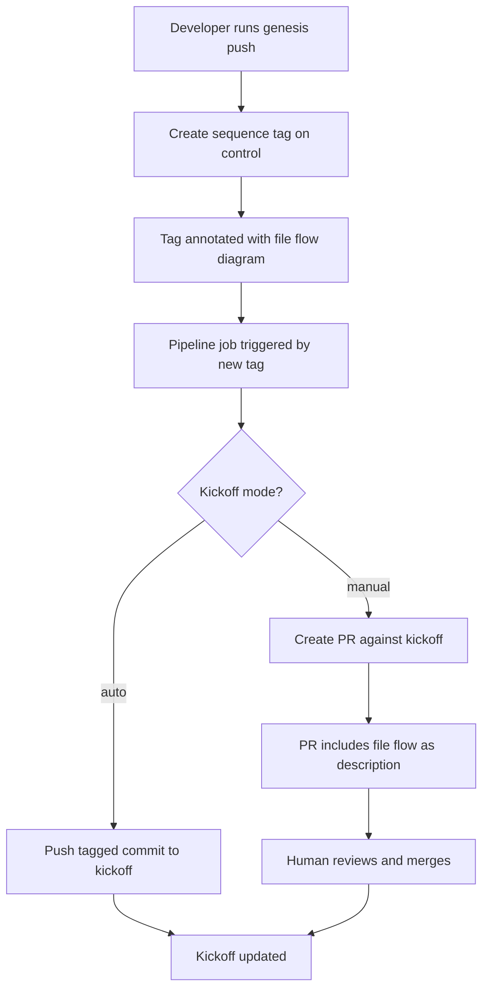
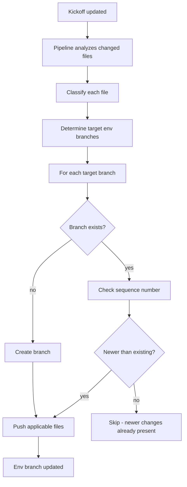
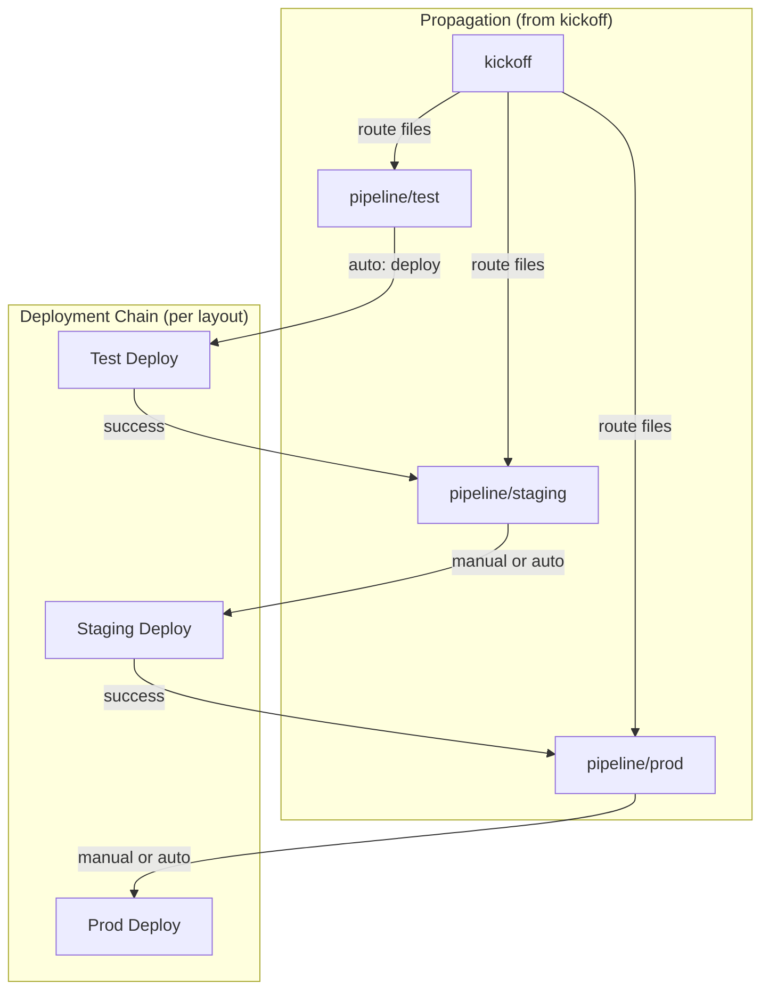

# Branch-Based Pipeline Architecture

**Status:** Draft
**Ticket:** [FWT-606](https://fivetwenty.atlassian.net/browse/FWT-606)
**Last Updated:** 2026-02-20

---

## Overview

This document defines the branch-based pipeline architecture that replaces the cache-based system. Changes originate on a `control` branch and propagate to environment-specific branches.

### Goals

- Simplify recovery from failed deployments
- Unify CLI and pipeline deployment behavior
- Enable git-native access controls and audit trails
- Preserve layout/trigger semantics from current system

### Non-Goals

- <!-- TBD -->

### Out of Scope

#### Dev Kits (`dev/` directory)

Dev kits (unpacked kits in the `dev/` directory) were never intended for pipeline use but were not explicitly blocked. The legacy cache system did not manage `dev/` contents, meaning changes would deploy immediately to any environment using a dev kit without propagating through predecessor environments.

**This behavior remains out of scope for the branch-based system.** Environments using dev kits bypass normal propagation rules. However, propagation rules should be designed with awareness that `dev/` exists and may be present in the repository.

---

## Terms

| Term | Definition |
|------|------------|
| **Repository** | A git-based hierarchical structure containing versioned files across multiple branches. Branches share a common base but may diverge in content. All changes are tracked in version history. |
| **`control` branch** | The primary branch for the standard workflow. Developers push changes here, potentially rebasing to reorder commits as needed. Changes do not automatically propagate—they must be explicitly tagged via `genesis push` to trigger distribution. Declarative in nature: you specify the desired end state and the pipeline determines how to propagate changes through the environment progression. |
| **`kickoff` branch** | A pipeline-controlled branch that mirrors `control` up to the latest pushed tag. Only writable by the pipeline service account (with break-glass exception). Serves as the dispatch point from which files are routed to environment branches. Shares ancestry with `control`. |
| **Environment Branch** | A namespaced branch (e.g., `pipeline/<env>`) containing only the files applicable to a specific deployment environment. Does not share git ancestry with `control`/`kickoff`. Updated by the pipeline when relevant changes are pushed. |
| **Environment File** | <!-- TBD --> |
| **Ancestral File** | A YAML file whose name is a prefix of an environment's name, based on hyphen-delimited segments. For environment `c-aws-east-prod`, ancestral files include `c.yml`, `c-aws.yml`, and `c-aws-east.yml`. Typically lacks a `genesis.env` key, making it a configuration fragment rather than a deployable environment. Ancestral files are shared across all environments matching their prefix and propagate to multiple environment branches. Ancestry does not require saturation—intermediate files may be absent. Using a deployable environment as an ancestor of another is possible but discouraged. |
| **Ops File** | A manifest fragment in the `ops/` directory that extends or customizes kit behavior. Referenced via the `kit.features` array in environment files. May be shared across environments or environment-specific. Unlike ancestral files, ops file applicability is explicit—determined by which environments reference them, not by naming convention. |
| **Included File** | A file explicitly inherited via the `genesis.inherits` key in an environment file. Provides direct inheritance independent of hyphen-based naming conventions. Allows environments to share configuration without requiring a common name prefix. |
| **Layout** | A deployment progression plan defined in `ci.yml` under `pipeline.layout` or `pipeline.layouts`. Uses arrow notation (`->`) to define environment succession (e.g., `sandbox -> preprod -> prod`). The `auto <pattern>` directive marks which environments trigger automatically on changes; others require manual triggering. Each environment may have only one predecessor but can have multiple successors (fan-out). Multiple layouts can be defined for different deployment topologies. |
| **Propagation** | The process of distributing file changes from `kickoff` to environment branches based on file classification and layout rules. |
| **Sidecar** | A reference (via tag) to files destined for downstream environments. Files are NOT committed to intermediate branches—the propagation tool pulls them from `kickoff` at the tagged commit when needed. May be superseded by later tags while in transit. |
| **Trigger** | <!-- TBD --> |
| **Cache** | <!-- TBD: Legacy term, define for contrast --> |

---

## Branch Structure

### The `control` Branch

**Role:** Active development branch where changes are built out iteratively. Developers may rebase to reorder commits as needed before pushing.

**Naming:** Configurable, defaults to `control`

**Contents:**
- All environment YAML files (ancestral and environment-specific)
- `ops/` directory
- `bin/` directory
- `kit-overrides.yml`
- `ci.yml`
- `.genesis/` directory

**Access:** Writable by developers

**Trigger behavior:** Commits do NOT automatically trigger propagation. Changes must be explicitly tagged via `genesis push`.

### The `kickoff` Branch

**Role:** Pipeline-controlled dispatch point. Mirrors `control` up to the latest pushed tag. Serves as the source for routing files to environment branches.

**Naming:** Configurable, defaults to `kickoff`

**Contents:** Full copy of `control` at the tagged commit

**Access:** Writable only by pipeline service account (break-glass exception for emergencies)

**Ancestry:** Shares git ancestry with `control`

### Sequence Tags

**Purpose:** Provide ordering for conflict resolution when fast-path commits overtake slow-path commits.

**Format:** Monotonically increasing integers (1, 2, 3, ...)

**Problem solved:**
```
Tag #n:   changes go test → staging → prod  (slow path)
Tag #n+1: changes go directly to prod       (fast path)

#n+1 arrives at prod before #n
When #n reaches prod, pipeline must not rollback #n+1's overlapping changes
Sequence numbers enable this comparison
```

**Created by:** `genesis push [<commit>]` command

**Annotation:** Markdown-formatted comment including Mermaid diagram of planned file flow

### Environment Branches

**Role:** Deployable state for a specific environment. Contains only the files applicable to that environment.

**Naming Convention:** Namespaced to avoid collision with other branches.
- `pipeline/<env>` (e.g., `pipeline/test`, `pipeline/staging`, `pipeline/prod`)
- Or `<ci-provider>/<env>` (e.g., `concourse/test`, `github-actions/staging`)
- TBD: Final convention to be decided

**Ancestry:** Does NOT share git ancestry with `control`/`kickoff`. Independent branch lineage.

**Contents:**
- Direct ancestral files for that environment (e.g., for `c-aws-prod`: `c.yml`, `c-aws.yml`, `c-aws-prod.yml`)
- Environment-specific file (`c-aws-prod.yml`)
- Ops files, included files, bosh-configs (scope TBD - see below)
- Kit files from `.genesis/kits/` matching env's `kit.name`/`kit.version`

**Contents - Open Design Question:**
Two approaches under consideration:
1. **All shared files propagate through envs** - ops files go to all branches, deployment only triggers if referenced
2. **Only files used by that environment** - smarter filtering, smaller branches

Will be determined iteratively during implementation. See propagation rules.

**Creation:** <!-- TBD: `genesis pipeline init`? On first tag push? -->

---

## File Classification

How files are categorized for propagation decisions.

### Classification Rules

Uses `Genesis::Env::relate_by_name()` logic:

| File Type | Example | Propagates To | Notes |
|-----------|---------|---------------|-------|
| Root ancestral | `c.yml` | All environments | <!-- TBD --> |
| Regional ancestral | `c-aws.yml` | All `c-aws-*` environments | <!-- TBD --> |
| Environment-specific | `c-aws-prod.yml` | Only `c-aws-prod` | <!-- TBD --> |
| Ops files | `ops/*.yml` | Envs that reference them in `kit.features` | <!-- TBD --> |
| Included files | via `genesis.inherits` | Envs that include them | <!-- TBD --> |
| Genesis binary | `.genesis/bin/genesis` | All environments | Embedded Genesis for pipeline use; created by `genesis embed` |
| Deployment scripts | `bin/*` | All environments (or smart detection) | Reaction scripts, helpers; could detect env references for smarter propagation |
| Kit overrides | `kit-overrides.yml` | <!-- TBD --> | <!-- TBD --> |

### File Analysis via `genesis yamls`

The propagation tool determines which files apply to each environment by:

1. Examining target environment's ancestral files (hyphen-based naming)
2. Merging ancestry to produce flattened YAML
3. Extracting from flattened YAML:
   - `genesis.inherits` → included files
   - `kit.features` → ops files

**This is already implemented:** `genesis yamls --no-kit <env>` produces the merged environment definition without kit expansion, providing exactly the information needed to determine file applicability.

### Open Questions

- [ ] How do we handle BOSH config files (under `ops/` but not manifest ops files)?

### Break-Glass Direct Edits

In emergency scenarios, files (including `.genesis/bin/genesis`) can be modified directly on environment branches, bypassing the normal `control` → `kickoff` → propagation flow. This should be rare and documented when it occurs.

---

## Propagation Flow

### Overview

Propagation is a multi-stage process:

1. **Developer triggers** `genesis push` on `control`
2. **Tag created** with sequence number and file flow annotation
3. **Pipeline job** detects new tag
4. **`kickoff` updated** (push or PR based on config)
5. **File analysis** determines routing to env branches
6. **Env branches updated** with applicable files
7. **Deployments triggered** per layout rules

### Stage 1: Control → Kickoff



### Stage 2: Kickoff → Environment Branches



### Kickoff Modes

| Mode | Behavior | Use Case |
|------|----------|----------|
| `auto` | Direct push to `kickoff` on tag | Trusted CI/CD, automated pipelines |
| `manual` | Create PR against `kickoff` | Change review required, audit trail |

### Sequence Number Conflict Resolution

The sequence tag is propagated to each env branch as part of the pipeline job. When an earlier-numbered tag arrives after a later-numbered tag (due to different routing paths), the pipeline creates a hybrid tag.

**Example scenario:**
```
Tag #33: changes route through test → staging → prod (slow path)
Tag #34: changes route directly to prod (fast path)

Timeline on pipeline/prod:
  1. #34 arrives first (fast path)  → branch tagged: push-34
  2. #33 arrives later (slow path)  → branch tagged: push-34+33
```

**Hybrid tag format:** `push-<latest>+<merged>` (e.g., `push-34+33`)

**Resolution logic:**
```
target_tag = current push tag on env branch (e.g., push-34)
incoming_tag = tag being propagated (e.g., push-33)

if target_tag > incoming_tag:
  for each file in incoming:
    if file exists from target_tag:
      skip (newer version already present)
      record in omitted_files list
    else:
      apply file from kickoff@incoming_tag

  commit with:
    - hybrid tag: push-34+33
    - message listing omitted files and why
```

**Commit message example:**
```
push-34+33: Propagated from test

Applied from push-33:
  - ops/widget.yml

Omitted (superseded by push-34):
  - prod.yml
```

The hybrid tag and commit message provide a complete audit trail of what was applied and what was skipped.

### Sidecar Files and Superseded Changes

Files destined for downstream environments are referenced via the push tag but NOT committed to intermediate branches. The propagation tool:

1. Analyzes the push tag to determine which files apply to which environments
2. Commits only applicable files to each env branch
3. For downstream files, records the tag reference (the "sidecar")
4. When the pipeline progresses, pulls files from `kickoff` at the tagged commit

**Key point:** Env branches never contain files that don't apply to them. The canonical source for any file is always `kickoff` at the relevant tag.

**Scenario:**
```
push-33:
  - Modify ops/widget.yml (used by test)
  - Modify prod.yml (add widget feature)
  → Routes to test first (prod.yml in sidecar)

push-34 (while test pipeline running):
  - Modify prod.yml (increase diego cells, REMOVE widget feature)
  → Routes directly to prod (prod-specific change)
```

**Timeline:**
1. push-33 starts test pipeline, prod.yml in sidecar
2. push-34 goes directly to prod, pipeline completes
3. push-33 test pipeline completes
4. Propagation wants to deliver sidecar prod.yml to prod

**Conflict:** push-33's prod.yml has widget feature + 10 instances. push-34's prod.yml has no widget + 16 instances.

**Resolution:** Skip the sidecar file entirely. Do NOT merge.

**Rationale:**
- `control` now has push-34's version of prod.yml (no widget, 16 instances)
- Applying push-33's sidecar would make prod diverge from `control`
- Goal: env branches should match `control` for their applicable files

**Reconciliation:** User creates push-35 to add widget feature back (with 16 instances preserved). Since ops/widget.yml was already validated in test, push-35 routes directly to prod.

**Design principle:** When a sidecar file has been superseded by a later tag, skip it. The env branch should reflect what's CURRENTLY in `control`, not what was in an older tag. User reconciles via new push if needed.

### Per-Environment Override

<!-- TBD: Can individual environments override the default propagation mode? -->

```yaml
pipeline:
  branches:
    propagation: push  # default
    prod:
      propagation: pr  # override for prod
```

---

## Deployment Triggers

### Layout Integration

Existing layout DSL continues to define trigger relationships:

```
auto *-sandbox
sandbox -> preprod -> prod
```

The layout determines:
- Which environments auto-trigger on branch changes (`auto` directive)
- Deployment progression order (arrow chains)
- When downstream deployments are triggered (on success of predecessor)

### Trigger Flow



### Auto vs Manual Triggers

| Trigger Type | Behavior |
|--------------|----------|
| `auto` | Deployment runs automatically when env branch is updated |
| Manual | Pipeline waits for human to trigger deployment job |

**Note:** This is separate from kickoff mode (auto/manual). An environment can:
- Receive files automatically (kickoff auto) but require manual deploy trigger
- Receive files via PR (kickoff manual) but auto-deploy once merged

---

## Deployment Execution

### Pipeline-Triggered Deploy

1. <!-- TBD: Watch env branch for changes? -->
2. <!-- TBD: Pull branch state? -->
3. <!-- TBD: Execute deployment -->
4. <!-- TBD: Commit results back to branch? -->
5. <!-- TBD: Trigger downstream? -->

### Manual Deploy (CLI)

<!-- TBD: How does `genesis deploy` behave when ci.yml exists with branch mode? -->

### Safeguards

| Scenario | Behavior |
|----------|----------|
| Deploy from `control` branch | <!-- TBD: Warn? Block? --> |
| Deploy with uncommitted changes | <!-- TBD --> |
| Deploy older revision than branch | <!-- TBD --> |

---

## Conflict Handling

### Conflict Scenarios

| Scenario | Description | Resolution |
|----------|-------------|------------|
| Concurrent edits | <!-- TBD --> | <!-- TBD --> |
| Manual branch edit | <!-- TBD --> | <!-- TBD --> |
| Propagation during deploy | <!-- TBD --> | <!-- TBD --> |

### Resolution Strategies

<!-- TBD: Configurable per-environment? -->

- `fail` - Stop and report
- `merge` - Attempt merge commit
- `rebase` - Rebase `control` changes
- `ask` - Create PR for manual resolution

---

## Recovery Procedures

### Failed Deployment at Environment N

**Current (cache-based):** Complex, requires manual cache reconstruction

**Branch-based:**
1. <!-- TBD -->
2. <!-- TBD -->

### Accidental Manual Deploy

<!-- TBD -->

### State File Recovery

<!-- TBD: How are state files (create-env) handled? -->

---

## ci.yml Schema Extensions

New keys for branch mode:

```yaml
pipeline:
  # Existing keys...

  # New branch-mode keys
  mode: branch              # 'branch' | 'legacy' (default: legacy)
  branches:
    control: control        # Control branch name
    propagation: push       # 'push' | 'pr'
    # Per-environment overrides
    <env-name>:
      propagation: pr
```

### Backward Compatibility

- Absence of `mode` key implies `legacy` behavior
- All new keys have sensible defaults
- Existing ci.yml files continue to work unchanged

---

## Edge Cases

### Proto-BOSH (create-env)

<!-- TBD: Special handling needed? -->

### Multi-Region Deployments

<!-- TBD: How do regional branches work? -->

### Locker Integration

<!-- TBD: Any changes needed? -->

### Sync-Back (env → `control`)

<!-- TBD: Deferred to post-MVP? How to handle manual changes on env branches? -->

### Unskippable Commits

<!-- TBD: Deferred to post-MVP? How to mark migrations that cannot be skipped? -->

---

## Diagrams

### Complete Workflow

<!-- TBD: End-to-end Mermaid diagram -->

### File Classification Decision Tree

<!-- TBD -->

### Propagation State Machine

<!-- TBD -->

---

## Open Questions

1. <!-- Collect questions here as we work through the design -->

---

## Decisions Log

| Date | Decision | Rationale |
|------|----------|-----------|
| 2026-02-20 | Fan-out only; no fan-in gates | See below |
| 2026-02-20 | Name `kickoff` for dispatch branch (tentative) | See below |

### 2026-02-20: Fan-Out Only (No Fan-In Gates)

**Context:** Should layouts support fan-in gating where multiple predecessor environments must all pass before triggering a successor? (e.g., `lab-us + lab-eu + lab-ap -> qa`)

**Decision:** No. Layouts support fan-out only (one predecessor, multiple successors). Fan-in gates are out of scope.

**Rationale:**
- Adds significant complexity for limited use cases
- Conflates two concerns: propagation (file flow) and triggering (deployment ordering)
- Users have workable alternatives:

**Alternative patterns:**

1. **Parallel regional paths** - Each region has its own progression:
   ```
   lab-us -> qa-us -> prod-us
   lab-eu -> qa-eu -> prod-eu
   ```

2. **Single gate with multiple successors** - One lab triggers all QA environments:
   ```
   lab-a -> qa-a
   lab-a -> qa-b
   lab-a -> qa-c
   # lab-b and lab-c exist for deployment/usage but don't gate anything
   ```

3. **Sequential chain** - When all environments must deploy before proceeding:
   ```
   lab-a -> lab-b -> lab-c -> qa-a -> qa-b -> ...
   ```
   Longer runtime but pipelines can run overnight.

**Trade-off accepted:** Sequential chains are slower but simpler than implementing fan-in gate logic.

### 2026-02-20: Dispatch Branch Naming (`kickoff`)

**Context:** Need a name for the branch between `control` and environment branches that serves as the pipeline-controlled dispatch point.

**Decision:** Use `kickoff` as working name (tentative, may revisit).

**Alternatives considered:**
- `dispatch` - describes the routing function
- `pending` - suggests queued changes
- `queue` - similar to pending
- `release` - implies finality
- `staging` - conflicts with common environment name

**Rationale for `kickoff`:** Captures the idea that this is where deployments "kick off" from. However, open to better suggestions as design evolves.

---

## References

- [Current System Documentation](./Current%20System%20Documentation.md)
- [Kickoff Issues](./Kickoff%20Issues.md)
- [ci.yml Configuration Reference](./ci.yml%20Configuration%20Reference.md)
- [Workflows](./Workflows.md)
