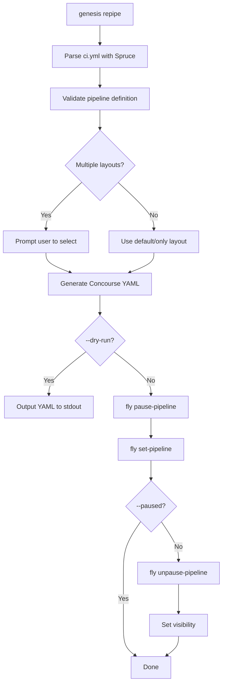
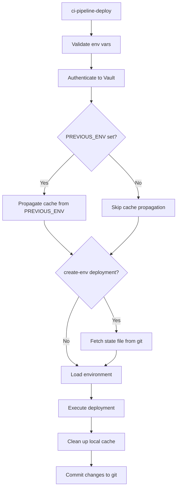
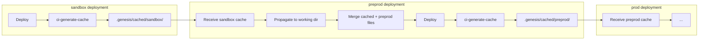
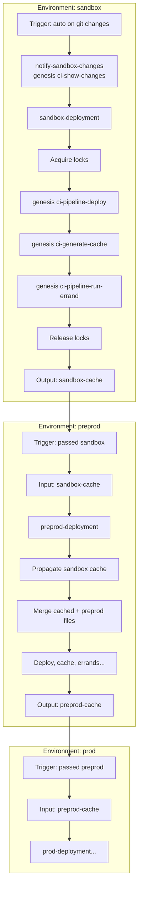

# Genesis Pipeline System - Current State Documentation

This document describes the current (legacy) cache-based pipeline system before the branch-based refactor.

## Overview

The Genesis pipeline system is a Concourse CI/CD integration framework that orchestrates deployment workflows across multiple environments. It implements:

- Hierarchical environment model based on hyphen-delimited naming
- File-based caching for validated change propagation
- Domain-specific language for pipeline configuration
- Automatic generation of Concourse pipeline YAML

---

## Pipeline Commands

### `genesis repipe [<layout>]`

**Purpose:** Configure and deploy a Concourse pipeline for automating deployments.

**Options:**
| Option | Description |
|--------|-------------|
| `--yes`, `-y` | Skip all confirmation prompts |
| `--dry-run`, `-n` | Generate YAML without deploying to Concourse |
| `--target`, `-t <name>` | Concourse target name (defaults to layout name) |
| `--config`, `-c <path>` | Pipeline config file (defaults to `ci.yml`) |
| `--paused`, `-P` | Keep pipeline paused after deployment |

**Workflow:**



---

### `genesis graph [<layout>]`

**Purpose:** Generate a Graphviz DAG representation of the pipeline.

**Output:** DOT format to stdout showing environment nodes and trigger dependencies.

---

### `genesis describe [<layout>]`

**Purpose:** Describe pipeline structure in human-readable ASCII tree format.

---

### `genesis ci-pipeline-deploy`

**Purpose:** Execute deployment from within Concourse pipeline context.

**Required Environment Variables:**
| Variable | Description |
|----------|-------------|
| `CURRENT_ENV` | Environment being deployed |
| `GIT_BRANCH` | Branch to push commits to |
| `VAULT_ROLE_ID` | Vault AppRole ID |
| `VAULT_SECRET_ID` | Vault AppRole Secret |
| `VAULT_ADDR` | Vault URL |
| `WORKING_DIR` | Deployment working directory |
| `OUT_DIR` | Output directory for commits |

**Optional Environment Variables:**
| Variable | Description |
|----------|-------------|
| `PREVIOUS_ENV` | Triggering environment (enables cache propagation) |
| `CACHE_DIR` | Required if PREVIOUS_ENV set |
| `GIT_GENESIS_ROOT` | Subdirectory path within repo |
| `GIT_PRIVATE_KEY` | SSH key (OR username/password) |
| `GIT_USERNAME` | HTTPS auth username |
| `GIT_PASSWORD` | HTTPS auth password |
| `VAULT_SKIP_VERIFY` | SSL verification bypass |
| `VAULT_NAMESPACE` | Enterprise Vault namespace |

**Workflow:**



---

### `genesis ci-show-changes`

**Purpose:** Display deployment changes without executing. Analyzes manifest differences.

**Behavior:**
- Propagates previous environment cache
- Generates `updates.yml` (pruned manifest)
- Generates `bosh-vars.yml` for interpolation
- Creates diff script comparing current vs deployed
- Detects cache mismatches and warns about inconsistencies

---

### `genesis ci-generate-cache`

**Purpose:** Generate cache of environment configuration files for downstream propagation.

**What Gets Cached:**
- Hierarchical YAML files (common with predecessor)
- `kit-overrides.yml`
- `ops/` directory
- `bin/` directory

**Cache Location:** `.genesis/cached/<env-name>/`

---

### `genesis ci-pipeline-run-errand`

**Purpose:** Execute BOSH errands after successful deployment.

**Required:** `ERRAND_NAME` environment variable

---

## Caching Mechanism

### File Hierarchy Model

Files are identified via `Genesis::Env::relate_by_name()`:

1. Environment names split by hyphen: `us-west-1-preprod-east` → `[us, west, 1, preprod, east]`
2. Common prefix found with predecessor
3. Files generated for each prefix level

**Example:**

| Environment | Predecessor | Common Files | Unique Files |
|-------------|-------------|--------------|--------------|
| `us-west-1-preprod-east` | `us-west-1-sandbox` | `us.yml`, `us-west.yml`, `us-west-1.yml` | `us-west-1-preprod.yml`, `us-west-1-preprod-east.yml` |

### Cache Propagation Flow



### Cache Directory Structure

```
.genesis/
├── cached/
│   ├── sandbox/
│   │   ├── us.yml
│   │   ├── us-west.yml
│   │   ├── us-west-1.yml
│   │   ├── kit-overrides.yml
│   │   ├── ops/
│   │   └── bin/
│   └── preprod/
│       └── ...
├── manifests/
│   ├── sandbox.yml
│   └── sandbox-state.yml  (create-env only)
├── kits/
└── config
```

---

## Pipeline Execution Flow



---

## Key Architectural Patterns

### Hierarchical File Naming

Files named with environment hierarchy enable automatic relationship detection:
- Pattern: `<org>-<region>-<zone>-<stage>[-<variant>].yml`
- Common prefix = shared configuration
- Additional tokens = environment-specific

### Cache-Based Propagation

- Prevents unvetted changes from propagating downstream
- Ensures deterministic deployments
- Supports complex multi-region topologies

### Trigger Chains

- Each environment can trigger multiple downstream environments
- But each environment can only be triggered by ONE upstream
- Layout DSL: `sandbox -> preprod -> prod`

### Atomic Commits

- Each stage has atomic git commits
- State files committed even on failure (for proto-BOSH recovery)

### Vault-Centric Security

- All credentials stored in Vault
- AppRole authentication for pipelines
- Spruce `(( vault ))` references in config

---

## Special Cases

### Proto-BOSH (create-env)

- No previous deployment manifest exists
- State file fetched from git before deployment
- No cloud-config/runtime-config resources
- No BOSH director lock required

### Multi-Region Deployments

- Common configurations shared across regions
- Cache only shares files up to common prefix
- Prevents region-specific config leakage

### Locker Integration

- Prevents BOSH director upgrade during deployment
- Prevents simultaneous deployments to same BOSH
- Optional but recommended for production

---

## Problems with Current System

See [Kickoff Issues.md](./Kickoff%20Issues.md) for detailed analysis of:

1. CLI vs Pipeline behavior mismatch
2. Complex cache system hard to understand/debug
3. Feature gaps (ops/, bin/ propagation)
4. Recovery difficulty from failed deployments
5. Missed/aggregated deployment risks
